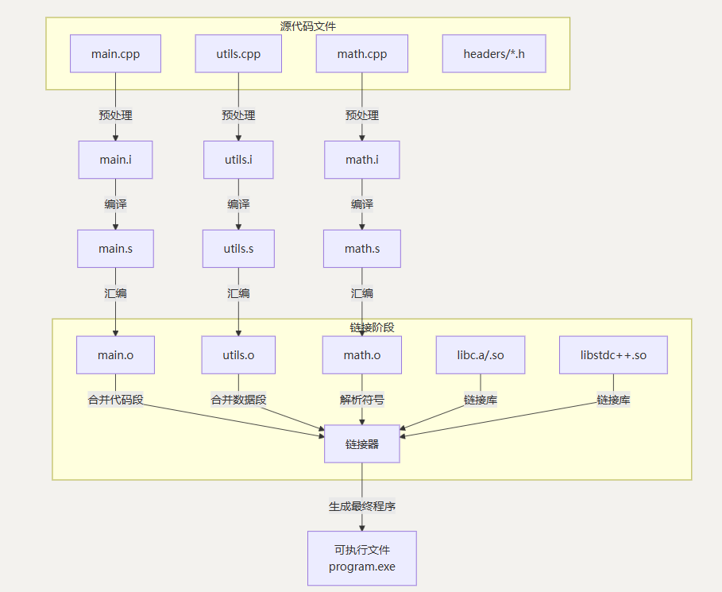

# 目录
## [$1.cpp初识$](#1-cpp初识)
<details><summary></summary>
<p><a href="#10-可执行程序是如何生成的">1.0-可执行程序是如何生成的</a></p>
<p><a href="#11-注释">1.1-注释</a></p>
<p><a href="#12-变量">1.2-变量</a></p>
<p><a href="#13-常量">1.3-常量</a></p>
<p><a href="#14-标识符">1.4-标识符</a></p>
</details>

## [$2.数据类型$](#2-数据类型)
<details><summary></summary>
<p><a href="#21-整型">2.1-整型</a></p>
<p><a href="#22-sizeof关键字">2.2-sizeof关键字</a></p>
<p><a href="#23-浮点型">2.3-浮点型</a></p>
<p><a href="#24-字符型">2.4-字符型</a></p>
<p><a href="#25-字符串型">2.5-字符串型</a></p>
<p><a href="#26-转义字符">2.6-转义字符</a></p>
<p><a href="#27-bool类型">2.7-bool类型</a></p>
<p><a href="#28-数据的输入">2.8-数据的输入</a></p>
</details>

## [$3.运算符$](#3-运算符)
<details><summary></summary>
<p><a href="#31-算术运算符">3.1-算术运算符</a></p>
<p><a href="#32-自增与自减运算符">3.2-自增与自减运算符</a></p>
<p><a href="#33-比较运算符">3.3-比较运算符</a></p>
<p><a href="#34-逻辑运算符">3.4-逻辑运算符</a></p>
<p><a href="#35-位运算符">3.5-位运算符</a></p>
<p><a href="#36-赋值运算符">3.6-赋值运算符</a></p>
</details>

## [$4.程序流程结构$](#4-程序流程结构)
<details><summary></summary>
<p><a href="#41-选择结构">4.1-选择结构</a></p>
<p><a href="#42-循环结构">4.2-循环结构</a></p>
<p><a href="#43-跳转语句">4.3-跳转语句</a></p>
</details>

## [$5.数组$](#5-数组)
<details><summary></summary>
<p><a href="#51-一维数组">5.1-一维数组</a></p>
<p><a href="#52-二维数组">5.2-二维数组</a></p>
<p><a href="#53-三维数组">5.3-三维数组</a></p>
</details>

## [$6.函数$](#6-函数)
<details><summary></summary>
<p><a href="#61-定义">6.1-定义</a></p>
<p><a href="#62-函数的常见样式">6.2-函数的常见样式</a></p>
<p><a href="#63-函数的声明">6.3-函数的声明</a></p>
<p><a href="#64-函数的分文件编写">6.4-函数的分文件编写</a></p>
</details>

## [$7.指针$](#7-指针)
<details><summary></summary>
<p><a href=""></a></p>
<p><a href=""></a></p>
<p><a href=""></a></p>
</details>

## [$8.结构体$](#8-结构体)
<details><summary></summary>
<p><a href=""></a></p>
<p><a href=""></a></p>
<p><a href=""></a></p>
</details>

---
# 1-cpp初识
## 1.0-可执行程序是如何生成的


**预处理**:预处理器执行已预处理指令(#头的指令)，得到预处理文件
1. #include:头文件包含(把头文件中的内容复制到指令所在位置)
2. #define MAXSIZE 9:宏定义(文本替换，代码中MAXSIZE替换成9)
3. #define F(x)(1+(x)+(x)\*(x)):宏函数(文本替换，如代码中F(5)替换成(1+(5)+(5)*(5)))

**编译**:编译器将预处理文件翻译成对应平台的汇编代码。  
**汇编**:汇编器把生成的汇编代码翻译成对应平台机器代码(二进制代码)。此时程序还不能运行，还需要最后一个步骤。  
**链接**:把汇编器生成的目标代码和程序需要的其他附加代码整合在一起，生成可执行程序。
## 1.1-注释
**作用**:在代码中加一些说明和解释，方便自己或其他程序员程序员阅读代码
**两种格式**  
1. 单行注释:`//描述信息`
    - 通常放在一行代码的上方，或者一条语句的末尾，对该行代码说明
2. 多行注释:`/*描述信息*/`
    - 通常放在一段代码的上方，对该段代码做整体说明
## 1.2-变量
**作用**:给一段指定的内存空间起名，方便操作这段内存。  
**语法**:`数据类型 标识符 = 初始值;`
## 1.3-常量
**作用**:用于记录程序中不可更改的数据
C++定义常量两种方式:
1. #define宏常量：`#define 标识符 常量值`
    - 通常在文件上方定义，表示一个常量
2. const修饰的变量：`const 数据类型 标识符 = 常量值`
    - 通常在变量定义前加关键字const，修饰该变量为常量，不可修改

***const常量和宏定义常量的区别***
1. *发生的时机不同：*
- 宏定义发生时机在预处理时，做字符串的替换;
- const常量是在编译时(const常量本质还是一个变量，只是用const关键字限定之后，赋予只读属性，使用时依然是以变量的形式去使用)
2. *类型和安全检查不同:*
- 宏定义没有类型，不做任何类型检查;
- const常量有具体的类型，在编译期会执行类型检查。

  在使用中，应尽量以const替换宏定义常量，可以减小犯错误的概率。
```cpp
#include <iostream>			//将iostream头文件包含在程序中
using namespace std;		//省去std::
/*
多段注释
*/
int main()					//入口函数
{

	//cout << "hello world!" << endl;
	//cout << "你好，世界" << endl;
	
	//int a;
	//a = 10;
	//cout << a << endl;
	//a = 20;
	//cout << a << endl;

	//int a = 10;			//初始化
	//float b = 3.14f;
	//double c = 1.2345;
	//char d = 'f';
	//bool e = true;		//1

	//cout << a << "\t" << b << "\t" << c << "\t" << d << "\t" << e << endl;

	//int a = 10;
	//float b = 20.22;
	//int c = a + b;			
	//cout << c << endl;	//30

	//const float pi = 3.14;
	int a;
	int b;
	cin >> a >> b;				//从键盘输入整数赋值给a,b
	system("pause");		//防止程序运行后窗口立即关闭
	return 0;				//表示程序正常结束
}
```
## 1.4-标识符
### 定义规则:
1. 标识符必须以字母、下划线或者美元符号开头，而不能以数字开头。

2. 标识符只能由字母、数字、下划线和美元符号组成。

3. 标识符的长度没有限制，但是为了提高代码的可读性，一般不要使用过长的标识符。

4. 区分大小，因此标识符中大小写字母是不同的。

5. 标识符不能与C语言的关键字或保留字相同，如if、else、 while等。
### 定义规范:
1. 驼峰命名法:首字母小写，后面单词首字母大写。例如:
firstName, lastName, userAddress等。

2. 下划线命名法:单词之间用下划线连接。例如: first_name,
last_name, user_address等。

3. 帕斯卡命名法:每个单词首字母都大写。例如: FirstName,
LastName, UserAddress等。

4. 匈牙利命名法:前缀表示数据类型，后面采用驼峰命名法命名。例
如:iCount, fPrice,sName等。
### [目录](#目录)
---
# 2-数据类型
C++规定在创建一个变量或者常量时，必须要指定出相应的数据类型，否则无法给变量分配内存。
## 2.1-整型
类型|大小|范围
---|---|---
short|2字节|-32768~32767
int|4字节|-2147483648~2147483647
long|4字节|-2147483648~2147483647
long long|8字节|~9223372036854775808~9223372036854775807
> C++标准没有明确规定int、 long、short等整数类型在字节(byte)或位(bit)上的具体大小。例如
> - 在大多数32位和64位系统中(如Windows、Linux、macOS)，int通常是32位，即4字节。
> - 在一些嵌入式系统或旧的系统中，int可能是16位，即2字节。
## 2.2-sizeof关键字
**作用**:利用sizeof关键字可以统计数据类型所占内存大小。  
**语法**:`sizeof(数据类型/变量)`
```cpp
int main() {
	cout << "short 类型所占内存空间为： " << sizeof(short) << endl;			//2
	cout << "int 类型所占内存空间为： " << sizeof(int) << endl;				//4
	cout << "long 类型所占内存空间为： " << sizeof(long) << endl;			//4
	cout << "long long 类型所占内存空间为： " << sizeof(long long) << endl;//8
	system("pause");
	return 0;
}
```
## 2.3-浮点型
类型|大小|范围
---|---|--- 
float|4字节|小数点后6~7位有效数字
|double|8字节|小数点后15~16位有效数字
## 2.4-字符型
**作用**：显示单个字符。  
**语法**：`char 标识符 = '单个字符';`
类型|大小|范围
---|---|--- 
[signed] char|1字节|-128~127
unsigned char|1字节|0~255
```cpp
char ch = 65;
cout << ch << endl;		//A

char ch2 = 'a';
cout << ch2 + 1 << endl;//98
cout << ch2 << endl;	//a

char ch3 = 'a' + 1;
cout << ch3 << endl;	//b
```
> 注意1:在显示字符型变量时，用单引号将字符括起来，不要用双引号  
>注意2:单引号内只能有一个字符，不可以是字符串
> - char类型本质上是数字，通过ASCII表进行的映射
> - char可以存储的范围是超出ASCII的，但是基于ASCII映射，可以认为，char应用内容就是ASCII表
> - 字符型变量并不是把字符本身放到内存中存储，而是将对应的ASCII编码放入到存储单元
## 2.5-字符串型
**作用**：表示一串字符。  
**语法**：
1. c++风格： `string 标识符 = "字符串值"`
2. c语言风格：
   - `char 数组名[] = "字符串值";//字符数组形式`
   - `const char *b = "字符串值";//指针形式`
```cpp
// c语言风格
char s1[] = "hello world";	//字符数组形式
const char* s2 = "hello world";	//指针形式
// c++风格
string s3 = "hello world";	//string类对象形式

cout << s1 << endl;
cout << s2 << endl;
cout << s3 << endl;
```
> 注意1：用双引号将字符串括起来，不要用单引号。  
> 注意2：c++风格需要加入头文件`#include <string>`
## 2.6 转义字符
**作用**：用于表示一些不能显示出来的ASCII字符
转义字符|含义     |描述                                                         
-------| -------- |-----
`\n`   |换行符    | 将光标移动到下一行的开头。                                   
`\t`   |水平制表符| 将光标移动到下一个水平制表位，通常相当于几个空格。           
`\r`   |回车符    | 将光标移动到当前行的开头。 
`\b`   |退格符    | 将光标向左移动一个位置。                                     
`\f`   |换页符    | 将光标移动到下一页的开头。                                   
`\v`   |垂直制表符| 将光标移动到下一个垂直制表位。                               
`\\`   |反斜杠    | 输出一个字面量的反斜杠 `\`。                                 
`\'`   |单引号    | 输出一个字面量的单引号 `'`。                                 
`\"`   |双引号    | 输出一个字面量的双引号`"`。                                 
`\?`   |问号      |输出一个字面量的问号 `?`
`\0`|空字符|输出一个空字符
`\ddd`|八进制转义字符|1~3位八进制所代表的任意字符
`\xhh`|十六进制转义字符|1~2位十六进制所代表的任意字符
## 2.7-bool类型
类型|大小|范围
---|---|--- 
bool|1字节|true（真）或false（假）
> 注意：真假也可用数字表示，非0的数字为真
## 2.8-数据的输入
**语法**：`cin >> 变量`
### [目录](#目录)
---
# 3-运算符
1. 算术运算符
2. 自增与自减运算符
3. 比较运算符
4. 逻辑运算符
5. 位运算符
6. 赋值运算符
## 3.1-算术运算符
运算符|描述
---|---
+|加
-|减
*|乘
/|除（取整）
%|取余
## 3.2-自增与自减运算符
运算符|描述
---|---
++|变量的值加1
--|变量的值减1

**前缀形式**：如`b=++a`，b等于加完1后的a。  
**后缀形式**：如`b=a--`，b等于还没减1的a。
## 3.3-比较运算符
运算符|描述
---|---
|>|左边的操作数大于右边则为真
<|小于
==|相等
!=|不相等
|>=|大于等于
<=|小于等于
## 3.4-逻辑运算符
运算符|描述
---|---
&&|（与）两个操作数都为真，则为真
\|\||（或）至少一个为真，则为真
!|（非）都为假，则为真
## 3.5-位运算符
位运算符允许直接在二进制级别操作整数，是系统编程、嵌入式开发和算法优化的基础工具。
运算符|描述
---|---
&|按位与运算（两个位都为1时结果为1）
\||按位或运算（两个位至少一个为1时结果为1）
^|按位异或运算（两个位不同时结果为1）
~|按位取反运算（1变0，0变1）
<<|二进制左移运算符（右侧补0）
\>>|二进制右移运算符（左侧补0）

a=1 0 1 0 1 0 1 1

b=1 1 0 0 0 1 0 0

c=1 0 0 0 0 0 0 0（与）

d=1 1 1 0 1 1 1 1（或）

e=0 1 1 0 1 1 1 1（异或）

a<<2:1 0 1 0 1 0 1 1 0 0（左移）

a>>2:0 0 1 0 1 0 1 0（右移）
> 注意：为了可移植性，最好仅对无符号数进行移位运算(在整数类型前加unsigned就是对应的无符号数，如`unsigned int n=10`)

*异或的一些优秀性质：*
- a ^ 0 = a
- a ^ b = b ^ a
- a ^ a = 0
## 3.6-赋值运算符
=、+=、-=、*=、/=、%=、&=、|=、^=、<<=、>>=
``` cpp
cout << 7 / 2;			//3
cout << 7.0 / 2;		//3.5

bool is = 1 > 1;
cout << is;			//0

bool is = 1 == 1;
cout << is;			//1

bool is = 1 > 1 && 2 < 3;
cout << is;			//0

bool is = 1 > 1 || 2 < 3;
cout << is;			//1

bool is = !1;
cout << is;			//0

int value1 = 10;		//二进制为1010
int value2 = value1 >> 2;
cout << value2;		//结果是2，二进制为10
```
### [目录](#目录)
---
# 4-程序流程结构
C++支持最基本的三种程序运行结构:顺序结构、选择结构、循环结构。
- 顺序结构:程序按顺序执行，不发生跳转
- 选择结构:依据条件是否满足，有选择的执行相应功能
- 循环结构:依据条件是否满足，循环多次执行某段代码
## 4.1-选择结构
### 4.1.1-if语句
1. 单行格式if语句
    - **语法**：`if (条件){条件满足执行的语句}`
2. 多行格式if语句
    - **语法**：`if (条件){条件满足执行的语句}else{条件不满足执行的语句}`
3. 多条件的if语句
    - **语法**：`if (条件1){条件1满足执行的语句}else if(条件2)···else{条件都不满足执行的语句}`

**注意事项**
1. 如果只有一条语句需要执行，大括号可以省略。但是，
这么做不利于代码的可读性，建议编写者使用大括号。
1. if语句的表达式的结果必须是布尔类型，即只能是true
或false，否则会导致编译错误。
1. 当使用逻辑运算符(如&&和||)时，应该使用括号来明
确运算的优先级，避免出现逻辑错误。
```cpp
  int hp = 10;
  if (0 < hp && hp < 20)
  {
      cout << "血量过低" << endl;
  }

  if (1)
  {
      cout << 2 << endl;
  }
  else if (1)
  {
  }
  else
  {
  }
```
### 4.1.2-三目运算符
**语法**：`表达式1 ? 表达式2 : 表达式3`  
**解释**：  
如果表达式1的值为真，执行表达式2，并返回表达式2的结果;  
如果表达式1的值为假，执行表达式3，并返回表达式3的结果。
```cpp
int a = 10;
int b = 20;
int c = 0;

c = a > b ? a : b;

cout << "c = " << c<< endl;//20
//C++中三目运算符返的是变量,可以继续赋值
(a > b ? a : b) =100;
cout << "a = " << a<< endl;//10
cout << "b = " << b<< endl;//100
cout << "c = " << c<< endl;//20
```
> 总结：和if语句比较，三目运算符优点是短小整洁，缺点是如果用嵌套，结构不清晰
### 4.1.3-switch语句
**作用**：执行多条件分支语句  
**语法**：
```
switch(表达式)
{
	case 结果1:
		代码1;
		break;
	case 结果2;
		代码2;
		break;
	···
	default:
		代码3;
        break;
}
```
```cpp
//请给电影评分 
//10 ~ 9   经典   
// 8 ~ 7   非常好
// 6 ~ 5   一般
// 5分以下 烂片

int score = 0;
cout << "请给电影打" << endl;
cin >> score;

switch (score)
{
case 10:
case 9:
	cout << "经典" << endl;
	break;
case 8:
case 7:
	cout << "非常好" << endl;
	break;
case 6:
case 5:
	cout << "一般" << endl;
	break;
default:
	cout << "烂片" << endl;
	break;
}
```
> 注意1：switch语句中表达式类型只能是整型或者字符型  
> 注意2：case里如果没有break，那么程序会一直向下执行。这种现象叫case穿透，可以利用Case穿透来避免重复代码的编写。
```cpp
int month;
int year;
int days;
cin >> year >> month;

switch (month) 
{
    case 1: case 3: case 5: case 7: case 8: case 10:case 12:
        days = 31;//不用重复写days = 31
        break;
    case 4: case 6: case 9: case 11:
        days = 30;
        break;
    case 2:
        // 闰年判断
        if ((year % 4 == 0 && year % 100 != 0) || (year % 400 == 0)) {
            days = 29;
        } else {
            days = 28;
        }
        break;
    default:
        days = -1;//说明输入month有错误
        break;
}
cout << "Month " << month << " has " << days << " days"<< endl;
```
> 总结:与i语句比，对于多条件判断时，switch的结构清晰，执行效率高，缺点是switch不可以判断区间
>
> switch是通过查表的方式来选择case，并不是一个case一个case进行判断。if else是按分支顺序一个个进行判断是否符合条件，因此switch执行效率高
### 4.1.4-枚举类型
**作用**：将一些数字或字符串符号化，以此增强程序的可读性和可维护性。本质上是一个被命名的整型常数的集合。  
**语法**：
```
enum 枚举名 {
    枚举元素1,
    枚举元素2,
    ...
};
```
```cpp
enum Color {
    RED,    // 默认值为 0
    GREEN,  // 默认值为 1
    BLUE = 5, // 手动指定值为 5
    YELLOW  // 默认值为 6 (基于 BLUE 的值 5 + 1)
};

enum Fruit {
    // RED, // 编译错误！因为 RED 已经在 Color 中定义，造成了命名冲突
    APPLE,
    BANANA
};

int main() {
    Color c = RED; // 直接使用枚举值
    int num = c;   // 允许：枚举可以隐式转换为 int，num 的值为 0
    return 0;
}
```
```cpp
enum Color {
RED = 1,
YELLOW,
BLUE
};

int num;
cout << "你们喜欢什么颜色？1红色，2黄色，3蓝色" << endl;
cin >> num;

switch (num) {
    case RED:
        cout << "喜欢红色！" << endl;
        break;
	case YELLOW:
        cout << "喜欢黄色！" << endl;
        break;
    case BLUE:
        cout << "喜欢蓝色！" << endl;
        break;
    default:
        cout << "输入的数字有误" << endl;
}
```
> 注意1：枚举是一种用户自定义类型，可以将数字标号定义为具体的符号  
> 注意2：枚举一般用于对各种不同的状态，定义可识别的符号  
> 注意3：枚举可以配合switch case语句一起使用
## 4.2-循环结构
### 4.2.1-for循环语句
**语法**：`for (起始表达式;条件表达式;末尾循环体) {循环语句;}`
#### 注意事项:
1. 起始表达式、条件表达式、末尾循环体都可以省略，但需要保留分号，例如:`for (;;){}`。
2. 条件表达式通常是一个布尔类型的表达式，可以使用比较运算符、逻辑运算符等方式。
3. 如果循环执行的代码只有一行可以不加大括号，但是建议加上
```cpp
for (int i = 0; i < 10; i += 1)
{
    cout << i;          //0123456789
}
```
### 4.2.2-while循环语句
**语法**：`while(条件表达式){循环语句;}`
#### 注意事项:
1. 条件表达式需要是一个布尔类型的表达式，且不能省略。
2. 循环语句可以是单条语句，也可以是多条语句，如果是多条语句，则需要使用花括号括起来。
3. 循环条件需要确保在一定条件下能够被终止，以避免陷入死循环。
4. 循环体内部的变量需要被初始化，循环过程中需要谨慎处理变量，避免出现未知错误。
```cpp
int x = 1;
while (x<10)
{
    cout << x << endl;
	x += 1;
}
```
### 4.2.3-do…while循环语句
**语法**：`do {循环语句;} while (条件表达式);`
```cpp
int x = 0;
do {
    cout << x << endl;
    x += 1;
} while (x<10);
```
> 注意:与while的区别在于do…while会先执行一次循环语句，再判断循环条件
## 4.3-跳转语句
### 4.3.1-break语句
**作用**：用于跳出循环，只在for、 while、do…while和switch语句中使用。

**break使用的时机**:
- 出现在switch条件语句中，作用是终止case并跳出switch
- 出现在循环语句中，作用是跳出当前的循环语句
- 出现在嵌套循环中，跳出最近的内层循环语句
### 4.3.2-continue语句
**作用**：用于结束当前循环的本次迭代，继续进行下一次循环。
### 4.3.3-goto语句
**作用**：用于无条件跳转到程序中指定的标记语句。
```cpp
int x = 0;
fffff:
    int x1 = 1;
    cout << x1 << endl;
          
while (x<10)
{
    x += 1;
    if (x % 2 == 0)
        cout << x << endl;
    else
        goto fffff;  	  
}
```
### [目录](#目录)
---
# 5-数组
**概述**：数组是由一批相同类型的元素的集合所组成的数据结构，分配一块连续的内存来存储。  
数组本身不存数据，而是记录了0号元素的内存地址。
## 5.1-一维数组
### 5.1.1-语法：
1. `数据类型 数组名[数组长度];`
2. `数据类型 数组名[数组长度] = {值1,值2,···};`
3. `数据类型 数组名[] = {值1,值2,···};`
```cpp
int arr[10] = { 0 };        
arr[0] = 1;
arr[2] = 1;
arr[3] = 2;
for (int i = 0; i < 10; i++)
{
    cout << arr[i] << endl;    // 1 0 1 2 0 0 0 0 0 0
}
```
> 注意：数组名的命名规范与变量名命名规范一致，不要和变量重名

### 5.1.2-数组名的用途：
- 可以统计整个数组在内存中的长度
- 可以获取数组在内存中的首地址
```cpp
//数组名用途
int arr[10] = { 1,2,3,4,5,6,7,8,9,10 };
//1、可以获取整个数组占用内存空间大小
cout << "整个数组所占内存空间为： " << sizeof(arr) << endl;
cout << "每个元素所占内存空间为： " << sizeof(arr[0]) << endl;
cout << "数组的元素个数为： " << sizeof(arr) / sizeof(arr[0]) << endl;
//2、可以通过数组名获取到数组首地址
cout << "数组首地址为： " << (int)arr << endl;
cout << "数组中第一个元素地址为： " << (int)&arr[0] << endl;
cout << "数组中第二个元素地址为： " << (int)&arr[1] << endl;
//arr = 100; 错误，数组名是常量，因此不可以赋值
```
> 注意:数组名是常量，不可以赋值
### 5.1.3-冒泡排序
**步骤**：
1. 比较相邻的元素。如果第一个比第二个大，就交换他们两个。
2. 对每一对相邻元素做同样的工作，执行完毕后，找到第一个最大值。
3. 重复以上的步骤，每次比较次数-1，直到不需要比较
```cpp
int arr[9] = { 4,2,8,0,5,7,1,3,9 };

for (int i = 0; i < 9 - 1; i++)
{
	for (int j = 0; j < 9 - 1 - i; j++)
	{
		if (arr[j] > arr[j + 1])
		{
			int temp = arr[j];
			arr[j] = arr[j + 1];
			arr[j + 1] = temp;
		}
	}
}

for (int i = 0; i < 9; i++)
{
	cout << arr[i] << endl;
}
```
##### *优化版本*
```cpp
#include <iostream>          
#include <vector>
using namespace std;        

void optimizedBubbleSort(vector<int>& arr) {
    int n = arr.size();
    for (int i = 0; i < n - 1; ++i) {
        bool swapped = false; // 标志位，用于记录本轮是否发生了交换
        for (int j = 0; j < n - i - 1; ++j) {
            if (arr[j] > arr[j + 1]) {
                swap(arr[j], arr[j + 1]);
                swapped = true;
            }
        }
        // 如果本轮没有发生任何交换，说明数组已经有序，可以提前结束
        if (!swapped) {
            break;
        }
    }
}

int main() {
    vector<int> data = { 4,2,8,0,5,7,1,3,9 };
    optimizedBubbleSort(data);
    for (int num : data) {
        cout << num << " ";
    }
    return 0;
}
```
### 5.1.4-高级for循环
**语法**：`for (元素类型 临时变量名: 数组变量){循环语句}`
```cpp
int arr[] = {1,2,3,4,5};
for (int element: arr){
    cout << element << endl;
}
```
### 5.1.5-字符数组
```cpp
"hello";
char s[] = "hello";
const char *s = "hello";
```
*均可表现为*
`char s[] = {'h','e','l','l','o','\0'};`
> 注意1：将每一个字符，作为1个元素，存入字符数组中  
> 注意2：在字符数组中，额外在最后添加一个元素\0(空字符)，作为结束标记
```cpp
char s[] = { 'h','e','l','l','o','\0' };
cout << s[5] << endl;		// 输出字符串结束符'\0'，结果是空行
cout << sizeof(s) << endl;	//6

for (char i : s) {
	cout << i;	            //hello			
}				
```
> 注意：这种规律不适用中文（ASCII无法表示），中文需使用string类型，不要用char数组
## 5.2-二维数组
在一维数组上，多加一个维度。
### 5.2.1-语法：
1. `数据类型 数组名[行数][列数];`
2. `数据类型 数组名[行数][列数]={{数据1，数据2},{数据3，数据4},···};`
3. `数据类型 数组名[行数][列数]={数据1,数据2,数据3,数据4,···};`
4. `数据类型 数组名[][列数]={数据1,数据2,数据3,数据4,···};`
```cpp
//方式1  
//数组类型 数组名 [行数][列数]
int arr[2][3];
arr[0][0] = 1;
arr[0][1] = 2;
arr[0][2] = 3;
arr[1][0] = 4;
arr[1][1] = 5;
arr[1][2] = 6;

for (int i = 0; i < 2; i++)
{
	for (int j = 0; j < 3; j++)
	{
		cout << arr[i][j] << " ";
	}
	cout << endl;
}
//方式2 
//数据类型 数组名[行数][列数] = { {数据1，数据2 } ，{数据3，数据4 } };
int arr2[2][3] =
{
	{1,2,3},
	{4,5,6}
};
//方式3
//数据类型 数组名[行数][列数] = { 数据1，数据2 ,数据3，数据4  };
int arr3[2][3] = { 1,2,3,4,5,6 };
//方式4 
//数据类型 数组名[][列数] = { 数据1，数据2 ,数据3，数据4  };
int arr4[][3] = { 1,2,3,4,5,6 };
```
> 注意：在定义二维数组时，如果初始化了数据，可以省略行数
### 5.2.2-数组名
- 查看二维数组所占内存空间
- 获取二维数组首地址
```cpp
//二维数组数组名
int arr[2][3] =
{
	{1,2,3},
	{4,5,6}
};

cout << "二维数组大小： " << sizeof(arr) << endl;
cout << "二维数组一行大小： " << sizeof(arr[0]) << endl;
cout << "二维数组元素大小： " << sizeof(arr[0][0]) << endl;

cout << "二维数组行数： " << sizeof(arr) / sizeof(arr[0]) << endl;
cout << "二维数组列数： " << sizeof(arr[0]) / sizeof(arr[0][0]) << endl;
//地址
cout << "二维数组首地址：" << arr << endl;
cout << "二维数组第一行地址：" << arr[0] << endl;
cout << "二维数组第二行地址：" << arr[1] << endl;

cout << "二维数组第一个元素地址：" << &arr[0][0] << endl;
cout << "二维数组第二个元素地址：" << &arr[0][1] << endl;
```
## 5.3-三维数组
**语法**：`数据类型 数组名[深度][行数][列数]`
```cpp
int arr[2][3][3] =
{
	{
		{1, 2, 3},
		{4, 5, 6},
		{7, 8, 9}
	},
	{
		{10, 11, 12},
		{13, 14, 15},
		{16, 17, 18}
	}
};
```
### [目录](#目录)
---
# 6-函数
**作用**:将一段经常使用的代码封装起来，减少重复代码
个较大的程序，一般分为若干个程序块，每个模块实现特定的功能。
## 6.1-定义
**步骤**：
1. 返回值类型
2. 函数名
3. 参数表列
4. 函数体语句
5. return 表达式
**语法**：
```
返回值类型 函数名 （参数列表）
{
       函数体语句
       return表达式
}
```
## 6.2-函数的常见样式
1. 无参无返
2. 有参无返
3. 无参有返
4. 有参有返
```cpp
//1、 无参无返
void test01()
{
	//void a = 10; //无类型不可以创建变量,原因无法分配内存
	cout << "this is test01" << endl;
	//test01(); 函数调用
}
//2、 有参无返
void test02(int a)
{
	cout << "this is test02" << endl;
	cout << "a = " << a << endl;
}
//3、无参有返
int test03()
{
	cout << "this is test03 " << endl;
	return 10;
}
//4、有参有返
int test04(int a, int b)
{
	cout << "this is test04 " << endl;
	int sum = a + b;
	return sum;
}
```
## 6.3-函数的声明
**作用**:告诉编译器函数名称及如何调用函数。函数的实际主体可以单独定义。
- 函数的声明可以多次，但是函数的定义只能有一次
```cpp
void fun();
void fun();							//可先声明再定义

int add(int a, int b)        
{
	fun();
    return a + b;            
}

void fun()
{
    cout << "你好,世界" << endl;
}

int main()                    
{
    int sum = add(10, 20);
    cout << sum << endl;            // 30
    fun();
	system("pause");        
    return 0;                
}
```
## 6.4-函数的分文件编写
**作用**:让代码结构更加清晰  
**步骤**：
1. 创建后缀名为.h的头文件
2. 创建后缀名为.cpp的源文件
3. 在头文件中写函数的声明
4. 在源文件中写函数的定义
```cpp
//swap.h文件
#include<iostream>
using namespace std;

//实现两个数字交换的函数声明
void swap(int a, int b);
```
```cpp
//swap.cpp文件
#include "swap.h"

void swap(int a, int b)
{
	int temp = a;
	a = b;
	b = temp;

	cout << "a = " << a << endl;
	cout << "b = " << b << endl;
}
```
```cpp
//main函数文件
#include "swap.h"
int main() {

	int a = 100;
	int b = 200;
	swap(a, b);

	system("pause");

	return 0;
}
```
### [目录](#目录)
---
# 7-指针
## 7.1-基本概念
**作用**:可以通过指针间接访问内存
- 内存编号是从0开始记录的，一般用十六进制数字表示
- 可以利用指针变量保存地址
## 7.2-定义和使用
**语法**：`数据类型 *变量名;`
```cpp
//1、指针的定义
int a = 10; //定义整型变量a
//指针定义语法： 数据类型 * 变量名 ;
int *p;
//指针变量赋值
p = &a; //指针指向变量a的地址
cout << &a << endl; //打印数据a的地址
cout << p << endl;  //打印指针变量p
//2、指针的使用
//通过*操作指针变量指向的内存
cout << "*p = " << *p << endl;//10
```
*指针变量和普通变量的区别*
- 普通变量存放的是数据,指针变量存放的是地址
- 指针变量可以通过”*”操作符，操作指针变量指向的内存空间，这个过程称为解引用
> 总结1：我们可以通过&符号 获取变量的地址  
> 总结2：利用指针可以记录地址  
> 总结3：对指针变量解引用，可以操作指针指向的内存
## 7.3-指针所占内存空间
```cpp
int a = 10;

int *p;
p = &a; //指针指向数据a的地址

cout << *p << endl; //10
cout << sizeof(p) << endl;//8
cout << sizeof(char*) << endl;//8
cout << sizeof(float*) << endl;//8
cout << sizeof(double*) << endl;//8
```
> 总结：所有指针类型在64位操作系统下是8个字节
## 7.4-空指针和野指针
**空指针**:指针变量指向内存中编号为0的空间  
**用途**:初始化指针变量  
> 注意：空指针指向的内存是不可以访问的
```cpp
//指针变量p指向内存地址编号为0的空间
int* p = NULL;//int* p = nullptr也可以

//访问空指针报错 
//内存编号0 ~255为系统占用内存，不允许用户访问
cout << *p << endl;
```
**野指针**:被声明但未初始化（赋值）的指针。指针变量指向随机的内存空间，可能导致未知问题
```cpp
//指针变量p指向内存地址编号为0x1100的空间
int* p = (int*)0x1100;
int* q;
*q = 10;
//访问野指针报错 
cout << *p << endl;
cout << *q << endl;
```
> 总结：空指针和野指针都不是我们申请的空间，因此不要访问。
## 7.5-指针运算
若p为指针，n为整型数字，`p+n`,`p-n`,`p++`,`p--`均为正常运算 

指针进行加减运算的结果，和指针指向内存区域的数据类型有关，以加法为例：
- char类型指针 +1,地址+1(字节)
- int类型指针+1，地址+4(字节)
- double类型指针+1，地址+8(字节)
```cpp
int num = 10;
int* p = &num;
cout << p << endl;//000000896272FB94
p++;
cout << p << endl;//000000896272FB98

int v[] = { 1,2,3,4,5 };//每个元素的地址相差4个字节
int* vp = v;//指针中记录了数组0下标元素的地址
cout << *vp << endl;//第一个元素：1
cout << v[0] << endl;//1 

cout << *(vp + 1) << endl;//2
cout << v[1] << endl;//2

*(vp + 2) = 33;//修改数组中第3个元素的值
cout << v[2] << endl;//33
```
> 总结：指针+n或-n，即内存地址`+n *类型大小`或`-n *类型大小`
## 7.6-动态内存分配
C++代码中，变量、数组等对象的创建，是由C++自动分配内存的，称之为(自动)静态内存分配。 

(自动)静态内存管理，是不会进行内存空间的自动清理的。(无垃圾回收机制)
我们需要手动的管理内存，即手动分配，用完清理。

**new**：
new运算符用于申请并分配内存空间并提供指向该空间的指针(内存地址)  
- **基本语法**：
  - `new type`：申请普通变量空间
  - `new type[n]`：申请数组空间

**delete**：
deLete运算符用于释放内存
仅可用于new运算符申请的内存区域
- **基本语法**：
  - `delete 指针`：删除普通变量空间
  - `delete[] 指针`：删除数组空间
```cpp
int* p = new int; 
*p = 10;
cout << *p << endl;
delete p;

int* q = new int[5];
q[0] = 1;//指针也可用下标，等同于*(q+0)
*q = 1;
q[1] = 2;//等同于*(q + 1) = 2;
cout << q[0] << endl;
cout << *(q + 1) << endl;
delete[] q;
```
## 7.7-数组元素的移除
**步骤**：
1. 通过new操作符，申请新数组的内存空间，并复制数据到新数组
2. 通过delete删除旧数组的空间占用
3. 将旧数组指针，指向新数组地址
```cpp
int* pArr = new int[5] {1,2,3,4,5};
//创建新数组
int* pNewArr = new int[4];
//循环遍历老数组，将需要的元素放入新数组中
for (int i = 0; i < 5; i++) 
{
	if (i == 2)
	{
		continue;
	}
	if (i > 2)
	{
		pNewArr[i - 1] = pArr[i];

	}
	else
	{
		pNewArr[i] = pArr[i];
	}
}
//可选
delete[] pArr;//回收老数组的空间
//可选
pArr = pNewArr;//让指针指向新数组
```
*多元素移除*
```cpp
int* pArr = new int[10] {1, 2, 3, 4, 5, 6, 7, 8, 9, 10};
//移除下标为0和2的元素
int* pNewArr = new int[8];
int offset = 0;//偏移量控制变量
for (int i = 0; i < 0; i++)
{
	if (i == 0 || i == 5)
	{
		offset++;
		continue;
	}
	pNewArr[i - offset] = pArr[i];
}
delete[] pArr;
//可选
pArr = pNewArr;
```
## 7.8-数组元素的插入
**步骤**：
1. 创建新数组，将老数组元素和新插入元素一起复制到新数组中
2. 要注意，新元素在指定位置插入(老数组元素要配合做下标增加)
```cpp
int* pArr = new int[5] {1, 2, 3, 4, 5};
int* pNewArr = new int[7];
int offset = 0;
for (int i = 0; i < 7; i++)
{
	if (i == 1)
	{
		pNewArr[i] = 11;
		offset++;
		continue;
	}
	else if (i == 3);
	{
		pNewArr[i] = 66;
		offset++;
		continue;
	}
	pNewArr[i] = pArr[i - offset];
}
delete[] pArr;
pArr = pNewArr;
```
## 7.9-指针悬挂
**定义**：指针指向区域已经被回收  
**总结**：
1. 不要轻易进行指针之间相互赋值
2. delete回收空间前，确保此空间100%不再被使用
```cpp
int* p1 = new int;
*p1 = 10;
int* p2 = p1;
cout << "*p1: " << *p1 << endl;
delete p1;
cout << "*p2: " << *p2 << endl; //Undefined behavior: accessing deleted memory
```

## 7.5-const修饰指针
*const修饰指针有三种情况*
1. const修饰指针一常量指针
2. const修饰常量一指针常量
3. const即修饰指针，又修饰常量
```cpp
int a = 10;
int b = 10;

//const修饰的是指针，指针指向可以改，指针指向的值不可以更改
const int *p1 = &a;
p1 = &b; //正确
//*p1 = 100;  报错

//const修饰的是常量，指针指向不可以改，指针指向的值可以更改
int* const p2 = &a;
//p2 = &b; //错误
*p2 = 100; //正确

//const既修饰指针又修饰常量
const int* const p3 = &a;
//p3 = &b; //错误
//*p3 = 100; //错误
```
## 7.6-指针和数组
**作用**：利用指针访问数组中的值
```cpp
int arr[] = { 1,2,3,4,5,6,7,8,9,10 };
int *p = arr;  //指向数组的指针

cout << "第一个元素： " << arr[0] << endl;
cout << "指针访问第一个元素： " << *p << endl;

for (int i = 0; i < 10; i++)
{
	//利用指针遍历数组
	cout << *p << endl;
	p++;
}
```
## 7.7-指针和函数
**作用**：利用指针作函数参数，可以修改实参的值
```cpp
//值传递
void swap1(int a, int b)
{
	int temp = a;
	a = b;
	b = temp;
}
//地址传递
void swap2(int* p1, int* p2)
{
	int temp = *p1;
	*p1 = *p2;
	*p2 = temp;
}

int main() 
{
	int a = 10;
	int b = 20;
	swap1(a, b); // 值传递不会改变实参
	cout << "a = " << a << endl;//10
	cout << "b = " << b << endl;//20
	swap2(&a, &b); //地址传递会改变实参
	cout << "a = " << a << endl;//20
	cout << "b = " << b << endl;//10

	system("pause");
	return 0;
}
```
> 总结：如果不想修改实参，就用值传递，如果想修改实参，就用地址传递
## 7.8-指针、数组、函数
```cpp
//冒泡排序函数
void bubbleSort(int* arr, int len)  //int * arr 也可以写为int arr[]
{
	for (int i = 0; i < len - 1; i++)
	{
		for (int j = 0; j < len - 1 - i; j++)
		{
			if (arr[j] > arr[j + 1])
			{
				int temp = arr[j];
				arr[j] = arr[j + 1];
				arr[j + 1] = temp;
			}
		}
	}
}

//打印数组函数
void printArray(int arr[], int len)
{
	for (int i = 0; i < len; i++)
	{
		cout << arr[i] << endl;
	}
}

int main() {

	int arr[10] = { 4,3,6,9,1,2,10,8,7,5 };
	int len = sizeof(arr) / sizeof(int);

	bubbleSort(arr, len);
	printArray(arr, len);

	system("pause");
	return 0;
}
```
### [目录](#目录)
---
# 8-结构体
结构体属于用户自定义的数据类型，允许用户存储不同的数据类型
## 8.1-定义和使用
**语法**：`struct 结构体名 {结构体成员列表};`

*通过结构体创建变量的方式有三种:*
- struct 结构体名 变量名
- struct 结构体名 变量名={成员1值，成员2值···}
- 定义结构体时顺便创建变量
```cpp
//结构体定义
struct student
{
	//成员列表
	string name;  //姓名
	int age;      //年龄
	int score;    //分数
}stu3; //结构体变量创建方式3 

int main() {
	//结构体变量创建方式1
	struct student stu1; //struct 关键字可以省略
	stu1.name = "张三";
	stu1.age = 18;
	stu1.score = 100;
	cout << "姓名：" << stu1.name << " 年龄：" << stu1.age << " 分数：" << stu1.score << endl;

	//结构体变量创建方式2
	struct student stu2 = { "李四",19,60 };
	cout << "姓名：" << stu2.name << " 年龄：" << stu2.age << " 分数：" << stu2.score << endl;

	stu3.name = "王五";
	stu3.age = 18;
	stu3.score = 80;
	cout << "姓名：" << stu3.name << " 年龄：" << stu3.age << " 分数：" << stu3.score << endl;

	system("pause");
	return 0;
}
```
> 总结1：定义结构体时的关键字是struct，不可省略  
> 总结2：创建结构体变量时，关键字struct可以省略  
> 总结3：结构体变量利用操作符"."访问成员
## 8.2-结构体数组
**作用**：将自定义的结构体放入到数组中方便维护  
**语法**: `struct 结构体名 数组名[元素个数]={{}，{}，...{}}`
```cpp
//结构体定义
struct student
{
	//成员列表
	string name;  //姓名
	int age;      //年龄
	int score;    //分数
};

int main() {
	//结构体数组
	struct student arr[3] =
	{
		{"张三",18,80 },
		{"李四",19,60 },
		{"王五",20,70 }
	};
	for (int i = 0; i < 3; i++)
	{
		cout << "姓名：" << arr[i].name << " 年龄：" << arr[i].age << " 分数：" << arr[i].score << endl;
	}

	system("pause");
	return 0;
}
```
## 8.3-结构体指针
**作用**：通过指针访问结构体中的成员
- 利用操作符`->`可以通过结构体指针访问结构体属性
```cpp
//结构体定义
struct student
{
	//成员列表
	string name;  //姓名
	int age;      //年龄
	int score;    //分数
};

int main() 
{
	struct student stu = { "张三",18,100 };
	struct student* p = &stu;
	p->score = 80; //指针通过 -> 操作符可以访问成员
	cout << "姓名：" << p->name << " 年龄：" << p->age << " 分数：" << p->score << endl;
	//姓名：张三 年龄：18 分数：80
	system("pause");
	return 0;
}
```
## 8.4-结构体嵌套结构体
**作用**：结构体中的成员可以是另一个结构体
```cpp
//学生结构体定义
struct student
{
	//成员列表
	string name;  //姓名
	int age;      //年龄
	int score;    //分数
};
//教师结构体定义
struct teacher
{
	//成员列表
	int id; //职工编号
	string name;  //教师姓名
	int age;   //教师年龄
	struct student stu; //子结构体 学生
};

int main() 
{
	struct teacher t1;
	t1.id = 10000;
	t1.name = "老王";
	t1.age = 40;

	t1.stu.name = "张三";
	t1.stu.age = 18;
	t1.stu.score = 100;

	cout << "教师 职工编号： " << t1.id << " 姓名： " << t1.name << " 年龄： " << t1.age << endl;
	cout << "辅导学员 姓名： " << t1.stu.name << " 年龄：" << t1.stu.age << " 考试分数： " << t1.stu.score << endl;

	system("pause");
	return 0;
}
```
## 8.5-结构体做函数参数
**作用**：将结构体作为参数向函数中传递  
**传递方式**：
- 值传递
- 地址传递
```cpp
//学生结构体定义
struct student
{
	//成员列表
	string name;  //姓名
	int age;      //年龄
	int score;    //分数
};
//值传递
void printStudent(student stu )
{
	stu.age = 28;
	cout << "子函数中 姓名：" << stu.name << " 年龄： " << stu.age  << " 分数：" << stu.score << endl;
}
//地址传递
void printStudent2(student *stu)
{
	stu->age = 28;
	cout << "子函数中 姓名：" << stu->name << " 年龄： " << stu->age  << " 分数：" << stu->score << endl;
}

int main() {

	student stu = { "张三",18,100};
	//值传递
	printStudent(stu);
	cout << "主函数中 姓名：" << stu.name << " 年龄： " << stu.age << " 分数：" << stu.score << endl;
	//子函数中 姓名：张三 年龄： 28 分数：100
	//主函数中 姓名：张三 年龄： 18 分数：100
	cout << endl;

	//地址传递
	printStudent2(&stu);
	cout << "主函数中 姓名：" << stu.name << " 年龄： " << stu.age  << " 分数：" << stu.score << endl;
	//子函数中 姓名：张三 年龄： 28 分数：100
	//主函数中 姓名：张三 年龄： 28 分数：100
	system("pause");
	return 0;
}
```
> 总结：如果不想修改主函数中的数据，用值传递，反之用地址传递
## 8.6-结构体中const使用场景
**作用**：用const来防止误操作
```cpp
//学生结构体定义
struct student
{
	//成员列表
	string name;  //姓名
	int age;      //年龄
	int score;    //分数
};
//const使用场景
void printStudent(const student* stu) //加const防止函数体中的误操作
{
	//stu->age = 100; //操作失败，因为加了const修饰
	cout << "姓名：" << stu->name << " 年龄：" << stu->age << " 分数：" << stu->score << endl; 
}

int main() 
{
	student stu = { "张三",18,100 };
	printStudent(&stu);

	system("pause");
	return 0;
}
```
## 8.7-结构体内存对齐
现代CPU通常以字(word)为单位访问内存，32位CPU通常4字节对齐访问最快，64位CPU通常8字节对齐访问最快。  
注意区分位、字节、字，8位(bit) =1字节 (Byte)，而字是计算机处理指令或数据的二进制数位数，32位CPU字长是32bit，也就是4字节。

*结构体内存对齐规则：*
1. 成员:每个成员的偏移量必须是其对齐值的整数倍
2. 结构体:结构体总大小必须是最大对齐值的整数倍
> 基本数据类型对齐值：通常等于其大小。例如char是1。
```cpp
struct StructA {
    char a; // 大小1，对齐1，偏移0（偏移量指的是相对结构体地址的差值）
    // 填充3字节（为了int对齐），填充字节是透明的（不可访问）
    int b;       // 大小4，对齐4，偏移4
    char c;      // 大小1，对齐1，偏移8
    // 填充3字节（结构体总大小必须是最4的整数倍）
};
struct StructB {
    int b;       // 大小4，对齐4，偏移0
    char a;      // 大小1，对齐1，偏移4
    char c;      // 大小1，对齐1，偏移5
    // 填充2字节（为了整体4字节对齐）
};
//因此这两个结构体大小是不一样的
int main() {
    cout << "A:" << sizeof(StructA) << "   B:" << sizeof(StructB) << std::endl;
    //A:12,B:8
    return 0;
}
```
### [目录](#目录)
---