# 算法分析
## 什么是算法分析
### 程序和算法的区别
算法是对问题解决的分步描述  
程序则是采用某种编程语言实现的算法，同一个算法通过不同的程序员采用不同的编程语言，能产生很多程序
### 计算资源指标
一种是算法解决问题过程中需要的存储空间或内存，另一种是算法的执行时间
### 运行时间检测
利用Python的time模块，在算法开始前和结束后分别记录系统时间，即可得到运行时间
```Python
import time
def sumf(n):
    start = time.time()
    Sum = 0
    for i in range(1,n+1):
        Sum += i
    end = time.time()
    return Sum, end-start
```
## 大O表示法
### 算法时间度量指标
一个算法所实施的操作数量或步骤数可作为独立于具体程序/机器的度量指标，赋值语句是一个合适的选择

一条赋值语句同时包含了（表达式）计算和（变量）存储两个基本资源。    
仔细观察程序设计语言特性，除了与计算资源无关的定义语句外，主要就是三种控制流语句和赋值语句，而控制流仅仅起了组织语句的作用，并不实施处理。
### 赋值语句执行次数
对于sumf的问题规模 $n$ ，赋值语句数量 $T(n)=n+1$
### 问题规模影响算法执行时间
***问题规模***：影响算法执行时间的主要因素

在前n个整数累计求和的算法中，需要累计的整数个数合适作为问题规模的指标  
算法分析的目标是要找出***问题规模***会怎么影响一个算法的执行时间
### 数量级函数 Order of Magnitude
基本操作数量函数 $T(n)$ 的精确值并不是特别重要，重要的是 $T(n)$ 中起决定性因素的主导部分
> 用动态的眼光看，就是当问题规模增大的时候， $T(n)$ 中的一些部分会盖过其它部分的贡献

数量级函数描述了 $T(n)$ 中随着n增加而增加速度最快的主导部分，称作“大O”表示法，记作 $O(f(n))$ ，其中 $f(n)$ 表示 $T(n)$ 中的主导部分
### 确定运行时间数量级大O的方法
#### 例1：
$T(n)=1+n$

当 $n$ 增大时，常数 $1$ 在最终结果中显得越来越无足轻重  
所以可以去掉 $1$ ，保留 $n$ 作为主要部分，运行时间数量级就是 $O(n)$
#### 例2：
$T(n)=5n^2+27n+1005$

当 $n$ 很小时，常数 $1005$ 其决定性作用  
但当 $n$ 越来越大， $n^2$ 项就越来越重要，其它两项对结果的影响则越来越小  
同样， $n^2$ 项中的系数 $5$ ，对于 $n^2$ 的增长速度来说也影响不大  
所以可以在数量级中去掉 $27n+1005$ ，以及系数 $5$ 的部分，确定为 $O(n^2)$
### 影响算法运行时间的其它因素
有时决定运行时间的不仅是问题规模，某些具体数据也会影响算法运行时间，分为*最好*、*最差*和*平均*情况，***平均***状况体现了算法的主流性能  
对算法的分析要看主流，而不被某几种特定的运行状况所迷惑
### 常见的大O数量级函数
通常当 $n$ 较小时，难以确定其数量级  
当 $n$ 增长到较大时，容易看出其主要变化量级
$f(n)$|名称
---|---
$1$|常数
$log(n)$|对数
$n$|线性
$n*log(n)$|对数线性
$n^2$|平方
$n^3$|立方
$2^n$|指数
### 从代码分析确定执行时间数量级函数
代码赋值语句可以分为4个部分  
$T(n) = 3+3n^2+2n+1 = 3n^2+2n+4$

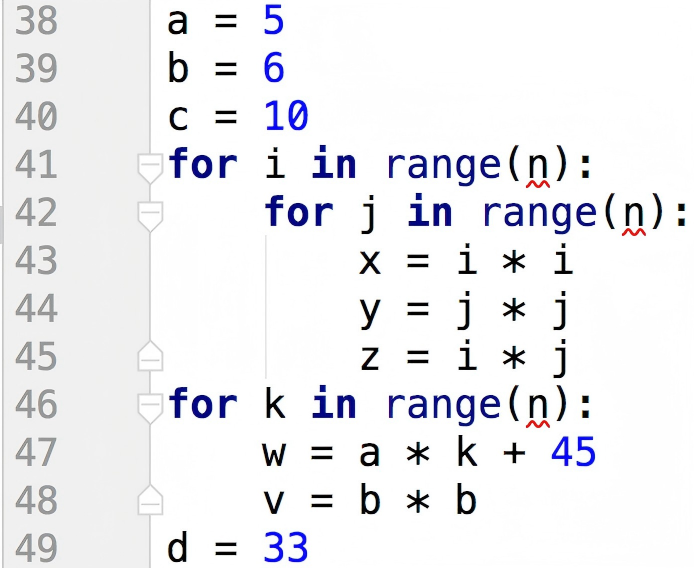

仅保留最高阶项 $n^2$ ，去掉所有系数数量级为 $O(n^2)$
### 其它算法复杂度表示法
#### 大O表示法
表示了所有上限中最小的那个上限
#### 大𝛀表示法
表示了所有下限中最大的那个下限  
$f(n)=\Omega(g(n))$ 当且仅当 $g(n)=O(f(n))$
#### 大𝚹表示法
如果上下限相同，那么就可以用大 $\Theta$ 表示  
$f(n)=\Theta(g(n))$ 当且仅当 $f(n)=O(g(n))$ 且 $f(n)=\Omega(g(n))$
## “变位词”判断问题
### 问题描述
所谓“变位词”是指两个词之间存在组成字母的重新排列关系，如：heart和earth，python和typhon

为了简单起见，假设参与判断的两个词仅由小写字母构成，而且长度相等
### 解题目标
写一个bool函数，以两个词作为参数，返回这两个词是否变位词
### 解法1-逐字检查
#### 解法思路
将词1中的字符逐个到词2中检查是否存在，存在就“打勾”标记（防止重复检查）  
如果每个字符都能找到，则两个词是变位词只要有1个字符找不到，就不是变位词
#### 程序技巧
实现“打勾”标记：将词2对应字符设为None。由于字符串是不可变类型，需要先复制到列表中
#### 具体程序
```Python
def anagramSolution1(s1,s2):
    alist = list(s2)
    pos1 = 0
    stillOK = True
    while pos1 < len(s1) and stillOK:
        pos2 = 0
        found = False
        while pos2 < len(alist) and not found:
            if s1[pos1] == alist[pos2]:
                found = True
            else:
                pos2 += 1
        if found:
            alist[pos2] = None
        else:
            stillOK = False
        pos1 += 1
    return stillOK
```
#### 算法分析
**问题规模**：词中包含的字符个数n  
主要部分在于两重循环：外层循环遍历s1每个字符，将内层循环执行n次，而内层循环在s2中查找字符，每个字符的对比次数，分别是1、2…n中的一个，而且各不相同  
所以总执行次数是1+2+3+……+n  
可知其数量级为 $O(n^2)$
### 解法2-排序比较
#### 解题思路
将两个字符串都按照字母顺序排好序，再逐个字符对比是否相同  
如果相同则是变位词，有任何不同就不是变位词
#### 具体程序
```Python
def anagramSolution2(s1, s2):
    alist1 = list(s1)
    alist2 = list(s2)
    alist1.sort()
    alist2.sort()
    pos = 0
    matches = True
    while pos < len(s1) and matches:
        if alist1[pos] == alist2[pos]:
            pos += 1
        else:
            matches = False
    return matches
```
#### 算法分析
粗看上去，本算法只有一个循环，最多执行n次，数量级是 $O(n)$  
但循环前面的两个sort并不是无代价的  
如果查询下后面的章节，会发现排序算法采用不同的解决方案，其运行时间数量级差不多是 $O(n^2)$ 或者 $O(nlog(n))$ ，大过循环的 $O(n)$  
所以本算法时间主导的步骤是排序步骤  
本算法的运行时间数量级就等于排序过程的数量级 $O(nlog(n))$
### 解法3-暴力法
#### 解题思路
穷尽所有可能组合  
将s1中出现的字符进行全排列，再查看s2是否出现在全排列列表中  
这里最大困难是产生s1所有字符的全排列  
根据组合数学的结论，如果n个字符进行全排列，其所有可能的字符串个数为 $n!$  
已知 $n!$ 的增长速度甚至超过 $2^n$

结论：暴力法恐怕不能算是个好算法
### 解法4-计数比较
#### 解题思路
对比两个词中每个字母出现的次数，如果26个字母出现的次数都相同的话，这两个字符串就一定是变位词
#### 具体做法
为每个词设置一个26位的计数器，先检查每个词，在计数器中设定好每个字母出现的次数  
计数完成后，进入比较阶段，看两个字符串的计数器是否相同，如果相同则输出是变位词的结论
#### 具体程序
```Python
def anagramSolution4(s1, s2):
    c1 = [0] * 26
    c2 = [0] * 26
    for i in range(len(s1)):
        pos = ord(s1[i]) - ord('a')
        c1[pos] += 1
    for i in range(len(s2)):
        pos = ord(s2[i]) - ord('a')
        c2[pos] += 1
    j = 0
    stillOK = True
    while j < 26 and stillOK:
        if c1[j] == c2[j]:
            j += 1
        else:
            stillOK = False
    return stillOK
```
#### 算法分析
计数比较算法中有3个循环迭代，但不像解法1那样存在嵌套循坏

前两个循环用于对字符串进行计数，操作次数等于字符串长度n  
第3个循环用于计数器比较，操作次数总是26次  
所以总操作次数 $T(n)=2n+26$ ，其数量级为 $O(n)$

这是一个线性数量级的算法，是4个变位词判断算法中性能最优的

> 注意：本算法依赖于两个长度为26的计数器列表，来保存字符计数，这相比前3个算法需要更多的存储空间  
> 如果考虑由大字符集构成的词（如中文具有上万不同字符），还会需要更多存储空间。
> 牺牲存储空间来换取运行时间，或者相反，这种在时间空间之间的取舍和权衡，在选择问题解法的过程中经常会出现。
## Python数据类型的性能
### 对比list和dict的操作

类型|list|dict
---|---|---
索引|自然数i|不可变类型值key
添加|append、extend、insert|b[k]=v
删除|pop、remove*|pop
更新|a[i]=v|b[k]=v
正查|a[i]、a[i:j]|b[k]、copy
反查|index(v)、count(v)|无
其他|reverse、sort|has_key、update

### list数据类型
让最常用的操作性能最好，牺牲不太常用的操作
> 80/20准则：80%的功能其使用率只有20%
#### 常用操作性能
最常用的是：按索引取值和赋值（v=a[i]，a[i]=v）

> 由于列表的随机访问特性，这两个操作执行时间与列表大小无关，均为$O(1)$

另一个是列表增长，可以选择append()和__add__()“+”

> `lst.append(v)`，执行时间是$O(1)$
> `lst= lst+ [v]`，执行时间是$O(n+k)$，其中k是被加的列表长度

#### 4种生成前n个整数列表的方法
首先是循环连接列表（+）方式生成
```Python
def test1():
    l = []
    for i in range(1000):
        l += [i]
```
然后是用append方法添加元素生成
```Python
def test2():
    l = []
    for i in range(1000):
        l.append(i)
```
接着用列表推导式来做
```Python
def test3():
    l = [i for i in range(1000)]
```
最后是range函数调用转成列表
```Python
def test4():
    l = list(range(1000))
```
#### 使用timeit模块对函数计时
创建一个Timer对象，指定需要反复运行的语句和只需要运行一次的“安装语句”  
然后调用这个对象的timeit方法，其中可以指定反复运行多少次
```Python
from timeit import Timer
t1 = Timer('test1()', 'from __main__ import test1')
print(f'contact {t1.timeit(number=1000)} seconds\n')   

t2 = Timer('test2()', 'from __main__ import test2')
print(f'append {t2.timeit(number=1000)} seconds\n')

t3 = Timer('test3()', 'from __main__ import test3')
print(f'comprehension {t3.timeit(number=1000)} seconds\n')

t4 = Timer('test4()', 'from __main__ import test4')
print(f'list range {t4.timeit(number=1000)} seconds\n')
```
```
contact 0.043239699909463525 seconds

append 0.018909000093117356 seconds

comprehension 0.013164800126105547 seconds

list range 0.008927199989557266 seconds
```
可以看到，4种方法运行时间差别很大。列表连接（contact）最慢，list range最快，
#### List基本操作的大O数量级

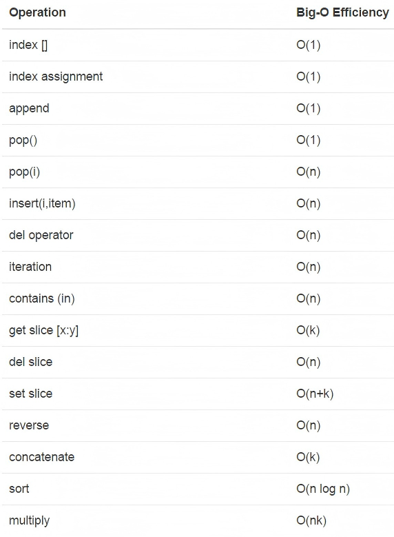

#### list.pop的计时试验
注意到pop这个操作
- `pop()`从列表末尾移除元素， $O(1)$
- `pop(i)`从列表中部移除元素， $O(n)$

**原因在于Python所选择的实现方法**  
从中部移除元素的话，要把移除元素后面的元素全部向前挪位复制一遍，这个看起来有点笨拙，但这种实现方法能够保证列表按索引取值和赋值的操作很快，达到 $O(1)$ 

**为了验证表中的大O数量级，我们把两种情况下的pop操作来实际计时对比**  
相对同一个大小的list，分别调用`pop()`和`pop(0)`

**对不同大小的list做计时，期望的结果是**  
`pop()`的时间不随list大小变化，`pop(0)`的时间随着list变大而变长

我们通过改变列表的大小来测试两个操作的增长趋势
```Python
import timeit
popzero = timeit.Timer('x.pop(0)', 'from __main__ import x')
popend = timeit.Timer('x.pop()', 'from __main__ import x')
print('pop(0)    pop()')
for i in range(1000000,100000001,1000000):
    x = list(range(i))
    pt = popend.timeit(number=1000)
    pz = popzero.timeit(number=1000)
    print(f'{pz:7.5f}   {pt:7.5f}')
```
```
pop(0)    pop()
0.35184   0.00002
0.71082   0.00002
1.04331   0.00002
1.39212   0.00003
1.74167   0.00002
2.22155   0.00002
···
```
### dict数据类型
**字典与列表不同，根据关键码（key）找到数据项，而列表是根据位置（index）**  
最常用的取值get和赋值set，其性能为 $O(1)$  
另一个重要操作contains(in)是判断字典中是否存在某个关键码（key），这个性能也是 $O(1)$
#### list和dict的in操作对比
**设计一个性能试验来验证list中检索一个值，以及dict中检索一个值的计时对比**  
生成包含连续值的list和包含连续关键码key的dict，用随机数来检验操作符in的耗时
```Python
import timeit
import random
for i in range(10000,1000001,20000):
    t = timeit.Timer(f'random.randrange({i}) in x', 'from __main__ import random, x')
    x = list(range(i))
    lst_time = t.timeit(number=1000)
    x = {j:None for j in range(i)}
    d_time = t.timeit(number=1000)
    print(f'{i},{lst_time:11.5f},{d_time:11.5f}')
```
```
···
510000,    1.16319,    0.00045
530000,    1.18504,    0.00045
550000,    1.24642,    0.00050
570000,    1.27892,    0.00051
590000,    1.30099,    0.00050
610000,    1.35568,    0.00052
630000,    1.42419,    0.00051
···
```
可见字典的执行时间与规模无关，是常数（在 0.0001x 秒级别）  
而列表的执行时间则随着列表的规模加大而线性上升
# 基本结构
## 什么是线性结构
**线性结构是一种有序数据项的集合，其中每个数据项都有*唯一*的前驱和后继**  
除了第一个没有前驱，最后一个没有后继  
新的数据项加入到数据集中时，只会加入到原有某个数据项之前或之后具有这种性质的数据集，就称为***线性结构***

线性结构总有两端，在不同的情况下，两端的称呼也不同，有时候称为“左”“右”端、“前”“后”端、“顶”“底”端

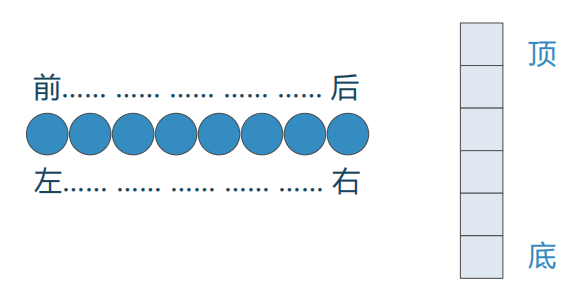

**两端的称呼并不是关键，不同线性结构的关键区别在于数据项增减的方式**  
有的结构只允许数据项从一端添加，而有的结构则允许数据项从两端移除

**我们从4个最简单但功能强大的结构入手，开始研究数据结构**  

***栈Stack，队列Queue，双端队列Deque和列表List***

这些数据集的共同点在于，数据项之间只存在先后的次序关系，都是线性结构
## 栈抽象数据类型及Python实现
### 什么是栈Stack
**一种有次序的数据项集合，在栈中，数据项的加入和移除都仅发生在同一端**  
这一端叫栈“顶top”，另一端叫栈“底base”

日常生活中有很多栈的应用，包括盘子、托盘、书堆等等

**距离栈底越近的数据项，留在栈中的时间就越长**  
而最新加入栈的数据项会被最先移除

**这种次序通常称为“后进先出LIFO”：Last in First out**  
这是一种基于数据项保存时间的次序，时间越短的离栈顶越近，而时间越长的离栈底越近
### 抽象数据类型Stack
抽象数据类型“栈”是一个有次序的数据集，每个数据项仅从“栈顶”一端加入到数据集中、从数据集中移除，栈具有后进先出LIFO的特性

**抽象数据类型“栈”定义为如下的操作**
- `Stack()`：创建一个空栈，不包含任何数据项
- `push(item)`：将item加入栈顶，无返回值
- `pop()`：将栈顶数据项移除，并返回，栈被修改
- `peek()`：“窥视”栈顶数据项，返回栈顶的数据项但不移除，栈不被修改
- `isEmpty()`：返回栈是否为空栈
- `size()`：返回栈中有多少个数据项

#### 操作样例
Stack Operation|Stack Contents|Return Value
---|---|---
s = Stack()|[]|Stack object
s.isEmpty|[]|True
s.push(4)|[4]|
s.push('dog')|[4, 'dog']|
s.peek()|[4, 'dog']|'dog'
s.push(True)|[4, 'dog', True]|
s.size()|[4, 'dog', True]|3
s.isEmpty()|[4, 'dog', True]|False
s.push(8.4)|[4, 'dog', True, 8.4]|
s.pop()|[4, 'dog', True]|8.4
s.pop()|[4, 'dog']|True
s.size()|[4, 'dog']|2

### 用Python实现ADT(Abstract Data Type) Stack
**Python的面向对象机制，可以用来实现用户自定义类型**  
将ADT Stack的操作实现为Class的方法  
由于Stack是一个数据集，所以可以采用Python的原生数据集来实现，我们选用最常用的数据集list来实现
```Python
class Stack:
    def __init__(self):
        self.items = []
    def isEmpty(self):
        return self.items == []
    def push(self, item):
        self.items.append(item)
    def pop(self):
        return self.items.pop()
    def peek(self):
        return self.items[len(self.items) - 1]
    def size(self):
        return len(self.items)
```
见[Stack.py](./code/栈/Stack.py)
## 栈的应用：简单括号匹配
**括号的使用必须遵循 “平衡”规则**
首先，每个开括号要恰好对应一个闭括号；其次，每对开闭括号要正确的嵌套
- 正确的括号：(()()()())，(((())))，(()((())()))
- 错误的括号：((((((())，()))，(()()(()

对括号是否正确匹配的识别，是很多语言编译器的基础算法
### 构造括号匹配识别算法
从左到右扫描括号串，最新打开的左括号，应该匹配最先遇到的右括号。这样，第一个左括号（最早打开），就应该匹配最后一个右括号（最后遇到）  
这种次序反转的识别，正好符合栈的特性
### 具体程序
```Python
from Stack import Stack
def parChecker(symbolString):
    s = Stack()
    balanced = True
    index = 0
    while index < len(symbolString) and balanced:
        symbol = symbolString[index]
        if symbol == '(':
            s.push(symbol)
        else:
            if s.isEmpty():
                balanced = False
            else:
                s.pop()
        index += 1
    if balanced and s.isEmpty():
        return True
    else:
        return False
print(parChecker('((()))'))     # True
print(parChecker('((()()()'))   # False
```
### 更多种括号的匹配
下面这些是匹配的
{ { ( [ ] [ ] ) } ( ) }，  
[ [ { { ( ( ) ) } } ] ]，  
[ ] [ ] [ ] ( ) { }

下面这些是不匹配的
( [ ) ]，   
( ( ( ) ] ) )，  
[ { ( ) ]
### 程序修改
```Python
from Stack import Stack
def parChecker(symbolString):
    s = Stack()
    balanced = True
    index = 0
    while index < len(symbolString) and balanced:
        symbol = symbolString[index]
        if symbol in '([{':
            s.push(symbol)
        else:
            if s.isEmpty():
                balanced = False
            else:
                top = s.pop()
                if not matches(top,symbol):
                    balanced = False
        index += 1
    if balanced and s.isEmpty():
        return True
    else:
        return False
def matches(open,close):
    opens = '([{'
    closes = ')]}'
    return opens.index(open) == closes.index(close)
print(parChecker('{{([][])}()}'))   # True
print(parChecker('[{(}]'))          # False
```
## 栈的应用：十进制转换为二进制
**所谓的“进制”，就是用多少个字符来表示整数**  
十进制是0～9这十个数字字符，二进制是0、1两个字符

**我们经常需要将整数在二进制和十进制之间转换**  
如： $(233)_{10}$ 的对应二进制数为 $(11101001)_2$ ，具体是这样：  

$(233)_{10}=2×10^2+3×10^1+3×10^0$  
$(11101001)_2=1×2^7+1×2^6+1×2^5+0×2^4+1×2^3+0×2^2+0×2^1+1×2^0$

**十进制转换为二进制，采用的是“除以2求余数”的算法**  
将整数不断除以2，每次得到的余数就是由低到高的二进制位

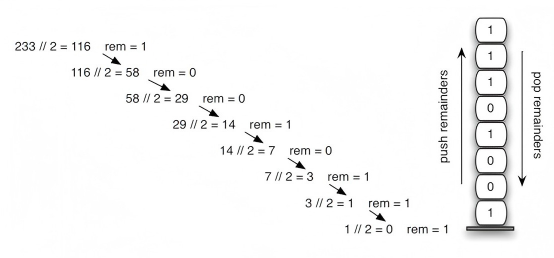

“除以2”的过程，得到的余数是从低到高的次序，而输出则是从高到低，所以需要一个栈来反转次序
### 具体程序
```Python
from Stack import Stack
def divideBy2(decNumber):
    remstack = Stack()
    while decNumber > 0:
        rem = decNumber % 2
        remstack.push(rem)
        decNumber = decNumber // 2
    binString = ''
    while not remstack.isEmpty():
        binString += str(remstack.pop())
    return binString
print(divideBy2(42))    # 101010
```
### 扩展到更多进制转换
**十进制转换为二进制的算法，很容易可以扩展为转换到任意N进制**  
只需要将“除以2求余数”算法改为“除以N求余数”算法就可以

**计算机中另外两种常用的进制是八进制和十六进制**  
$(233)\_{10}$ 等于 $(351)_8$ 和 $(E9)_{16}$  
$(351)_8=3×8^2+5×8^1+1×8^0$  
$(E9)_{16}=14×16^1+9×16^0$  

**主要的问题是如何表示八进制及十六进制**  
二进制有两个不同数字0、1  
十进制有十个不同数字0、1、2、3、4、5、6、7、8、9  
八进制可用八个不同数字0、1、2、3、4、5、6、7  
十六进制的十六个不同数字则是0、1、2、3、4、5、6、7、8、9、A、B、C、D、E、F
### 程序修改
```Python
from Stack import Stack
def baseConverter(decNumber,base):
    digits = '0123456789ABCDEF'
    remstack = Stack()
    while decNumber > 0:
        rem = decNumber % base
        remstack.push(rem)
        decNumber = decNumber // base
    newString = ''
    while not remstack.isEmpty():
        newString += digits[remstack.pop()]
    return newString
print(baseConverter(25,2))  # 11001
print(baseConverter(25,16)) # 19
```
## 表达式转换
### 中缀表达式
我们通常看到的表达式象这样：B*C，很容易知道这是B乘以C  
这种操作符（operator）介于操作数（operand）中间的表示法，称为“中缀”表示法

**但有时候中缀表示法会引起混淆，如“A+B\*C”**  
是A+B然后再乘以C
还是B\*C然后再去加A？
### 中缀表达式中的优先级
**人们引入了操作符“优先级”的概念来消除混淆**  
规定高优先级的操作符先计算  
相同优先级的操作符从左到右依次计算  
这样A+B*C就没有疑义是A加上B与C的乘积

**同时引入了括号来表示强制优先级，括号的优先级最高，而且在嵌套的括号中，内层的优先级更高**  
这样(A+B)*C就是A与B的和再乘以C
### 全括号中缀表达式
**虽然人们已经习惯了这种表示法，但计算机处理最好是能明确规定所有的计算顺序，这样无需处理复杂的优先规则**

**引入全括号表达式：在所有的表达式项两边都加上括号**  
A+B\*C+D，应表示为((A+(B\*C))+D)
### 前缀和后缀表达式
**如果将表达式中操作符的位置稍移动一下，例如中缀表达式A+B**  
将操作符移到前面，变为“+AB”  
或者将操作符移到最后，变为“AB+”

**我们就得到了表达式的另外两种表示法：“*前缀*”和“*后缀*”表示法**

这样A+B\*C将变为前缀的“+A\*BC”，后缀的“ABC\*+”
### 前缀、中缀和后缀表达式
再来看中缀表达式“(A+B)\*C”，按照转换的规则，前缀表达式是“\*+ABC”，而后缀表达式是“AB+C\*”

神奇的事情发生了，在中缀表达式里必须的括号，在前缀和后缀表达式中消失了？

在前缀和后缀表达式中，操作符的次序完全决定了运算的次序，不再有混淆

所以在很多情况下，表达式的计算机表示都避免用复杂的中缀形式

**下面看更多的例子**
中缀表达式|前缀表达式|后缀表达式
---|---|---
A + B * C + D|++ A * B C D|A B C * + D +
(A + B) * (C + D)|* + A B + C D|A B + C D + *
A * B + C * D|+ * A B * C D|A B * C D * +
A + B + C + D|+ + + A B C D|A B + C + D +

### 中缀表达式转换为前缀和后缀形式
无论表达式多复杂，需要转换成前缀或者后缀，只需要两个步骤
1. 将中缀表达式转换为全括号形式
2. 将所有的操作符移动到子表达式所在的左括号（前缀）或者右括号（后缀）处，替代之，再删除所有的括号
### 通用的中缀转后缀算法
**来看中缀表达式A+B\*C，其对应的后缀表达式是ABC\*+**  
操作数ABC的顺序没有改变  
操作符的出现顺序，在后缀表达式中反转了  
由于*的优先级比+高，所以后缀表达式中操作符的出现顺序与运算次序一致

**在中缀表达式转换为后缀形式的处理过程中，操作符比操作数要晚输出**  
所以在扫描到对应的第二个操作数之前，需要把操作符先保存起来  

**而这些暂存的操作符，由于优先级的规则，还有可能要反转次序输出**
在A+B\*C中，+虽然先出现，但优先级比后面这个\*要低，所以它要等\*处理完后，才能再处理  

**这种反转特性，使得我们考虑用*栈*来保存暂时未处理的操作符**

**再看看(A+B)\*C，对应的后缀形式是AB+C\***  
这里+的输出比\*要早，主要是因为括号使得+的优先级提升，高于括号之外的\*

**回顾“全括号”表达式，后缀表达式中操作符应该出现在左括号对应的右括号位置**  
所以遇到左括号，要标记下，其后出现的操作符优先级提升了，一旦扫描到对应的右括号，就可以马上输出这个操作符

**总结下，在从左到右扫描逐个字符扫描中缀表达式的过程中，采用一个栈来暂存未处理的操作符**  
**这样，栈顶的操作符就是最近暂存进去的，当遇到一个新的操作符，就需要跟栈顶的操作符比较下优先级，再行处理**
#### 流程
后面的算法描述中，约定中缀表达式是由空格隔开的一系列单词（token）构成，操作符单词包括*/+-()而操作数单词则是单字母标识符A、B、C等

**首先，创建空栈opstack用于暂存操作符，空表postfixList用于保存后缀表达式**  
**将中缀表达式转换为单词（token）列表**
> A+B\*C =split=> ['A', '+', 'B', '*', 'C']

**从左到右扫描中缀表达式单词列表**
- 如果单词是操作数，则直接添加到后缀表达式列表的末尾
- 如果单词是左括号“(”，则压入opstack栈顶
- 如果单词是右括号“)”，则反复弹出opstack栈顶操作符，加入到输出列表末尾，直到碰到左括号
- 如果单词是操作符“*/+-”，则压入opstack栈顶

但在压入之前，要比较其与栈顶操作符的优先级
> 如果栈顶的高于或等于它，就要反复弹出栈顶操作符，加入到输出列表末尾，直到栈顶的操作符优先级低于它

**中缀表达式单词列表扫描结束后，把opstack栈中的所有剩余操作符依次弹出，添加到输出列表末尾**  
**把输出列表再用join方法合并成后缀表达式字符串，算法结束**
### 具体程序
```Python
from Stack import Stack
def infixToPostfix(infixexpr):
    prec = {}
    prec['*'] = 3
    prec['/'] = 3
    prec['+'] = 2
    prec['-'] = 2
    prec['('] = 1
    opStack = Stack()
    postfixList = []
    tokenList = infixexpr.split()
    for token in tokenList:
        if token in 'ABCDEFGHIJKLMNOPQRSTUVWXYZ' or token in '0123456789':
            postfixList.append(token)
        elif token == '(':
            opStack.push(token)
        elif token == ')':
            topToken = opStack.pop()
            while topToken != '(':
                postfixList.append(topToken)
                topToken = opStack.pop()
        else:
            while (not opStack.isEmpty()) and (prec[opStack.pop()] >= prec[token]):
                postfixList.append(opStack.pop())
            opStack.push(token)
    while not opStack.isEmpty():
        postfixList.append(opStack.pop())
    return ' '.join(postfixList)
```
## 后缀表达式求值
跟中缀转换为后缀问题不同，在对后缀表达式从左到右扫描的过程中，由于操作符在操作数的后面，所以要暂存操作数，在碰到操作符的时候，再将暂存的两个操作数进行实际的计算
> 仍然是栈的特性：操作符只作用于离它最近的两个操作数
### 流程
- 创建空栈operandStack用于暂存操作数
- 将后缀表达式用split方法解析为单词（token）的列表
- 从左到右扫描单词列表
  - 如果单词是一个操作数，将单词转换为整数int，压入operandStack栈顶
  - 如果单词是一个操作符（*/+-），就开始求值，从栈顶弹出2个操作数，先弹出的是右操作数，后弹出的是左操作数，计算后将值重新压入栈顶
- 单词列表扫描结束后，表达式的值就在栈顶
- 弹出栈顶的值，返回
### 具体程序
```Python
from Stack import Stack
def postfixEval(postfixExpr):
    operandStack = Stack()
    tokenList = postfixExpr.split()
    for token in tokenList:
        if token in '0123456789':
            operandStack.push(int(token))
        else:
            operand2 = operandStack.pop()
            operand1 = operandStack.pop()
            result = doMath(token, operand1, operand2)
            operandStack.push(result)
    return operandStack.pop()
def doMath(op, op1, op2):
    if op == '*':
        return op1 * op2
    elif op == '/':
        return op1 / op2
    elif op == '+':
        return op1 + op2
    else:
        return op1 - op2
```
## 队列抽象数据类型及Python实现
### 什么是队列Queue
**队列是一种有次序的数据集合，其特征是**
- 新数据项的添加总发生在一端（通常称为“尾rear”端）
- 而现存数据项的移除总发生在另一端（通常称为“首front”端）

**当数据项加入队列，首先出现在队尾，随着队首数据项的移除，它逐渐接近队首**  
**新加入的数据项必须在数据集末尾等待，而等待时间最长的数据项则是队首**

这种次序安排的原则称为（FIFO:First-in first-out）先进先出，或“先到先服务first-come first-served”

队列的例子包括排队

**队列仅有一个入口和一个出口**  
不允许数据项直接插入队中，也不允许从中间移除数据项
### 计算机科学中队列的例子
#### 打印队列
一台打印机面向多个用户/程序提供服务

打印速度比打印请求提交的速度要慢得多

有任务正在打印时，后来的打印请求就要排成队列，以FIFO的形式等待被处理
#### 进程调度
操作系统核心采用多个队列来对系统中同时运行的进程进行调度

进程数远多于CPU核心数

有些进程还要等待不同类型I/O事件

调度原则综合了“先到先服务”及“资源充分利用”两个出发点
#### 键盘缓冲
键盘敲击并不马上显示在屏幕上

需要有个队列性质的缓冲区，将尚未显示的敲击字符暂存其中

队列的先进先出性质则保证了字符的输入和显示次序一致性
### 抽象数据类型Queue
**抽象数据类型Queue是一个有次序的数据集合**  
数据项仅添加到“尾rear”端，而且仅从“首front”端移除  
Queue具有FIFO的操作次序

**抽象数据类型Queue定义为如下操作**
- `Queue()`：创建一个空队列对象，返回值为Queue对象
- `enqueue(item)`：将数据项item添加到队尾，无返回值
- `dequeue()`：从队首移除数据项，返回值为队首数据项，队列被修改
- `isEmpty()`：测试是否空队列，返回值为布尔值
- `size()`：返回队列中数据项的个数
#### 操作样例
Queue Operation|Queue Contents|Return Value
---|---|---
q = Queue()|[]|Queue object
q.isEmpty()|[]|True
q.enqueue(4)|[4]|
q.enqueue('dog')|['dog', 4]|
q.enqueue(True)|[True, 'dog', 4]|
q.size()|[True, 'dog', 4]|3
q.isEmpty()|[True, 'dog', 4]|False
q.enqueue(8.4)|[8.4, True, 'dog', 4]|
q.dequeue()|[8.4, True, 'dog']|4
q.dequeue()|[8.4, True]|'dog'
q.size()|[8.4, True]|2

### 用Python实现ADT Queue
**采 用 List 来容纳Queue的数据项**
- 将List首端作为队列尾端
- List的末端作为队列首端
- enqueue()复杂度为O(n)
- dequeue()复杂度为O(1)

**首尾倒过来的实现，复杂度也倒过来**
```Python
class Queue:
    def __init__(self):
        self.items = []
    def isEmpty(self):
        return self.items == []
    def enqueue(self, item):
        self.items.insert(0, item)
    def dequeue(self):
        return self.items.pop()
    def size(self):
        return len(self.items)
```
见[Queue.py](./code/队列/Queue.py)
## 队列的应用：热土豆
### 热土豆问题（约瑟夫问题）
“击鼓传花”的土豆版本  
传烫手的热土豆，鼓声停的时候，手里有土豆的小孩就要出列

如果去掉鼓，改为传过固定人数，就成了“现代版”的约瑟夫问题
> 传说犹太人反叛罗马人，落到困境，约瑟夫和39人决定殉难，坐成一圈儿，报数1～7，报到7的人由旁边杀死，结果约瑟夫给自己安排了个位置，最后活了下来……
### 算法
用队列来实现热土豆问题的算法，参加游戏的人名列表，以及传土豆次数num，算法返回最后剩下的人名

模拟程序采用队列来存放所有参加游戏的人名，按照传递土豆方向从队首排到队尾

游戏时，队首始终是持有土豆的人  
模拟游戏开始，只需要将队首的人出队，随即再到队尾入队，算是土豆的一次传递  
传递了num次后，将队首的人移除，不再入队  

如此反复，直到队列中剩余1人
### 具体程序
```Python
from Queue import Queue
def hotPotato(namelist, num):
    simqueue = Queue()
    for name in namelist:
        simqueue.enqueue(name)
    while simqueue.size() > 1:
        for i in range(num):
            simqueue.enqueue(simqueue.dequeue())
        simqueue.dequeue()
    return simqueue.dequeue()
print(hotPotato(['Bill', 'David', 'Susan', 'Jane', 'Kent', 'Brad'],7)) # Susan
```
## 队列的应用：打印任务
多人共享一台打印机，采取“先到先服务”的队列策略来执行打印任务  
在这种设定下，首要的问题就是
- 这种打印作业系统的容量有多大？
- 在能够接受的等待时间内，系统能容纳多少用户以多高频率提交多少打印任务？

**一个具体的实例配置如下：**  
一个实验室，在任意的一个小时内，大约有10名学生在场，这一小时中，每人会发起2次左右的打印，每次120页

**打印机的性能是：**
- 以草稿模式打印的话，每分钟10页
- 以正常模式打印的话，打印质量好，但速度下降为每分钟5页

**问题是：怎么设定打印机的模式，让大家都不会等太久的前提下尽量提高打印质量？**

这是一个典型的决策支持问题，但无法通过规则直接计算

我们要用一段程序来模拟这种打印任务场景，然后对程序运行结果进行分析，以支持对打印机模式设定的决策
### 问题建模
**对象：打印任务、打印队列、打印机**
- 打印任务的属性：提交时间、打印页数
- 打印队列的属性：具有FIFO性质的打印任务队列
- 打印机的属性：打印速度、是否忙

**过程：生成和提交打印任务**
- 确定生成概率：实例为每小时会有10个学生提交的20个作业，这样，概率是每180秒会有1个作业生成并提交，概率为每秒1/180
- 确定打印页数：实例是1~20页，那么就是1~20页之间概率相同

**过程：实施打印**
- 当前的打印作业：正在打印的作业
- 打印结束倒计时：新作业开始打印时开始倒计时，回0表示打印完毕，可以处理下一个作业

**模拟时间：**
- 统一的时间框架：以最小单位（秒）均匀流逝的时间，设定结束时间
- 同步所有过程：在一个时间单位里，对生成打印任务和实施打印两个过程各处理一次
### 模拟流程
**创建打印队列对象**

**时间按照秒的单位流逝**  
按照概率生成打印作业，加入打印队列
- 如果打印机空闲，且队列不空，则取出队首作业打印，记录此作业等待时间
- 如果打印机忙，则按照打印速度进行1秒打印
- 如果当前作业打印完成，则打印机进入空闲

**时间用尽，开始统计平均等待时间**

**作业的等待时间**  
- 生成作业时，记录生成的时间戳
- 开始打印时，当前时间减去生成时间即可

**作业的打印时间**  
生成作业时，记录作业的页数开始打印时，页数除以打印速度即可
### 具体程序
见[打印任务.py](./code/队列/打印任务.py)
## 双端队列抽象数据类型及Python实现
### 什么是双端队列Deque
**双端队列Deque是一种有次序的数据集**，跟队列相似，其两端可以称作“首”“尾”端，但deque中数据项既可以从队首加入，也可以从队尾加入；数据项也可以从两端移除    
某种意义上说，双端队列集成了栈和队列的能力

**但双端队列并不具有内在的LIFO或者FIFO特性**  
如果用双端队列来模拟栈或队列，需要由使用者自行维护操作的一致性

### 抽象数据类型Deque
**抽象数据类型“双端队列”定义为如下的操作**
- `Deque()`：创建一个空双端队列
- `addFront(item)`：将item加入队首
- `addRear(item)`：将item加入队尾
- `removeFront()`：从队首移除数据项，返回值为移除的数据项
- `removeRear()`：从队尾移除数据项，返回值为移除的数据项
- `isEmpty()`：返回deque是否为空
- `size()`：返回deque中有包含数据项的个数
### 操作样例
Deque Operation|Deque Contents|Return Value
---|---|---
d = Deque()|[]|Deque object
d.isEmpty()|[]|True
d.addRear(4)|[4]|
d.addRear('dog')|['dog', 4]|
d.addFront('cat')|['dog', 4, 'cat']|
d.addFront(True)|['dog', 4, 'cat', True]|
d.size()|['dog', 4, 'cat', True]|4
d.isEmpty()|['dog', 4, 'cat', True]|False
d.addRear(8.4)|[8.4, 'dog', 4, 'cat', True]|
d.removeRear()|['dog', 4, 'cat', True]|8.4
d.removeFront()|['dog', 4, 'cat']|True
### Python实现ADT Deque
**采用List实现**
- List下标0作为deque的尾端
- List下标-1作为deque的首端

**操作复杂度**
- addFront/removeFront O(1)
- addRear/removeRear O(n)
```Python
class Deque:
    def __init__(self):
        self.items = []
    def isEmpty(self):
        return self.items == []
    def addFront(self, item):
        self.items.append(item)
    def addRear(self, item):
        self.items.insert(0, item)
    def removeFront(self):
        return self.items.pop()
    def removeRear(self):
        return self.items.pop(0)
    def size(self):
        return len(self.items)
```
### “回文词”判定
**“回文词”指正读和反读都一样的词**  
如radar、madam、toot  
中文“上海自来水来自海上”“山东落花生花落东山”

**用双端队列很容易解决“回文词”问题**  
- 先将需要判定的词从队尾加入deque
- 再从两端同时移除字符判定是否相同，直到deque中剩下0个或1个字符
```Python
from Deque import Deque
def palchecker(aString):
    chardeque = Deque()
    for ch in aString:
        chardeque.addRear(ch)
    stillEqual = True
    while chardeque.size() > 1 and stillEqual:
        first = chardeque.removeFront()
        last = chardeque.removeRear()
        if first != last:
            stillEqual = False
    return stillEqual
```
见[“回文词”判定.py](./code/双端队列/“回文词”判定.py)
## 无序表抽象数据类型及Python实现
### 什么是列表List
**列表List是一种简单强大的数据集结构，提供了丰富的操作接口**  
> 但并不是所有的编程语言都提供了List数据类型，有时候需要程序员自己实现

**一种数据项按照相对位置存放的数据集**  
特别的，被称为“无序表unordered list”，其中数据项只按照存放位置来索引，如第1个、第2个……、最后一个等
>为了简单起见，假设表中不存在重复数据项

如一个考试分数的集合“54, 26, 93, 17,77和31”  
如果用无序表来表示，就是[54, 26, 93,17, 77, 31]
### 抽象数据类型无序表UnorderedList
**抽象数据类型“无序表”定义为如下的操作**
- `UnorderedList()`：创建一个空无序表
- `add(item)`：添加一个数据项到列表中，假设item原先不存在于列表中
- `remove(item)`：从列表中移除item，列表被修改，item原先应存在于表中
- `search(item)`：在列表中查找item，返回布尔类型值
- `isEmpty()`：返回列表是否为空
- `size()`：返回列表包含了多少数据项
- `append(item)`：添加一个数据项到表末尾，假设item原先不存在于列表中
- `index(item)`：返回数据项在表中的位置
- `insert(pos, item)`：将数据项插入到位置pos，假设item原先不存在与列表中，同时原列表具有足够多个数据项，能让item占据位置pos
- `pop()`：从列表末尾移除数据项，假设原列表至少有1个数据项
- `pop(pos)`：移除位置为pos的数据项，假设原列表存在位置pos
### 采用链表实现无序表
**为了实现无序表数据结构，可以采用链接表的方案**

**虽然列表数据结构要求保持数据项的前后相对位置，但这种前后位置的保持，并不要求数据项依次存放在连续的存储空间**

**如下图，数据项存放位置并没有规则，但如果在数据项之间建立链接指向，就可以保持其前后相对位置**


第一个和最后一个数据项需要显式标记出来，一个是队首，一个是队尾，后面再无数据了
### 链表实现：节点Node
**链表实现的最基本元素是节点Node**  
每个节点至少要包含2个信息：数据项本身，以及指向下一个节点的引用信息
> 注意next为None的意义是没有下一个节点了，这个很重要

#### 具体程序
```Python
class Node:
    def __init__(self, initdata):
        self.data = initdata
        self.next = None
    def getData(self):
        return self.data
    def getNext(self):
        return self.next
    def setData(self, newdata):
        self.data = newdata
    def setNext(self, newnext):
        self.next = newnext
```
### 链表实现：无序表UnorderedList
**可以采用链接节点的方式构建数据集来实现无序表**

**链表的第一个和最后一个节点最重要**  
如果想访问到链表中的所有节点，就必须从第一个节点开始沿着链接遍历下去  

**所以无序表必须要有对第一个节点的引用信息**  
设立一个属性head，保存对第一个节点的引用空表的head为None
```Python
class UnorderedList:
    def __init__(self):
        self.head = None
```
随着数据项的加入，无序表的head始终指向链条中的第一个节点
> 注意：无序表mylist对象本身并不包含数据项（数据项在节点中）

其中包含的head只是对首个节点Node的引用  
判断空表的isEmpty()很容易实现  
## 无序表的链表实现
### add
**接下来，考虑如何实现向无序表中添加数据项，实现add方法**  
由于无序表并没有限定数据项之间的顺序，新数据项可以加入到原表的任何位置  
按照实现的性能考虑，应添加到最容易加入的位置上 

**由链表结构我们知道，要访问到整条链上的所有数据项，都必须从表头head开始沿着next链接逐个向后查找**  
**所以添加新数据项最快捷的位置是表头，整个链表的首位置**
```Python
def add(self, item):
    temp = Node(item)
    temp.setNext(self.head)
    self.head = temp
```
### size
**size：从链条头head开始遍历到表尾同时用变量累加经过的节点个数**
```Python
def size(self):
    current = self.head
    count = 0
    while current is not None:
        count += 1
        current = current.getNext()
    return count
```
### search
**从链表头head开始遍历到表尾，同时判断当前节点的数据项是否目标**
```Python
def search(self, item):
    current = self.head
    found = False
    while current is not None and not found:
        if current.getData() == item:
            found = True
        else:
            current = current.getNext()
    return found
```
### remove(item)
**首先要找到item，这个过程跟search一样，但在删除节点时，需要特别的技巧**  
current指向的是当前匹配数据项的节点，而删除需要把前一个节点的next指向current的下一个节点，所以我们在search current的同时，还要维护前一个(previous)节点的引用

找到item之后，current指向item节点，previous指向前一个节点，开始执行删除，需要区分两种情况：
- current是首个节点
- 或者是位于链条中间的节点
```Python
def remove(self, item):
    current = self.head
    previous = None
    found = False
    while not found:
        if current.getData() == item:
            found = True
        else:
            previous = current
            current = current.getNext()
    if previous is None:
        self.head = current.getNext()
    else:
        previous.setNext(current.getNext()) 
```
### 具体程序
见[UnorderedList.py](./code/无序表/UnorderedList.py)
## 有序表抽象数据类型及Python实现
### 什么是有序表OrderedList
**有序表是一种数据项依照其某可比性质（如整数大小、字母表先后）来决定在列表中的位置**  
越“小”的数据项越靠近列表的头，越靠“前”
### 抽象数据类型：有序表OrderedList
**抽象数据类型“有序表”定义为如下的操作**
- `OrderedList()`：创建一个空的有序表
- `add(item)`：在表中添加一个数据项，并保持整体顺序，此项原不存在
- `remove(item)`：从有序表中移除一个数据项，此项应存在，有序表被修改
- `search(item)`：在有序表中查找数据项，返回是否存在
- `isEmpty()`：是否空表
- `size()`：返回表中数据项的个数
- `index(item)`：返回数据项在表中的位置，此项应存在
- `pop()`：移除并返回有序表中最后一项，表中应至少存在一项
- `pop(pos)`：移除并返回有序表中指定位置的数据项，此位置应存在
### 有序表OrderedList实现
**在实现有序表的时候，需要记住的是，数据项的相对位置，取决于它们之间的“大小”比较**  
由于Python的扩展性，下面对数据项的讨论并不仅适用于整数，可适用于所有定义了__gt__方法（即'>'操作符）的数据类型

- 同样采用链表方法实现
- Node定义相同
- OrderedList也设置一个head来保存链表表头的引用
```Python
class OrderedList:
    def __init__(self):
        self.head = None
```
对于isEmpty/size/remove这些方法，与节点的次序无关 ， 所以其实现跟UnorderedList是一样的  
search/add方法则需要有修改
#### search(item)
**在*无序表*的search中，如果需要查找的数据项不存在，则会搜遍整个链表，直到表尾**  

**对于*有序表*来说，可以利用链表节点有序排列的特性，来为search节省不存在数据项的查找时间**  
一旦当前节点的数据项大于所要查找的数据项，则说明链表后面已经不可能再有要查找的数据项，可以直接返回False
```Python
def search(self, item):
    current = self.head
    found = False
    stop = False
    while current is not None and not found and not stop:
        if current.getData() == item:
            found = True
        else:
            if current.getData() > item:
                stop = True
            else:
                current = current.getNext()
    return found
```
#### add(item)
**相比无序表，改变最大的方法是add，因为add方法必须保证加入的数据项添加在合适的位置，以维护整个链表的有序性**

由于涉及到的插入位置是当前节点之前，而链表无法得到“前驱”节点的引用  
所以要跟remove方法类似，引入一个previous的引用，跟随当前节点current
```Python
def add(self, item):
    current = self.head
    previous = None
    stop = False
    while current is not None and not stop:
        if current.getData() > item:
            stop = True
        else:
            previous = current
            current = current.getNext()
    temp = Node(item)
    if previous is None:
        temp.setNext(self.head)
        self.head = temp
    else:
        temp.setNext(current)
        previous.setNext(temp)
```
见[OrderedList.py](./code/链表/OrderedList.py)
### 链表实现的算法分析
**对于链表复杂度的分析，主要是看相应的方法是否涉及到链表的遍历**  
对于一个包含节点数为n的链表  
- isEmpty是O(1)，因为仅需要检查head是否为None
- size是O(n)，因为除了遍历到表尾，没有其它办法得知节点的数量
- search/remove以及有序表的add方法，则是O(n)，因为涉及到链表的遍历，按照概率其平均操作的次数是n/2
- 无序表的add方法是O(1)，因为仅需要插入到表头

链表实现的List，跟Python内置的列表数据类型，在有些相同方法的实现上的时间复杂度不同  
主要是因为Python内置的列表数据类型是基于*顺序存储*来实现的，并进行了优化
# 递归动规
## 什么是递归
### 什么是递归Recursion
**递归是一种解决问题的方法，其精髓在于**  
将问题分解为规模更小的相同问题，持续分解，直到问题规模小到可以用非常简单直接的方式来解决  
递归的问题分解方式非常独特，其算法方面的明显特征就是：*在算法流程中调用自身*
### 初识递归：数列求和
**求和实际上最终是由一次次的加法实现的，而加法恰有2个操作数，这个是确定的**

看看怎么想办法，将问题规模较大的列表求和，分解为规模较小而且固定的2个数求和（加法）

**换个方式来表达数列求和：全括号表达式(1+(3+(5+(7+9))))**  
上面这个式子，最内层的括号(7+9)，这是无需循环即可计算的，实际上整个求和的过程是这样：  
$total = (1 + (3 + (5 + (7 + 9))))$  
$total = (1 + (3 + (5 + 16)))$  
$total = (1 + (3 + 21))$  
$total = (1 + 24)$  
$total = 25$

**观察上述过程中所包含的重复模式，可以把求和问题归纳成这样：**  
数列的和=“首个数”+“余下数列”的和
#### 具体程序
```Python
def listsum(numList):
    if len(numList) == 1:
        return numList[0]
    else:
        return numList[0] + listsum(numList[1:])
```
**上面程序的要点：**
1. 问题分解为更小规模的相同问题，并表现为“调用自身”
2. 对“最小规模”问题的解决：简单直接
### 递归“三定律”
1. 递归算法必须有一个基本结束条件（最小规模问题的直接解决）
2. 递归算法必须能改变状态向基本结束条件演进（减小问题规模）
3. 递归算法必须调用自身（解决减小了规模的相同问题）

数列求和问题首先具备了基本结束条件：  
**当列表长度为1的时候，直接输出所包含的唯一数**

数列求和处理的数据对象是一个列表，而基本结束条件是长度为1的列表，那递归算法就要改变列表并向长度为1的状态演进
## 递归的应用：任意进制转换
**用最熟悉的十进制分析下这个问题**

十进制有十个不同符号：convString = "0123456789"  
比十小的整数，转换成十进制，直接查表就可以了：convString[n]  
想办法把比十大的整数，拆成一系列比十小的整数，逐个查表  
比如七百六十九，拆成七、六、九，查表得到769就可以了

**所以，在递归三定律里，我们找到了“基本结束条件”，就是小于十的整数**  
拆解整数的过程就是向“基本结束条件”演进的过程

**我们用整数除，和求余数两个计算来将整数一步步拆开**  
除以“进制基base”（// base）  
对“进制基”求余数（% base）  

**问题就分解为：**
- 余数总小于“进制基base”，是“基本结束条件”，可直接进行查表转换
- 整数商成为“更小规模”问题，通过递归调用自身解决
### 具体代码
```Python
def toStr(n, base):
    convertString = '0123456789ABCDEF'
    if n < base:
        return convertString[n]
    else:
        return toStr(n//base,base) + convertString[n%base]
```
见[任意进制转换.py](./code/递归/任意进制转换.py)
## 递归调用的实现
**当一个函数被调用的时候，系统会把调用时的现场数据压入到系统调用栈**  
每次调用，压入栈的现场数据称为栈帧  
当函数返回时，要从调用栈的栈顶取得返回地址，恢复现场，弹出栈帧，按地址返回
### Python中的递归深度限制
在调试递归算法程序的时候经常会碰到这样的错误：RecursionError
> 递归的层数太多，系统调用栈容量有限

这时候要检查程序中是否忘记设置基本结束条件，导致无限递归，或者向基本结束条件演进太慢，导致递归层数太多，调用栈溢出

在Python内置的sys模块可以获取和调整最大递归深度

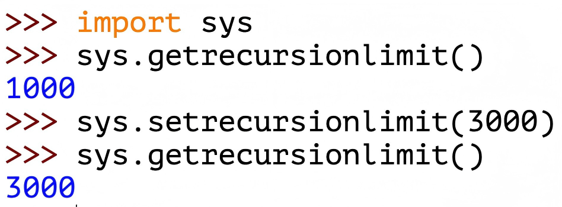

## 递归可视化：分形树
### 海龟作图
**下面我们通过递归作图来展现递归调用的视觉影像**

**Python的海龟作图系统turtle module**  
Python内置，随时可用，以LOGO语言的创意为基础，其意象为模拟海龟在沙滩上爬行而留下的足迹
- 爬行：`forward(n)`; `backward(n)`
- 转向：`left(a)`; `right(a)`
- 抬笔放笔：`penup()`; `pendown()`
- 笔属性：`pensize(s)`; `pencolor(c)`

```Python
import turtle
t = turtle.Turtle()
t.pencolor("red")
t.pensize(3)
def drawSpiral(t, lineLen):
    if lineLen > 0:
        t.forward(lineLen)
        t.right(90)
        drawSpiral(t, lineLen - 5)
drawSpiral(t, 100)
turtle.done()
```
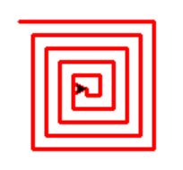

### 分形树：自相似递归图形
“一个粗糙或零碎的几何形状，可以分成数个部分，且每一部分都（至少近似地）是整体缩小后的形状”，即具有*自相似*的性质。”

**自然现象中所具备的分形特性，使得计算机可以通过分形算法生成非常逼真的自然场景**

**分形是在不同尺度上都具有相似性的事物**  
我们能看出一棵树的每个分叉和每条树枝，实际上都具有整棵树的外形特征（也是逐步分叉的）

**我们可以把树分解为三个部分：树干、左边的小树、右边的小树**  
分解后，正好符合递归的定义：*对自身的调用*
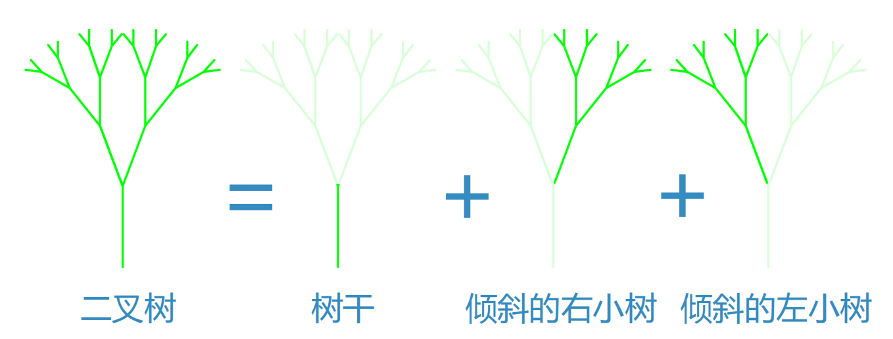
#### 具体程序
```Python
import turtle
def tree(t, branch_len):
    if branch_len > 5:
        t.forward(branch_len)
        t.right(20)
        tree(t, branch_len - 15)
        t.left(40)
        tree(t, branch_len - 15)
        t.right(20)
        t.backward(branch_len)
t = turtle.Turtle()
t.left(90)
t.penup()
t.backward(100)
t.pendown()
t.pencolor('green')
t.pensize(2)
tree(t, 75)
t.hideturtle()
turtle.done()
```
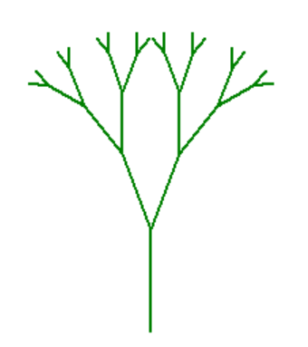
## 递归可视化：谢尔宾斯基三角形
### 谢尔宾斯基Sierpinski三角形
**分形构造，平面称谢尔宾斯基三角形，立体称谢尔宾斯基金字塔**  
实际上，真正的谢尔宾斯基三角形是完全不可见的，其面积为0，但周长无穷，是介于一维和二维之间的分数维（约1.585维）构造

**根据自相似特性，谢尔宾斯基三角形是由3个尺寸减半的谢尔宾斯基三角形按照品字形拼叠而成**  
由于我们无法真正做出谢尔宾斯基三角形（degree->∞），只能做degree有限的近似图形

**在degree有限的情况下，degree=n的三角形，是由3个degree=n-1的三角形按照品字形拼叠而成**  
同时，这3个degree=n-1的三角形边长均为degree=n的三角形的一半（规模减小）。  
当degree=0，则就是一个等边三角形，这是递归基本结束条件
#### 具体程序
```Python
import turtle
t = turtle.Turtle()
points = {                 
    'left':(-200, -100),
    'top':(0, 200),
    'right':(200, -100),
}
def drawTriangle(t, points, color):
    t.fillcolor(color)
    t.penup()
    t.goto(points['top'])
    t.pendown()
    t.begin_fill()
    t.goto(points['left'])
    t.goto(points['right'])
    t.goto(points['top'])
    t.end_fill()
def getMid(p1, p2):
    return (p1[0] + p2[0]) / 2, (p1[1] + p2[1]) / 2
def sierpinski(degree, points):
    colormap = ['blue', 'red', 'green', 'white','yellow', 'orange']
    drawTriangle(t, points, colormap[degree])
    if degree > 0:
        sierpinski(
            degree - 1,
            {'left': points['left'],
            'top': getMid(points['left'], points['top']),
            'right': getMid(points['left'], points['right']),})
        sierpinski(
            degree - 1,
            {'left': getMid(points['left'], points['top']),
            'top': points['top'],
            'right': getMid(points['top'], points['right']),})
        sierpinski(
            degree - 1,
            {'left': getMid(points['left'], points['right']),
            'top': getMid(points['top'], points['right']),
            'right': points['right'],})
sierpinski(5, points)
t.hideturtle()
turtle.done()
```

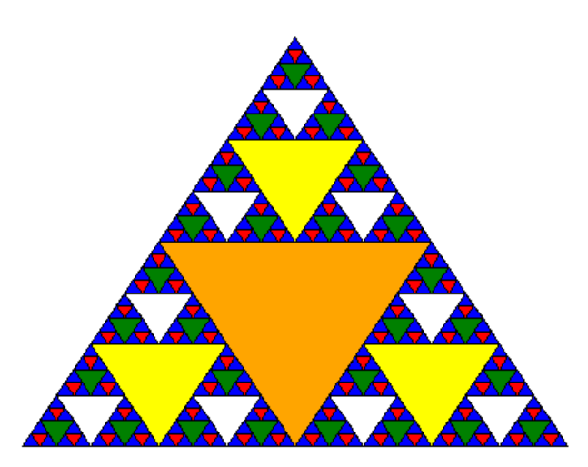

见[谢尔宾斯基三角形.py](./code/递归/谢尔宾斯基三角形.py)

## 递归的应用：汉诺塔
### 递归思路
**将盘片塔从开始柱，经由中间柱，移动到目标柱：**  
1. 首先将上层N-1个盘片的盘片塔，从开始柱，经由目标柱，移动到中间柱
2. 然后将第N个（最大的）盘片，从开始柱，移动到目标柱
3. 最后将放置在中间柱的N-1个盘片的盘片塔，经由开始柱，移动到目标柱

**基本结束条件，也就是最小规模问题是：**  
*1个盘片的移动问题*

### 具体程序
```Python
def moveTower(height, fromPole, withPole, toPole):
    if height >=1:
        moveTower(height-1, fromPole, toPole, withPole)
        moveDisk(height, fromPole, toPole)
        moveTower(height-1, withPole, fromPole, toPole)
def moveDisk(disk, fromPole,toPole):
    print(f'Moving disk[{disk}] from {fromPole} to {toPole}')
```
见[汉诺塔.py](./code/递归/汉诺塔.py)
## 递归的应用：探索迷宫
**将海龟放在迷宫中间，如何能找到出口**  

**首先，我们将整个迷宫的空间（矩形）分为行列整齐的方格，区分出墙壁和通道**  
给每个方格具有行列位置，并赋予“墙壁”、“通道”的属性
### 迷宫的数据结构
**考虑用矩阵方式来实现迷宫数据结构**  
采用“数据项为字符列表的列表”这种两级列表的方式来保存方格内容  
采用不同字符来分别代表“墙壁+”、“通道 ”、“海龟投放点S”  
从一个文本文件逐行读入迷宫数据

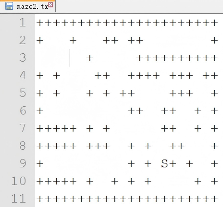

```Python
class Maze:
    def __init__(self, mazeFileName):
        rowsInMaze = 0
        columnsInMaze = 0
        self.mazelist = []
        mazeFile = open(mazeFileName, 'r')
        for line in mazeFile:
            rowList = []
            col = 0
            for ch in line[:-1]:
                rowList.append(ch)
                if ch == 'S':
                    self.startRow = rowsInMaze
                    self.startCol = col
                col += 1
            rowsInMaze += 1
            self.mazelist.append(rowList)
            columnsInMaze = len(rowList)
```
### 算法思路
**探索迷宫的递归算法思路如下：**
- 将海龟从原位置向北移动一步，以新位置递归调用探索迷宫寻找出口
- 如果上面的步骤找不到出口，那么将海龟从原位置向南移动一步，以新位置递归调用探索迷宫
- 如果向南还找不到出口，那么将海龟从原位置向西移动一步，以新位置递归调用探索迷宫
- 如果向西还找不到出口，那么将海龟从原位置向东移动一步，以新位置递归调用探索迷宫
- 如果上面四个方向都找不到出口，那么这个迷宫没有出口

**思路看起来很完美，但有些细节至关重要**  
如果我们向某个方向（如北）移动了海龟，那么如果新位置的北正好是一堵墙壁，那么在新位置上的递归调用就会让海龟向南尝试，可是新位置的南边一格，正好就是递归调用之前的原位置，这样就陷入了无限递归的死循环之中

**所以需要有个机制记录海龟所走过的路径**  
沿途洒“面包屑”，一旦前进方向发现“面包屑”，就不能再踩上去，而必须换下一个方向尝试  
对于递归调用来说，就是某方向的方格上发现“面包屑”，就立即从递归调用返回上一级

**递归调用的“基本结束条件”归纳如下：**
- 海龟碰到“墙壁”方格，递归调用结束，返回失败
- 海龟碰到“面包屑”方格，表示此方格已访问过，递归调用结束，返回失败
- 海龟碰到“出口”方格，即“位于边缘的通道”方格，递归调用结束，返回成功
- 海龟在四个方向上探索都失败，递归调用结束，返回失败

### 辅助的动画过程
**为了让海龟在迷宫图里跑起来，我们给迷宫数据结构Maze Class添加一些成员和方法**
- `t`：一个作图的海龟，设置其shape为海龟的样子（缺省是一个箭头）
- `drawMaze()`：绘制出迷宫的图形，墙壁用实心方格绘制
- `updatePosition(row, col, val)`：更新海龟的位置，并做标注
- `isExit(row, col)`：判断是否“出口”

```Python
def searchFrom(maze, startRow, startColumn):
    maze.updatePosition(startRow, startColumn)
    # 1. 碰到墙壁，返回失败
    if maze[startRow][startColumn] == OBSTACLE:
        return False
    # 2. 碰到面包屑，或者死胡同，返回失败
    if maze[startRow][startColumn] == TRIED or maze[startRow][startColumn] == DEAD_END:
        return False
    # 3. 碰到出口，返回成功
    if maze.isExit(startRow, startColumn):
        maze.updatePosition(startRow, startColumn, PART_OF_PATH)
        return True
    # 4. 撒一下面包屑，继续探索
    maze.updatePosition(startRow, startColumn, TRIED)
    # 向东南西北4个方向依次探索，or操作符具有短路效应
    found = searchFrom(maze, startRow - 1, startColumn) or \
            searchFrom(maze, startRow + 1, startColumn) or \
            searchFrom(maze, startRow, startColumn - 1) or \
            searchFrom(maze, startRow, startColumn + 1)
    # 如果探索成功，标记当前点，失败则标记为“死胡同”
    if found:
        maze.updatePosition(startRow, startColumn, PART_OF_PATH)
    else:
        maze.updatePosition(startRow, startColumn, DEAD_END)
    return found
```
见[迷宫.py](./code/递归/迷宫.py)
## 分治策略与递归
### 分治策略
**解决问题的典型策略：分而治之**  
将问题分为若干更小规模的部分  
通过解决每一个小规模部分问题，并将结果汇总得到原问题的解

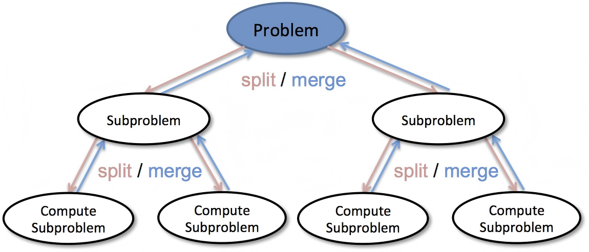

### 递归算法与分治策略
**递归三定律：**
1. 基本结束条件，解决最小规模问题
2. 缩小规模，向基本结束条件演进
3. 调用自身来解决已缩小规模的相同问题

**体现了分治策略**  
问题解决依赖于若干缩小了规模的问题汇总得到原问题的解

**应用相当广泛**  
排序、查找、遍历、求值等等
## 优化问题和贪心策略
### 优化问题
**计算机科学中许多算法都是为了找到某些问题的最优解**  
例如，两个点之间的最短路径；  
能最好匹配一系列点的直线；  
或者满足一定条件的最小集合
### 找零兑换问题
**一个经典案例是兑换最少个数的硬币问题**  
假设你为一家自动售货机厂家编程序，自动售货机要每次找给顾客最少数量硬币；  
假设某次顾客投进100\$纸币，买了37\$的东西，要找63\$，那么最少数量就是：2个quarter（25\$）、1个dime（10\$）和3个penny（1\$），一共6个
### 贪心策略解决找零兑换问题
**人们会采用各种策略来解决这些问题，例如最直观的“贪心策略”**  

**一般我们这么做：**  
从最大面值的硬币开始，用尽量多的数量  
有余额的，再到下一最大面值的硬币，还用尽量多的数量，一直到penny（1\$）为止
### 贪心策略Greedy Method
我们每次都试图解决问题的尽量大的一部分对应到兑换硬币问题，就是每次以最多数量的最大面值硬币来迅速减少找零面值

“贪心策略”解决找零兑换问题，在美元或其他货币的硬币体系下表现尚好
### 贪心策略失效
但如果你的老板决定把自动售货机出口到Elbonia，事情就会有点复杂（系列漫画Dilbert里杜撰的国家）

因为这个古怪的国家除了上面3种面值之外，还有一种【21\$】的硬币！

按照“贪心策略”，在Elbonia，63\$还是原来的6个硬币  
63\$ = 25\$\*2 + 10\$\*1 + 1\$\*3

但实际上最优解是3个面值21\$的硬币
63\$ = 21\$\*3

**“贪心策略”失效了**
## 找零兑换问题的递归解法
### 递归解法
**我们来找一种肯定能找到最优解的方法**  
贪心策略是否有效依赖于具体的硬币体系

首先是确定基本结束条件，兑换硬币这个问题最简单直接的情况就是，需要兑换的找零，其面值正好等于某种硬币
> 如找零25分，答案就是1个硬币

**其次是减小问题的规模，我们要对每种硬币尝试1次，例如美元硬币体系：**
- 找零减去1分(penny)后，求兑换硬币最少数量（递归调用自身）；
- 找零减去5分(nikel)后，求兑换硬币最少数量
- 找零减去10分(dime)后，求兑换硬币最少数量
- 找零减去25分(quarter)后，求兑换硬币最少数量

上述4项中选择最小的一个

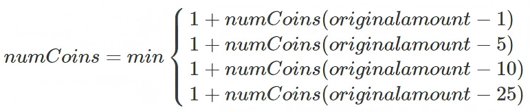

### 具体程序
```Python
def recMC(coinValueList, change):
    minCoins = change
    if change in coinValueList:
        return 1
    else:
        for i in [c for c in coinValueList if c <= change]:
            numCoins = 1 + recMC(coinValueList, change - i)
            if numCoins < minCoins:
                minCoins = numCoins
    return minCoins
```
见[找零兑换/递归解法.py](code/递归/找零兑换/递归解法.py)
### 递归解法分析
**递归解法虽然能解决问题，但其最大的问题是：*极其低效！***  
对63分的兑换硬币问题，需要进行67,716,925次递归调用！

**重复计算太多！**
### 递归解法改进
**改进的关键就在于消除重复计算**  
我们可以用一个表将计算过的中间结果保存起来，在计算之前查表看看是否已经计算过

**这个算法的中间结果就是部分找零的最优解，在递归调用过程中已经得到的最优解被记录下来**  
在递归调用之前，先查找表中是否已有部分找零的最优解
- 如果有，直接返回最优解而不进行递归调用
- 如果没有，才进行递归调用

### 改进程序
```Python
def recMC(coinValueList, change, knownResults):
    minCoins = change
    if change in coinValueList:
        knownResults[change] = 1
        return 1
    elif knownResults[change] > 0:
        return knownResults[change]
    else:
        for i in [c for c in coinValueList if c <= change]:
            numCoins = 1 + recMC(coinValueList, change - i, knownResults)
            if numCoins < minCoins:
                minCoins = numCoins
                knownResults[change] = numCoins
    return minCoins
```
见[找零兑换/递归解法改进.py](code/递归/找零兑换/递归解法改进.py)
## 找零兑换问题的动态规划解法
### 找零兑换：动态规划解法
**中间结果记录可以很好解决找零兑换问题**

**实际上，这种方法还不能称为动态规划，而是叫做“memoization（记忆化/函数值缓存）”的技术提高了递归解法的性能**

**动态规划算法采用了一种更有条理的方式来得到问题的解**  
找零兑换的动态规划算法从最简单的“1分钱找零”的最优解开始，逐步递加上去，直到我们需要的找零钱数  
在找零递加的过程中，设法保持每一分钱的递加都是最优解，一直加到求解找零钱数，自然得到最优解  

**递加的过程能保持最优解的关键是，其依赖于更少钱数最优解的简单计算，而更少钱数的最优解已经得到了**

问题的最优解包含了更小规模子问题的最优解，这是一个最优化问题能够用动态规划策略解决的必要条件

originalamount找零兑换问题具体来说就是：


**采用动态规划来解决11分钱的兑换问题**
从1分钱兑换开始，逐步建立一个兑换表

**计算11分钱的兑换法，我们做如下几步：**
- 首先减去1分硬币，剩下10分钱查表最优解是1
- 然后减去5分硬币，剩下6分钱查表最优解是2
- 最后减去10分硬币，剩下1分钱查表最优解是1

通过上述最小值得到最优解：2个硬币
### 具体程序
```Python
def dpMakeChange(coinValueList,change,minCoins):
    for cents in range(change+1):
        coinCount = cents
        for j in [c for c in coinValueList if c <= cents]:
            if minCoins[cents-j] + 1 < coinCount:
                coinCount = minCoins[cents-j]+1
        minCoins[cents] = coinCount
    return minCoins[change]
```
见[找零兑换/动态规划解法.py](code/递归/找零兑换/动态规划解法.py)
### 拓展
**注意到动态规划算法的dpMakeChange并不是递归函数**  
虽然这个问题是从递归算法开始解决，但最终我们得到一个更有条理的高效非递归算法

**动态规划中最主要的思想是：**  
从最简单情况开始到达所需找零的循环  
其每一步都依靠以前的最优解来得到本步骤的最优解，直到得到答案

**前面的算法已经得到了最少硬币的数量，但没有返回硬币如何组合**  
扩展算法的思路很简单，只需要在生成最优解列表同时跟踪记录所选择的那个硬币币值即可  
在得到最后的解后，减去选择的硬币币值，回溯到表格之前的部分找零，就能逐步得到每一步所选择的硬币币值
#### 具体程序
```Python
def dpMakeChange(coinValueList,change,minCoins,coinsUsed):
    for cents in range(change+1):
        coinCount = cents
        newCoin = 1
        for j in [c for c in coinValueList if c <= cents]:
            if minCoins[cents-j] + 1 < coinCount:
                coinCount = minCoins[cents-j]+1
                newCoin = j
        minCoins[cents] = coinCount
        coinsUsed[cents] = newCoin
    return minCoins[change]

def printCoins(coinsUsed,change):
    coin = change
    while coin > 0:
        thisCoin = coinsUsed[coin]
        print(thisCoin)
        coin -= thisCoin
```
见[找零兑换/动态规划算法扩展.py](code/递归/找零兑换/动态规划解法扩展.py)
## 动态规划案例分析
### 讨论：博物馆大盗问题
**大盗潜入博物馆，面前有5件宝物，分别有重量和价值，大盗的背包仅能负重20公斤，请问如何选择宝物，总价值最高？**

item|weight|value
:-:|:-:|:-:
1|2|3
2|3|4
3|4|8
4|5|8
5|9|10

我们把 $m(i, W)$ 记为：前 $i(1\leq i\leq 5)$ 个宝物中，组合不超过 $W(1\leq W\leq 20)$ 重量，得到的最大价值  
$m(i, W)$ 应该是 $m(i-1, W)$ 和 $m(i-1, W-W_i)+v_i$ 两者最大值  

我们从 $m(1, 1)$ 开始计算到 $m(5, 20)$


### 具体程序
```Python
tr = [None,
      {'w': 2, 'v': 3},
      {'w': 3, 'v': 4},
      {'w': 4, 'v': 8},
      {'w': 5, 'v': 8},
      {'w': 9, 'v': 10}]
max_w = 20
m = {(i, w): 0 for i in range(len(tr)) for w in range(max_w + 1)}
for i in range(1, len(tr)):
    for w in range(1, max_w + 1):
        if tr[i]['w'] > w:
            m[(i, w)] = m[(i-1, w)] 
        else:           
            m[(i, w)] = max(m[(i-1, w)], m[(i-1, w-tr[i]['w'])] + tr[i]['v'])
print(m[(len(tr)-1, max_w)])
```
见[博物馆大盗问题/动态规划解法.py](./code/递归/博物馆大盗问题/动态规划解法.py)
### 递归解法
```Python
tr = {(2, 3), (3, 4), (4, 8), (5, 8), (9, 10)}
max_w = 20
m = {}
def thief(tr, w):
    if tr == set() or w == 0:
        m[(tuple(tr), w)] = 0  
        return 0
    elif (tuple(tr), w) in m:
        return m[(tuple(tr), w)]
    else:
        vmax = 0
        for t in tr:
            if t[0] <= w:
                v = thief(tr - {t}, w - t[0]) + t[1]
                vmax = max(vmax, v)
        m[(tuple(tr), w)] = vmax
        return vmax
print(thief(tr, max_w))
```
见[物馆大盗问题/递归解法.py](./code/递归/博物馆大盗问题/递归解法.py)
# 排序与查找
## 顺序查找算法及分析
### 顺序查找Sequential Search
**如果数据项保存在如列表这样的集合中，我们会称这些数据项具有线性或者顺序关系**  
在Python List中，这些数据项的存储位置称为下标（index），这些下标都是有序的整数  
**通过下标，我们就可以按照顺序来访问和查找数据项，这种技术称为“顺序查找”**

**要确定列表中是否存在需要查找的数据项**  
首先从列表的第1个数据项开始，按照下标增长的顺序，逐个比对数据项，如果到最后一个都未发现要查找的项，那么查找失败

#### 无序表查找代码
```Python
def sequentialSearch(alist, item):
    pos = 0
    found = False
    while pos < len(alist) and not found:
        if alist[pos] == item:
            found = True
        else:
            pos += 1
    return found
```
见[顺序查找/无序表查找.py](./code/排序与查找/顺序查找/无序表查找.py)
### 算法分析
在顺序查找算法中，为了保证是讨论的一般情形，需要假定列表中的数据项并没有按值排列顺序，而是随机放置在列表中的各个位置
> 换句话说，数据项在列表中各处出现的概率是相同的

**数据项是否在列表中，比对次数是不一样的**  
- 如果数据项不在列表中，需要比对所有数据项才能得知，比对次数是n
- 如果数据项在列表中，要比对的次数，其情况就较为复杂
  - 最好的情况，第1次比对就找到
  - 最坏的情况，要n次比对

因为数据项在列表中各个位置出现的概率是相同的。所以平均状况下，比对的次数是n/2  
**所以，顺序查找的算法复杂度是 $O(n)$**

这里我们假定列表中的数据项是无序的，那么如果数据项排了序，顺序查找算法的效率又如何呢？

实际上，我们在前面的有序表Search方法实现中介绍过顺序查找  
当数据项存在时，比对过程与无序表完全相同  
不同之处在于，如果数据项不存在，比对可以提前结束  
#### 有序表查找代码
```Python
def orderedSequentialSearch(alist, item):
    pos = 0
    found = False
    stop = False
    while pos < len(alist) and not found and not stop:
        if alist[pos] == item:
            found = True
        else:
            if alist[pos] > item:
                stop = True
            else:
                pos = pos+1
    return found
```
实际上，就算法复杂度而言，仍然是 $O(n)$

只是在数据项不存在的时候，有序表的查找能节省一些比对次数，但并不改变其数量级
## 二分查找算法及分析
**那么对于有序表，有没有更好更快的查找算法？**

**我们从列表中间开始比对**  
- 如果列表中间的项匹配查找项，则查找结束
- 如果不匹配，那么就有两种情况
  - 列表中间项比查找项大，那么查找项只可能出现在前半部分
  - 列表中间项比查找项小，那么查找项只可能出现在后半部分

无论如何，我们都会将比对范围缩小到原来的一半：n/2
### 具体代码
```Python
def binarySearch(alist, item):
    first = 0
    last = len(alist) - 1
    found = False
    while first <= last and not found:
        midpoint = (first + last) // 2
        if alist[midpoint] == item:
            found = True
        else:
            if item < alist[midpoint]:
                last = midpoint - 1
            else:
                first = midpoint + 1
    return found
```
### 分而治之
**二分查找算法实际上体现了解决问题的典型策略：分而治之**  
将问题分为若干更小规模的部分  
通过解决每一个小规模部分问题，并将结果汇总得到原问题的解

**显然，递归算法就是一种典型的分治策略算法，二分法也适合用递归算法来实现**
#### 具体程序
```Python
def binarySearch(alist, item):
    if len(alist) == 0:
        return False
    else:
        midpoint = len(alist) // 2
        if alist[midpoint] == item:
            return True
        else:
            if item < alist[midpoint]:
                return binarySearch(alist[:midpoint], item)
            else:
                return binarySearch(alist[midpoint+1:], item)
```
#### 算法分析
**由于二分查找，每次比对都将下一步的比对范围缩小一半**


Comparisons|Approximate Number of Items Left
:-:|:-:
1|n/2
2|n/4
3|n/8
...|...
i|n/2<sup>i</sup>

当比对次数足够多以后，比对范围内就会仅剩余1个数据项

无论这个数据项是否匹配查找项，比对最终都会结束，解下列方程： $\frac{n}{2^i}=1$

得到：i=log<sub>2</sub>(n)

**所以二分法查找的算法复杂度是 $O(log\ n)$**
### 进一步的考虑
虽然我们根据比对的次数，得出二分查找的复杂度 $O(log\ n)$

**但本算法中除了比对，还有一个因素需要注意到：**  
`binarySearch(alist[:midpoint],item)`这个递归调用使用了列表切片，而切片操作的复杂度是O(k)，这样会使整个算法的时间复杂度稍有增加

当然，我们采用切片是为了程序可读性更好，实际上也可以不切片，而只是传入起始和结束的索引值即可，这样就不会有切片的时间开销了

**另外，虽然二分查找在时间复杂度上优于顺序查找**  
**但也要考虑到对数据项进行排序的开销**  
- 如果一次排序后可以进行多次查找，那么排序的开销就可以摊薄
- 但如果数据集经常变动，查找次数相对较少，那么可能还是直接用无序表加上顺序查找来得经济

**所以，在算法选择的问题上，光看时间复杂度的优劣是不够的，还需要考虑到实际应用的情况**
## 冒泡排序和选择排序算法及分析
### 冒泡排序Bubble Sort
**冒泡排序的算法思路在于对无序表进行多趟比较交换，每趟包括了多次两两相邻比较，并将逆序的数据项互换位置，最终能将本趟的最大项就位**

经过n-1趟比较交换，实现整表排序。每趟的过程类似于“气泡”在水中不断上浮到水面的经过

**第1趟比较交换，共有n-1对相邻数据进行比较**  
一旦经过最大项，则最大项会一路交换到达最后一项

**第2趟比较交换时，最大项已经就位，需要排序的数据减少为n-1，共有n-2对相邻数据进行比较**

**直到第n-1趟完成后，最小项一定在列表首位，就无需再处理了**
#### 具体程序
```Python
def bubbleSort(alist):
    for passnum in range(len(alist) - 1, 0, -1):
        for i in range(passnum):
            if alist[i] > alist[i + 1]:
                alist[i], alist[i + 1] = alist[i + 1], alist[i]
```
见[冒泡排序.py](code/排序与查找/冒泡排序和选择排序/冒泡排序.py)
#### 算法分析
**无序表初始数据项的排列状况对冒泡排序没有影响**

算法过程总需要n-1趟，随着趟数的增加，比对次数逐步从n-1减少到1，并包括可能发生的数据项交换

比对次数是1~n-1的累加： $\frac{1}{2}n^2 - \frac{1}{2}n$  
比对的时间复杂度是 $O(n^2)$

**关于交换次数，时间复杂度也是O(n<sup>2</sup>)，通常每次交换包括3次赋值**
- 最好的情况是列表在排序前已经有序，交换次数为0
- 最差的情况是每次比对都要进行交换，交换次数等于比对次数
- 平均情况则是最差情况的一半

**冒泡排序通常作为时间效率较差的排序算法，来作为其它算法的对比基准**  
其效率主要差在每个数据项在找到其最终位置之前，必须要经过多次比对和交换，其中大部分的操作是无效的

**但有一点优势，就是无需任何额外的存储空间开销**
#### 性能改进
**通过监测每趟比对是否发生过交换，可以提前确定排序是否完成**  
这也是其它多数排序算法无法做到的  

**如果某趟比对没有发生任何交换，说明列表已经排好序，可以提前结束算法**
```Python
def shortBubbleSort(alist):
    exchanges = True
    passnum = len(alist) - 1
    while passnum > 0 and exchanges:
       exchanges = False
       for i in range(passnum):
           if alist[i] > alist[i+1]:
               exchanges = True
               alist[i], alist[i+1] = alist[i+1], alist[i]
       passnum -= 1
```
见[冒泡排序性能改进.py](code/排序与查找/冒泡排序和选择排序/冒泡排序性能改进.py)
### 选择排序Selection Sort
选择排序对冒泡排序进行了改进，保留了其基本的多趟比对思路，每趟都使当前最大项就位  
**但选择排序对交换进行了削减，相比起冒泡排序进行多次交换，每趟仅进行1次交换，记录最大项的所在位置，最后再跟本趟最后一项交换**

**选择排序的时间复杂度比冒泡排序稍优**  
- 比对次数不变，还是 $O(n^2)$
- 交换次数则减少为 $O(n)$
#### 具体程序
```Python
def selectionSort(alist):
    for fillslot in range(len(alist) - 1, 0, -1):
        positionOfMax = 0
        for location in range(1, fillslot + 1):
            if alist[location] > alist[positionOfMax]:
                positionOfMax = location
        alist[fillslot], alist[positionOfMax] = alist[positionOfMax], alist[fillslot]
```
见[选择排序.py](./code/排序与查找/冒泡排序和选择排序/选择排序.py)
## 插入排序算法及分析
### 插入排序Insertion Sort
**插入排序时间复杂度仍然是 $O(n^2)$ ，但算法思路与冒泡排序、选择排序不同**

**插入排序维持一个已排好序的子列表，其位置始终在列表的前部，然后逐步扩大这个子列表直到全表**

- 第1趟，子列表仅包含第1个数据项，将第2个数据项作为“新项”插入到子列表的合适位置中，这样已排序的子列表就包含了2个数据项  
- 第2趟，再继续将第3个数据项跟前2个数据项比对，并移动比自身大的数据项，空出位置来，以便加入到子列表中  
- 经过n-1趟比对和插入，子列表扩展到全表，排序完成

**插入排序的比对主要用来寻找“新项”的插入位置**
- 最差情况是每趟都与子列表中所有项进行比对，总比对次数与冒泡排序相同，数量级仍是 $O(n^2)$
- 最好情况，列表已经排好序的时候，每趟仅需1次比对，总次数是 $O(n)$
### 具体程序
```Python
def insertionSort(alist):
    for index in range(1, len(alist)):
        currentvalue = alist[index]
        position = index
        while position > 0 and alist[position - 1] > currentvalue:
            alist[position] = alist[position - 1]
            position -= 1
        alist[position] = currentvalue
```
见[插入排序.py](./code/排序与查找/插入排序.py)

由于移动操作仅包含1次赋值，是交换操作的1/3，所以插入排序性能会较好一些
## 谢尔排序算法及分析
### 谢尔排序Shell Sort
注意到插入排序的比对次数，在最好的情况下是 $O(n)$ ，这种情况发生在列表已是有序的情况下，实际上，**列表越接近有序，插入排序的比对次数就越少**

从这个情况入手，谢尔排序以插入排序作为基础，对无序表进行“间隔”划分子列表，每个子列表都执行插入排序

随着子列表的数量越来越少，无序表的整体越来越接近有序，从而减少整体排序的比对次数  

间隔为3的子列表，子列表分别插入排序后的整体状况更接近有序

最后一趟是标准的插入排序，但由于前面几趟已经将列表处理到接近有序，这一趟仅需少数几次移动即可完成
### 具体程序
```Python
def shellSort(alist):
    sublistcount = len(alist) // 2
    while sublistcount > 0:
        for startposition in range(sublistcount):
            gapInsertionSort(alist, startposition, sublistcount)
        print("After increments of size", sublistcount,"The list is", alist)
        sublistcount = sublistcount // 2
def gapInsertionSort(alist, start, gap):
    for i in range(start + gap, len(alist), gap):
        position = i
        currentvalue = alist[position]
        while position >= gap and alist[position - gap] > currentvalue:
            alist[position] = alist[position - gap]
            position -= gap
        alist[position] = currentvalue
```
见[谢尔排序.py](./code/排序与查找/谢尔排序.py)
### 算法分析
粗看上去，谢尔排序以插入排序为基础，可能并不会比插入排序好

但由于每趟都使得列表更加接近有序，这过程会减少很多原先需要的“无效”比对  
对谢尔排序的详尽分析比较复杂，大致说是介于 $O(n)$ 和 $O(n^2)$ 之间

如果将间隔保持在2<sup>k</sup>-1(1、3、5、7、15
、31等等)，谢尔排序的时间复杂度约为 $O(n^\frac{3}{2})$
## 归并排序算法及分析
### 归并排序Merge Sort
**下面看看分治策略在排序中的应用**

归并排序是递归算法，思路是将数据表持续分裂为两半，对两半分别进行归并排序

**递归的基本结束条件是：数据表仅有1个数据项，自然是排好序的**  
- 缩小规模：将数据表分裂为相等的两半，规模减为原来的二分之一
- 调用自身：将两半分别调用自身排序，然后将分别排好序的两半进行归并，得到排好序的数据表
### 具体程序
#### 传统版
```Python
def mergeSort(alist):
    if len(alist) > 1:
        mid = len(alist) // 2
        lefthalf = alist[:mid]
        righthalf = alist[mid:]
        mergeSort(lefthalf)
        mergeSort(righthalf)
        i = 0
        j = 0
        k = 0
        while i < len(lefthalf) and j < len(righthalf):
            if lefthalf[i] < righthalf[j]:
                alist[k] = lefthalf[i]
                i += 1
            else:
                alist[k] = righthalf[j]
                j += 1
            k += 1
        while i < len(lefthalf):
            alist[k] = lefthalf[i]
            i += 1
            k += 1
        while j < len(righthalf):
            alist[k] = righthalf[j]
            j += 1
            k += 1
```
见[归并排序/传统版.py](./code/排序与查找/归并排序/传统版.py)
#### Python风格版
```Python
def merge_sort(lst):
    if len(lst) <= 1:
        return lst
    mid = len(lst) // 2
    left = merge_sort(lst[:mid])
    right = merge_sort(lst[mid:])
    merged = []
    while left and right:
        if left[0] <= right[0]:
            merged.append(left.pop(0))
        else:
            merged.append(right.pop(0))
    merged.extend(right if right else left)
    return merged
```
见[并排序/Pythonic.py](./code/排序与查找/归并排序/Pythonic.py)
### 算法分析
将归并排序分为两个过程来分析：**分裂**和**归并**
- *分裂*的过程，借鉴二分查找中的分析结果，是对数复杂度，时间复杂度为 $O(log\ n)$
- *归并*的过程，相对于分裂的每个部分，其所有数据项都会被比较和放置一次，所以是线性复杂度，其时间复杂度是 $O(n)$

综合考虑，每次分裂的部分都进行一次 $O(n)$ 的数据项归并，总的时间复杂度是 $O(nlog\ n)$
## 快速排序算法及分析
### 快速排序Quick Sort
快速排序的思路是依据一个“**中值**”数据项来把数据表分为两半：小于中值的一半和大于中值的一半，然后每部分分别进行快速排序（递归）

如果希望这两半拥有相等数量的数据项，则应该找到数据表的“中位数”  
但找中位数需要计算开销！要想没有开销，只能随意找一个数来充当“中值”，比如，第1个数

快速排序的递归算法“**递归三要素**”如下
- **基本结束条件**：数据表仅有1个数据项，自然是排好序的
- **缩小规模**：根据“中值”，将数据表分为两半，最好情况是相等规模的两半
- **调用自身**：将两半分别调用自身进行排序（排序基本操作在分裂过程中）

**分裂数据表的目标：找到“中值”的位置**

分裂数据表的手段：设置左右标（left/rightmark），左标向右移动，右标向左移动
- 左标一直向右移动，碰到比中值大的就停止
- 右标一直向左移动，碰到比中值小的就停止
- 然后把左右标所指的数据项交换

继续移动，直到左标移到右标的右侧，停止移动，这时右标所指位置就是“中值”应处的位置，将中值和这个位置交换。分裂完成，左半部比中值小，右半部比中值大
### 具体程序
```Python
def quickSort(alist):
    quickSortHelper(alist, 0, len(alist) - 1)
def quickSortHelper(alist, first, last):
    if first < last:
        splitpoint = partition(alist, first, last)
        quickSortHelper(alist, first, splitpoint - 1)
        quickSortHelper(alist, splitpoint + 1, last)
def partition(alist, first, last):
    pivotvalue = alist[first]
    leftmark = first + 1
    rightmark = last
    done = False
    while not done:
        while leftmark <= rightmark and alist[leftmark] <= pivotvalue:
            leftmark += 1
        while alist[rightmark] >= pivotvalue and rightmark >= leftmark:
            rightmark -= 1
        if rightmark < leftmark:
            done = True
        else:
            alist[rightmark], alist[leftmark] = alist[leftmark], alist[rightmark]
    alist[rightmark], alist[first] = alist[first], alist[rightmark]
    return rightmark
```
见[快速排序.py](./code/排序与查找/快速排序.py)
### 算法分析
快速排序过程分为两部分：**分裂**和**移动**

- 如果分裂总能把数据表分为相等的两部分，那么就是 $O(log\ n)$ 的复杂度
- 移动需要将每项都与中值进行比对，还是 $O(n)$

综合起来就是 $O(nlog\ n)$

而且，算法运行过程中不需要额外的存储空间

但是，如果不那么幸运的话，中值所在的分裂点过于偏离中部，造成左右两部分数量不平衡

极端情况，有一部分始终没有数据，这样时间复杂度就退化到 $O(n^2)$

还要加上递归调用的开销（比冒泡排序还糟糕）

可以适当改进下中值的选取方法，让中值更具有代表性，比如“三点取样”，从数据表的头、尾、中间选出中值
> 会产生额外计算开销，仍然不能排除极端情况
## 散列
### 散列：Hashing
前面我们利用数据集中关于数据项之间排列关系的知识，来将查找算法进行了提升

如果数据项之间是按照大小排好序的话，就可以利用二分查找来降低算法复杂度

现在我们进一步来构造一个新的数据结构，能使得查找算法的复杂度降到 $O(1)$ ，这种概念称为“***散列Hashing***”
### 基本概念
散列表（hash table，又称哈希表）是一种数据集，其中数据项的存储方式尤其有利于将来快速的查找定位

散列表中的每一个存储位置，称为槽（slot），可以用来保存数据项，每个槽有一个唯一的名称

例如：一个包含11个槽的散列表，槽的名称分别为0~10  
在插入数据项之前，每个槽的值都是None，表示空槽

实现从数据项到存储槽名称的转换的，称为**散列函数**（hash function）

下面示例中，散列函数接受数据项作为参数，返回整数值0~10，表示数据项存储的槽号（名称）
### 示例
为了将数据项保存到散列表中，我们设计第一个散列函数
> 数据项：54，26，93，17，77，31

**有一种常用的散列方法是“求余数”：将数据项除以散列表的大小，得到的余数作为槽号**  
实际上“求余数”方法会以不同形式出现在所有散列函数里  
因为散列函数返回的槽号必须在散列表大小范围之内，所以一般会对散列表大小求余

本例中我们的散列函数是最简单的求余：h(item)= item % 11

按照散列函数h(item)，为每个数据项计算出存放的位置之后，就可以将数据项存入相应的槽中

Item|Hash Value
:-:|:-:
54|10
26|4
93|5
17|6
77|0
31|9

例子中的6个数据项插入后，占据了散列表11个槽中的6个  
槽被数据项占据的比例称为散列表的“**负载因子**”，这里负载因子为6/11

数据项都保存到散列表后，查找就无比简单  
要查找某个数据项是否存在于表中，我们只需要使用同一个散列函数，对查找项进行计算，测试下返回的槽号所对应的槽中是否有数据项即可
> 实现了 $O(1)$ 时间复杂度的查找算法
### 问题
假如还要保存44，h(44)=0，它跟77被分配到同一个0#槽中，这种情况称为“**冲突**collision”，后面会讨论到这个问题的[解决方案](#hash-collision-solution)
## 完美散列函数
获得完美散列函数的一种方法是扩大散列表的容量，大到所有可能出现的数据项都能够占据不同的槽

但这种方法对于可能数据项范围过大的情况并不实用
>假如我们要保存手机号（11位数字），完美散列函数得要求散列表具有百亿个槽！会浪费太多存储空间

退而求其次，好的散列函数需要具备特性  
**冲突最少（近似完美）、计算难度低（额外开销小）、充分分散数据项（节约空间）**
### 更多用途
除了用于在散列表中安排数据项的存储位置，散列技术还用在信息处理的很多领域

由于完美散列函数能够对任何不同的数据生成不同的散列值，如果把散列值当作数据的“指纹”或者“摘要”，这种特性被广泛应用在数据的一致性校验上

由任意长度的数据生成长度固定的“指纹”，还要求具备唯一性，这在数学上是无法做到的，但设计巧妙的“准完美”散列函数却能在实用范围内做到这一点

作为一致性校验的数据“指纹”函数需要具备如下的特性
- 压缩性：任意长度的数据，得到的“指纹”长度是固定的
- 易计算性：从原数据计算“指纹”很容易；（从指纹计算原数据是不可能的）
- 抗修改性：对原数据的微小变动，都会引起“指纹”的大改变
- 抗冲突性：已知原数据和“指纹”，要找到相同指纹的数据（伪造）是非常困难的
### 散列函数MD5/SHA
最著名的近似完美散列函数是MD5和SHA系列函数

***MD5***（Message Digest）将任何长度的数据变换为固定长为128位（16字节）的“摘要”
> 128位二进制已经是一个极为巨大的数字空间：据说是地球沙粒的数量

***SHA***（Secure Hash Algorithm）是另一组散列函数
- SHA-0/SHA-1输出散列值160位（20字节）
- SHA-256/SHA-224分别输出256位、224位
- SHA-512/SHA-384分别输出512位和384位
> 160位二进制相当于10的48次方，地球上水分子数量估计是47次方
> 
> 256位二进制相当于10的77方，已知宇宙所有基本粒子大约是72～87次方
### Python的散列函数库hashlib
Python自带MD5和SHA系列的散列函数库：hashlib
> 包括了md5 / sha1 / sha224 / sha256 / sha384 / sha512等6种散列函数

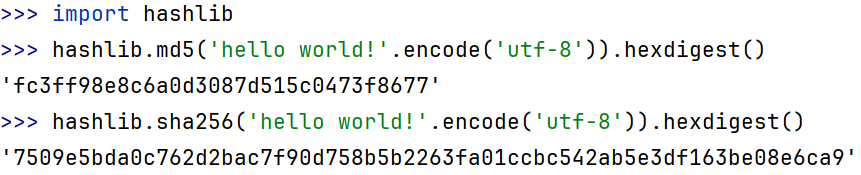

除了对单个字节串进行散列计算之外，还可以用`update`方法来对任意长的数据
分部分来计算，这样不管多大的数据都不会有内存不足的问题

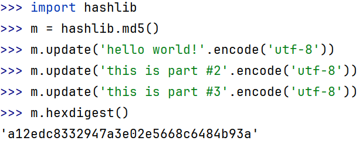
### 完美散列函数用于数据一致性校验
加密形式保存密码：  
仅保存密码的散列值，用户输入密码后，计算散列值并比对；无需保存密码的明文即可判断用户是否输入了正确的密码

防文件篡改：原理同数据文件一致性判断
> 当然还有更多密码学机制来保护数据文件，防篡改，防抵赖，是电子商务的信息技术基础

彩票投注应用：彩民下注前，机构将中奖的结果散列值公布，然后彩民投注，开奖后，彩民可以通过公布的结果和散列值对比，验证机构是否作弊
## 区块链技术
### 散列函数的最酷应用：区块链技术
**区块链是一种分布式数据库**  
通过网络连接的节点，每个节点都保存着整个数据库所有数据，任何地点存入的数据都会完成同步

**区块链最本质特征是“去中心化”**  
不存在任何控制中心、协调中心节点，所有节点都是平等的，无法被控制
### 区块链
区块链由一个个区块（block）组成，区块分为头（head）和体（body）
- 区块头记录了一些元数据和链接到前一个区块的信息：生成时间、前一个区块(head+body)的散列值
- 区块体记录了实际数据

**由于散列值具有抗修改性，任何对某个区块数据的改动必然引起散列值的变化**  
为了不导致这个区块脱离链条，就需要修改所有后续的区块  
由于有“**工作量证明**”的机制，这种大规模修改不可能实现的，除非掌握了全网51%以的计算力

### 工作量证明：Proof of Work(POW)
由于区块链是大规模的分布式数据库，同步较慢，新区块的添加速度需要得到控制  
目前最大规模区块链Bitcoin采用的速度是平均每10分钟生成一个区块  
大家不惜付出海量的计算，去抢着算出一个区块的有效散列值，最先算出的那位“矿工”才有资格把区块挂到区块链中
### 为什么有效散列值那么难算出？
因为很难算出，所以控制了新区块生成的速度，便于在整个分布式网络中进行同步

每个区块设置了一个难度系数Difficulty，用常数targetmax除以它，得到一个target，难度系数越高，target越小

矿工的工作是，找到一个数值Nonce，把它跟整个区块数据一起计算散列，这个散列值必须小于target，才是有效的散列值

由于散列值无法回推原值，这个Nonce的寻找只能靠暴力穷举，计算工作量+运气是唯一的方法
### 为什么矿工抢着生成区块？
在加密货币Bitcoin中，区块内包含的数据是“交易记录”，也就是“账本”，这对于货币体系至关重要

Bitcoin规定，每个区块中包含了一定数量的比特币作为“记账奖励”，这样就鼓励了更多人加入到抢先记账的行列

由于硬件摩尔定律的存在，计算力将持续递增，为了维持每10分钟生成一个区块的速度，难度系数Difficulty也将持续递增
> 挖矿计算力升级：CPU（20MHash/s）→GPU（400MHash/s）→FPGA（25GHash/s）→ASIC（3.5THash/s）→大规模集群挖矿（3.5THash/s*X）

另外，为了保持货币总量不会无限增加，每4年奖励的比特币减半
> 2008年开始是50个，2019年为12.5个
## 散列函数设计
### 折叠法
**基本步骤**：将数据项按照位数分为若干段，再将几段数字相加，最后对散列表大小求余，得到散列值

例如，对电话号码62767255  
可以两位两位分为4段(62、76、72、55)相加(62+76+72+55=265)。散列表包括11个槽，那么就是265%11=1，所以h(62767255)=1

有时候折叠法还会包括一个**隔数反转**的步骤  
比如(62、76、72、55)隔数反转为(62、67、72、55)，再累加(62+67+72+55=256)，对11求余(256%11=3)，所以h'(62767255)=3

虽然隔数反转从理论上看来毫无必要，但这个步骤确实为折叠法得到散列函数提供了一种微调手段，以便更好符合散列特性
### 平方取中法
**基本步骤**：首先将数据项做平方运算，然后取平方数的中间两位，再对散列表的大小求余

例如，对44进行散列  
首先44*44=1936，然后取中间的93，对散列表大小11求余，93%11=5

**下表是两种散列函数的对比**  
两个都是完美散列函数，分散度都很好，不过平方取中法计算量稍大
Item|Remainder|Mid-Square
:-:|:-:|:-:
54|10|3
26|4|7
93|5|9
17|6|8
77|0|4
31|9|6

### 非数项
我们也可以对非数字的数据项进行散列，把字符串中的每个字符看作ASCII码即可

如cat，ord('c')==99, ord('a')==96, ord('t')==116
，再将这些整数累加，对散列表大小求余(99+96+116)%11=4

当然，这样的散列函数对所有的变位词都返回相同的散列值

为了防止这一点，可以将字符串所在的位置作为权重因子，乘以ord值
```Python
def hash(astring, tablesize):
    sum = 0
    for pos in range(len(astring)):
        sum += ord(astring[pos]) * (pos + 1)
    return sum % tablesize
```

我们还可以设计出更多的散列函数方法，但要坚持的一个基本出发点是，散列函数不能成为存储过程和查找过程的计算负担

如果散列函数设计太过复杂，去花费大量的计算资源计算槽号，可能还不如简单地进行顺序查找或者二分查找

这就失去了散列本身的意义
## 冲突解决方案<a id="hash-collision-solution"></a>
如果两个数据项被散列映射到同一个槽，需要一个系统化的方法在散列表中保存第二个数据项，这个过程称为“**解决冲突**”

前面提到，如果说散列函数是完美的，那就不会有散列冲突，但完美散列函数常常是不现实的

解决散列冲突成为散列方法中很重要的一部分

**解决散列的一种方法就是为冲突的数据项再找一个开放的空槽来保存**  
最简单的就是从冲突的槽开始往后扫描，直到碰到一个空槽。如果到散列表尾部还未找到，则从首部接着扫描

这种寻找空槽的技术称为“**开放定址open addressing**”

向后逐个槽寻找的方法则是开放定址技术中的“**线性探测linear probing**”
### 线性探测Linear Probing
把44、55、20逐个插入到散列表中
- h(44)=0，但发现0#槽已被77占据，向后找到第一个空槽1#，保存
- h(55)=0，同样0#槽已经被占据，向后找到第一个空槽2#，保存
- h(20)=9，发现9#槽已经被31占据了，向后，再从头开始找到3#槽保存

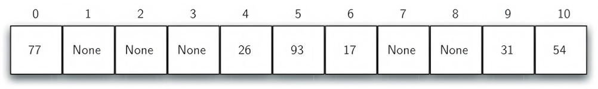

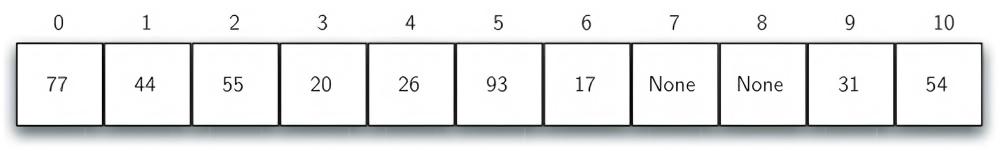

采用线性探测方法来解决散列冲突的话，则散列表的查找也遵循同样的规则

如果在散列位置没有找到查找项的话，就必须向后做顺序查找，直到找到查找项，或者碰到空槽（查找失败）
#### 线性探测的改进
线性探测法的一个缺点是有**聚集**（clustering）的趋势，即如果同一个槽冲突的数据项较多的话，这些数据项就会在槽附近聚集起来，从而连锁式影响其它数据项的插入

避免聚集的一种方法就是将线性探测扩展，从逐个探测改为跳跃式探测  
下图是“+3”探测插入44、55、20

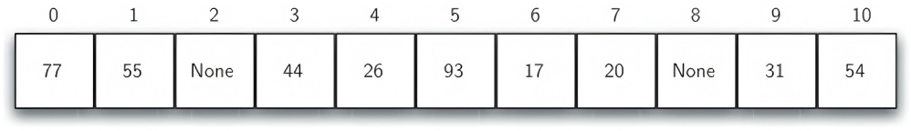
### 再散列rehashing
重新寻找空槽的过程可以用一个更为通用的“**再散列rehashing**”来概括  
`newhashvalue = rehash(oldhashvalue)`  
- 对于线性探测来说，`rehash(pos)= (pos+ 1) % sizeoftable`  
- “+3”的跳跃式探测则是：`rehash(pos)= (pos+ 3) % sizeoftable`
- 跳跃式探测的再散列通式是：`rehash(pos)= (pos+skip) % sizeoftable`

跳跃式探测中，需要注意的是skip的取值，不能被散列表大小整除，否则会产生周期，造成很多空槽永远无法探测到
> 一个技巧是，把散列表的大小设为素数，如例子的11

还可以将线性探测变为 “ **二次探测quadratic probing**”  
不再固定skip的值，而是逐步增加skip值，如1、3、5、7、9  
这样槽号就会是原散列值以平方数增加：h, h+1, h+4, h+9, h+16...
### 数据项链Chaining
除了寻找空槽的开放定址技术之外，另一种解决散列冲突的方案是将容纳单个数据项的槽扩展为容纳数据项集合（或者对数据项链表的引用）

这样，散列表中的每个槽就可以容纳多个数据项，如果有散列冲突发生，只需要简单地将数据项添加到数据项集合中

查找数据项时则需要查找同一个槽中的整个集合，当然，随着散列冲突的增加，对数据项的查找时间也会相应增加

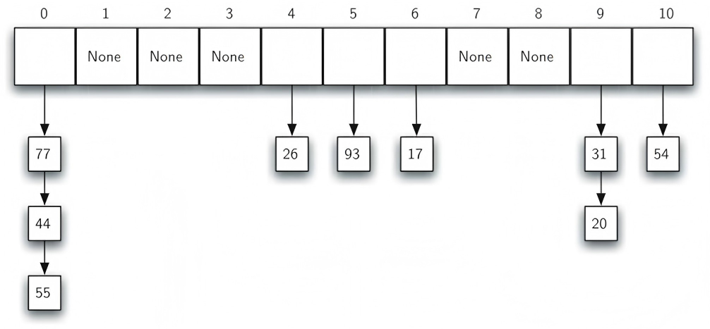
## 映射抽象数据类型及Python实现
### 抽象数据类型“映射”:ADT Map
Python最有用的数据类型之一“**字典**”

字典是一种可以保存key-data键值对的数据类型

其中关键码key可用于查询关联的数据值data

这种键值关联的方法称为“映射Map”

ADT Map的结构是键-值关联的无序集合
- 关键码具有唯一性
- 通过关键码可以唯一确定一个数据值

**抽象数据类型“映射”定义为如下的操作**
- `Map()`：创建一个空映射，返回空映射对象
- `put(key, val)`：将key-val关联对加入映射中，如果key已存在，将val替换旧关联值
- `get(key)`：给定key，返回关联的数据值，如不存在，则返回None
- `del`：通过del map[key]的语句形式删除key-val关联
- `len()`：返回映射中key-val关联的数目
- `in`：通过key in map的语句形式，返回key是否存在于关联中，布尔值
### 映射ADT Map实现
使用字典的优势在于，给定关键码key，能够很快得到关联的数据值data

为了达到快速查找的目标，需要一个支持高效查找的ADT实现

可以采用列表数据结构加顺序查找或者二分查找  
当然，更为合适的是使用前述的散列表来实现，这样查找可以达到最快 $O(1)$ 的性能

下面，我们用一个HashTable类来实现ADT Map，该类包含了两个列表作为成员
- 其中一个slot列表用于保存key
- 另一个平行的data列表用于保存数据项

在slot列表查找到一个key的位置以后，在data列表对应相同位置的数据项即为关联数据

保存key的列表就作为散列表来处理，这样可以迅速查找到指定的key

注意散列表的大小，虽然可以是任意数，但考虑到要让冲突解决算法能有效工作，应该选择为素数
```Python
class HashTable:
    def __init__(self):
        self.size = 11
        self.slots = [None] * self.size
        self.data = [None] * self.size
```
#### put()
hashfunction方法采用了简单求余方法来实现散列函数，而冲突解决则采用线性探测“加1”再散列函数
```Python
def hashfunction(self, key, size):
    return key % size
def rehash(self, oldhash, size):
    return (oldhash + 1) % size
def put(self, key, data):
    hashvalue = self.hashfunction(key, len(self.slots))
    if self.slots[hashvalue] is None:
        self.slots[hashvalue] = key
        self.data[hashvalue] = data
    else:
        if self.slots[hashvalue] == key:
            self.data[hashvalue] = data
        else:
            nextslot = self.rehash(hashvalue, len(self.slots))
            while self.slots[nextslot] is not None and self.slots[nextslot] != key:
                nextslot = self.rehash(nextslot, len(self.slots))
            if self.slots[nextslot] is None:
                self.slots[nextslot] = key
                self.data[nextslot] = data
            else:
                self.data[nextslot] = data  # replace
```
#### get()
```Python
def get(self, key):
    startslot = self.hashfunction(key, len(self.slots))
    data = None
    stop = False
    found = False
    position = startslot
    while self.slots[position] is not None and not found and not stop:
        if self.slots[position] == key:
            found = True
            data = self.data[position]
        else:
            position = self.rehash(position, len(self.slots))
            if position == startslot:
                stop = True
    return data
```
#### 通过特殊方法实现[]访问
```Python
def __getitem__(self, key):
    return self.get(key)
def __setitem__(self, key, data):
    self.put(key, data)
```
见[映射.py](./code/排序与查找/映射.py)
### 散列算法分析
散列在最好的情况下，可以提供O(1)常数级时间复杂度的查找性能
> 由于散列冲突的存在，查找比较次数就没有这么简单

评估散列冲突的最重要信息就是负载因子 $\lambda$ ，一般来说：
- 如果 $\lambda$ 较小，散列冲突的几率就小，数据项通常会保存在其所属的散列槽中
- 如果 $\lambda$ 较大，意味着散列表填充较满，冲突会越来越多，冲突解决也越复杂，也就需要更多的比较来找到空槽；如果采用数据链的话，意味着每条链上的数据项增多

如果采用线性探测的开放定址法来解决冲突（ $\lambda$ 在0~1之间）
- 成功的查找，平均需要比对次数为： $\frac{1}{2}(1+\frac{1}{1-\lambda})$
- 不成功的查找，平均比对次数为： $\frac{1}{2}(1+(\frac{1}{1-\lambda})^2)$

如果采用数据链来解决冲突（ $\lambda$ 可大于1）
- 成功的查找，平均需要比对次数为： $1+\frac{\lambda}{2}$
- 不成功的查找，平均比对次数为： $\lambda$
# 树及算法
## 什么是树
本章我们来讨论一种基本的“**非线性**”数据结构——树

树在计算机科学的各个领域中被广泛应用：操作系统、图形学、数据库系统、计算机网络

跟自然界中的树一样，数据结构树也分为：根、枝和叶等三个部分
> 一般数据结构的图示把根放在上方，叶放在下方

### 树的例子
#### 生物学物种分类体系
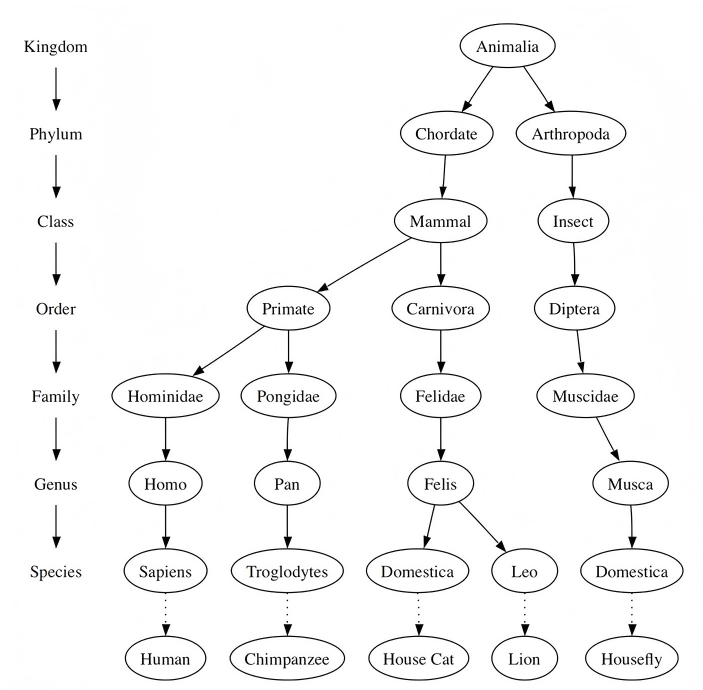

首先分类体系是**层次化**的
树是一种分层结构，越接近顶部的层越普遍，越接近底部的层越独特
> 界、门、纲、目、科、属、种

分类树的第二个特征：一个节点的子节点与另一个节点的子节点相互之间是**隔离**、**独立**的  
猫属Felis和蝇属Musca下面都有Domestica的同名节点  
但相互之间并无任何关联，可以修改其中一个Domestica而不影响另一个

分类树的第三个特征：每一个叶节点都具有**唯一性**  
可以用从根开始到达每个种的完全路径来唯一标识每个物种  
> 动物界->脊索门->哺乳纲->食肉目->猫科->猫属->家猫种  
> Animalia->Chordate->Mammal->Carnivora->Felidae->Felis->Domestica  

#### 文件系统
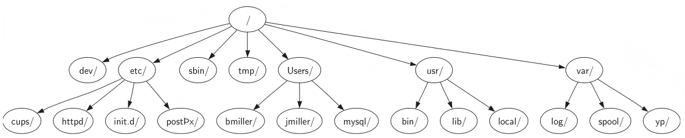

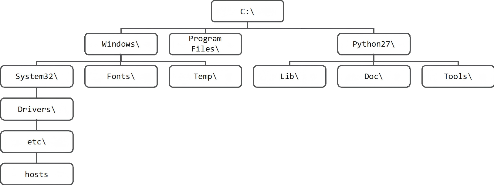
#### HTML文档（嵌套标记）


#### 域名体系
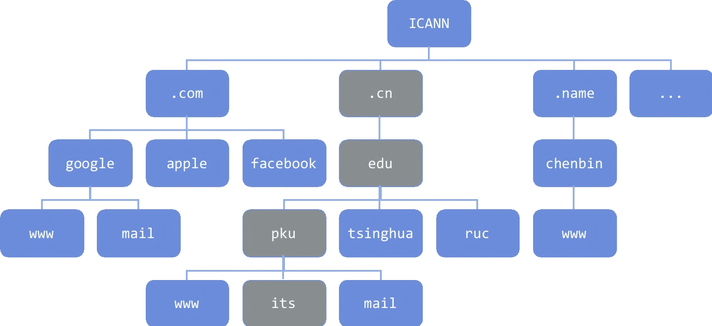
## 树结构相关术语
**节点Node**：组成树的基本部分  
每个节点具有名称，或“键值”，节点还可以保存额外数据项，数据项根据不同的应用而变

**边Edge**：边是组成树的另一个基本部分  
每条边恰好连接两个节点，表示节点之间具有关联，边具有出入方向；每个节点（除根节点）恰有一条来自另一节点的
入边；每个节点可以有多条连到其它节点的出边

**根Root**：树中唯一一个没有入边的节点

**路径Path**：由边依次连接在一起的节点的有序列表
> 如：HTML->BODY->UL->LI，是一条路径

**子节点Children**：入边均来自于同一个节点的若干节点，称为这个节点的子节点

**父节点Parent**：一个节点是其所有出边所连接节点的父节点

**兄弟节点Sibling**：具有同一个父节点的节点之间称为兄弟节点

**子树Subtree**：一个节点和其所有子孙节点，以及相关边的集合

**叶节点Leaf**：没有子节点的节点称为叶节点

**层级Level**：从根节点开始到达一个节点的路径，所包含的边的数量，称为这个节点的层级
> 如D的层级为2，根节点的层级为0

**高度**：树中所有节点的最大层级称为树的高度
> 如下图树的高度为2

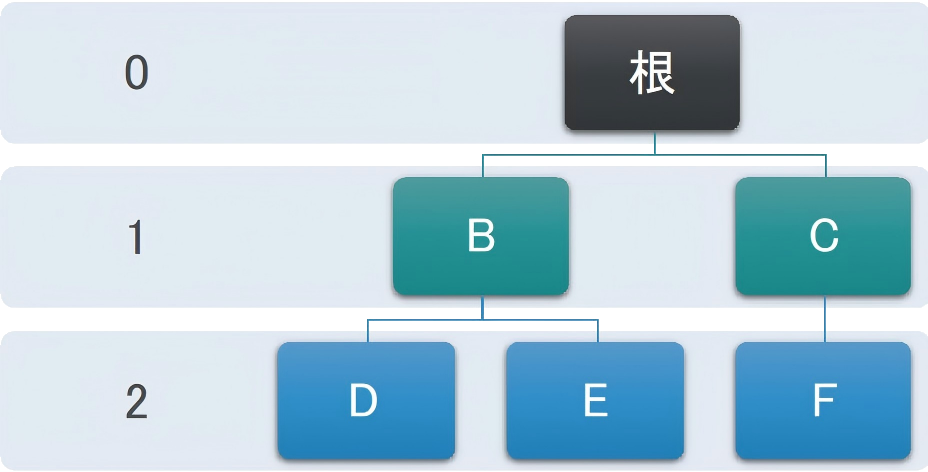

### 树的定义
树由若干**节点**，以及两两连接节点的**边**组成，并有如下性质
- 其中一个节点被设定为根
- 每个节点n(除根节点)，都恰连接一条来自节点p的边，p是n的父节点
- 每个节点从根开始的路径是唯一的

如果每个节点最多有两个子节点，这样的树称为“**二叉树**”
#### 递归定义
树是：
- 空集
- 或者由根节点及0或多个子树构成（其中子树也是树），每个子树的根到根节点具有边相连
## 树的实现
### 嵌套列表法
首先尝试用Python List来实现二叉树树数据结构

递归的嵌套列表实现二叉树，由具有3个元素的列表实现：
1. 第1个元素为根节点的值
2. 第2个元素是左子树（所以也是一个列表）
3. 第3个元素是右子树（所以也是一个列表）
> [root, left, right]

<div style="display: flex; gap: 5px;">
    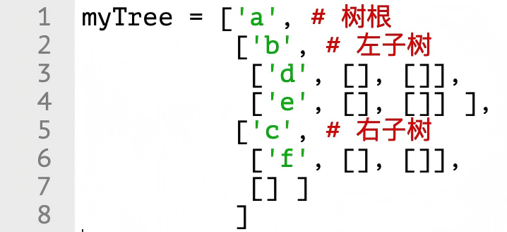
    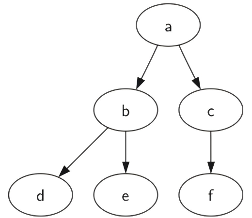
</div>

通过定义一系列函数来辅助操作嵌套列表
- BinaryTree创建仅有根节点的二叉树
- insertLeft/insertRight将新节点插入树中作为其直接的左/右子节点
- get/setRootVal则取得或返回根节点
- getLeft/RightChild返回左/右子树
#### 具体程序
```Python
def BinaryTree(r):
    return [r, [], []]
def insertLeft(root, newBranch):
    t = root.pop(1)
    if len(t) > 1:
        root.insert(1, [newBranch,t,[]])
    else:
        root.insert(1, [newBranch, [], []])
    return root
def insertRight(root, newBranch):
    t = root.pop(2)
    if len(t) > 1:
        root.insert(2, [newBranch,[],t])
    else:
        root.insert(2, [newBranch,[],[]])
    return root
def getRootVal(root):
    return root[0]
def setRootVal(root, newVal):
    root[0] = newVal
def getLeftChild(root):
    return root[1]
def getRightChild(root):
    return root[2]
```
见[树的嵌套列表实现.py](./code/树/树的嵌套列表实现.py)
### 节点链接法
**同样可以用节点链接法来实现树**  
每个节点保存根节点的数据项，以及指向左右子树的链接
#### 具体程序
定义一个BinaryTree类
- 成员key保存根节点数据项
- 成员left/rightChild则保存指向左/右子树的引用（同样是BinaryTree对象）
```Python
class BinaryTree:
    def __init__(self, rootObj):
        self.key = rootObj
        self.leftChild = None
        self.rightChild = None
    def insertLeft(self, newNode):
        if self.leftChild is None:
            self.leftChild = BinaryTree(newNode)
        else:
            t = BinaryTree(newNode)
            t.leftChild = self.leftChild
            self.leftChild = t
    def insertRight(self, newNode):
        if self.rightChild is None:
            self.rightChild = BinaryTree(newNode)
        else:
            t = BinaryTree(newNode)
            t.rightChild = self.rightChild
            self.rightChild = t
    def getRightChild(self):
        return self.rightChild
    def getLeftChild(self):
        return self.leftChild
    def setRootVal(self, obj):
        self.key = obj
    def getRootVal(self):
        return self.key
```
见[树的链表实现.py](./code/树/树的链表实现.py)  
完整版见[BinaryTree.py](./code/树/BinaryTree.py)
## 树的应用：表达式解析
### 解析树（语法树）
将树用于表示语言中句子，可以分析句子的各种语法成分，对句子的各种成分进行处理

**语法分析树**  
主谓宾，定状补

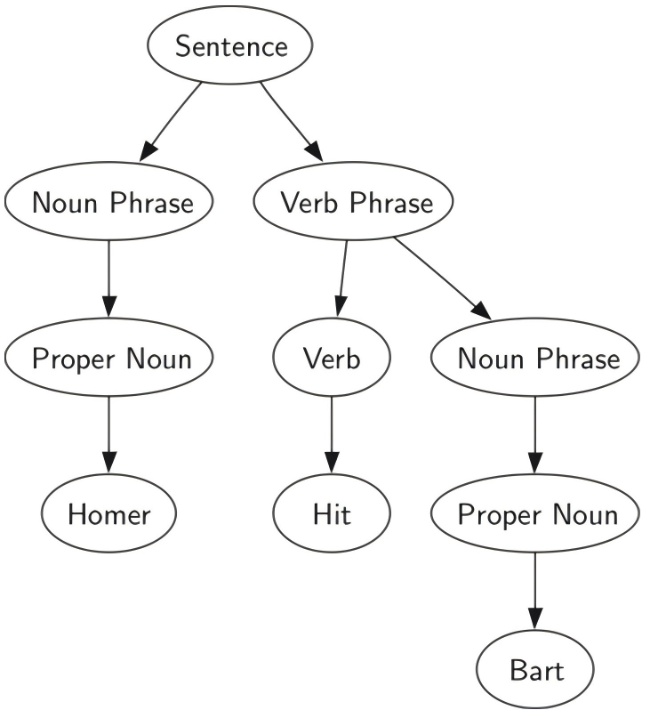

**程序设计语言的编译**  
词法、语法检查  
从语法树生成目标代码  

**自然语言处理**  
机器翻译、语义理解
### 表达式解析
**还可以将表达式表示为树结构**  
叶节点保存操作数，内部节点保存操作符

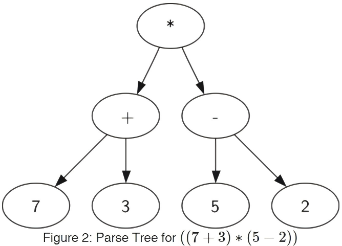

**全括号表达式((7+3)*(5-2))**  
由于括号的存在，需要计算*的话，就必须先计算7+3和5-2，表达式层次决定计算的优先级，越底层的表达式，优先级越高

**树中每个子树都表示一个子表达式**  
将子树替换为子表达式值的节点，即可实现求值

下面，我们用树结构来做如下尝试
1. 从全括号表达式构建表达式解析树
2. 利用表达式解析树对表达式求值
3. 从表达式解析树恢复原表达式的字符串形式
#### 建立表达式解析树
**首先，全括号表达式要分解为单词Token列表**  
其单词分为括号“（）”、操作符“+-*/”和操作数“0～9”这几类  
左括号就是表达式的开始，而右括号是表达式的结束

全括号表达式：(3+(4\*5))  
分解为单词表['(', '3', '+', '(', '4', '\*', '5', ')', ')']

##### 过程
- 创建空树，当前节点为根节点
- 读入'('，创建了左子节点，当前节点下降
- 读入'3'，当前节点设置为3，上升到父节点
- 读入'+'，当前节点设置为+，创建右子节点，当前节点下降
- 读入'('，创建左子节点，当前节点下降
- 读入'4'，当前节点设置为4，上升到父节点
- 读入'\*'，当前节点设置为\*，创建右子节点，当前节点下降
- 读入'5'，当前节点设置为5，上升到父节点
- 读入')'，上升到父节点
- 读入')'，再上升到父节点
##### 规则
1. 如果当前单词是"("：为当前节点添加一个新节点作为其左子节点，当前节点下降为这个新节点
2. 如果当前单词是操作符"+,-,/,*"：将当前节点的值设为此符号，为当前节点添加一个新节点作为其右子节点，当前节点下降为这个新节点
3. 如果当前单词是操作数：将当前节点的值设为此数，当前节点上升到父节点
4. 如果当前单词是")"：则当前节点上升到父节点
##### 思路
创建树过程中关键的是对当前节点的跟踪
- 创建左右子树可调用insertLeft/Right
- 当前节点设置值，可以调用setRootVal
- 下降到左右子树可调用getLeft/RightChild

但是，上升到父节点，这个没有方法支持！

我们可以用一个**栈**来记录跟踪父节点
- 当前节点下降时，将下降前的节点push入栈
- 当前节点需要上升到父节点时，上升到pop出栈的节点即可
##### 具体代码
```Python
def buildParseTree(fpexp):
    fplist = fpexp.split()
    pStack = Stack()
    eTree = BinaryTree('')
    pStack.push(eTree)
    currentTree = eTree
    for i in fplist:
        if i == '(':
            currentTree.insertLeft('')
            pStack.push(currentTree)
            currentTree = currentTree.getLeftChild()
        elif i not in ['+', '-', '*', '/', ')']:
            currentTree.setRootVal(int(i))
            parent = pStack.pop()
            currentTree = parent
        elif i in ['+', '-', '*', '/']:
            currentTree.setRootVal(i)
            currentTree.insertRight('')
            pStack.push(currentTree)
            currentTree = currentTree.getRightChild()
        elif i == ')':
            currentTree = pStack.pop()
        else:
            raise ValueError
    return eTree
```
见[表达式解析.py](./code/树/表达式解析.py)
#### 利用表达式解析树求值
##### 思路
创建了表达式解析树，可用来进行求值

由于二叉树BinaryTree是一个递归数据结构，自然可以用递归算法来处理

**求值递归函数evaluate**
由前述对子表达式的描述，可从树的底层子树开始，逐步向上层求值，最终得到整个表达式的值

求值函数evaluate的递归三要素：
- **基本结束条件**：叶节点是最简单的子树，没有左右子节点，其根节点的数据项即为子表达式树的值
- **缩小规模**：将表达式树分为左子树、右子树，即为缩小规模
- **调用自身**：分别调用evaluate计算左子树和右子树的值，然后将左右子树的值依根节点的操作符进行计算，从而得到表达式的值
##### 具体程序
```Python
import operator
def postordereval(tree):
    opers = {'+': operator.add, '-': operator.sub, '*': operator.mul, '/': operator.truediv}
    if tree:
        res1 = postordereval(tree.getLeftChild())
        res2 = postordereval(tree.getRightChild())
        if res1 and res2:
            return opers[tree.getRootVal()](res1, res2)
        else:
            return tree.getRootVal()
```
见[表达式解析.py](./code/树/表达式解析.py)
## 树的遍历
### 树的遍历Tree Traversals
对一个数据集中的所有数据项进行访问的操作称为“**遍历Traversal**”

线性数据结构中，对其所有数据项的访问比较简单直接，按照顺序依次进行即可

树的非线性特点，使得遍历操作较为复杂

按照对节点访问次序的不同来区分3种遍历
- **前序遍历（preorder）**：先访问根节点，再递归地前序访问左子树、最后前序访问右子树
- **中序遍历（inorder）**：先递归地中序访问左子树，再访问根节点，最后中序访问右子树
- **后序遍历（postorder）**：先递归地后序访问左子树，再后序访问右子树，最后访问根节点
### 前序遍历的例子：一本书的章节阅读
Book -> Chapter1 -> Section1.1 -> Section1.2 -> Section1.2.1 -> Section1.2.2 -> Chapter2 -> Section 2.1 -> Section2.2 -> Section2.2.1 -> Section2.2.2
### 具体程序
```Python
def inorder(tree):
    if tree is not None:
        inorder(tree.getLeftChild())
        print(tree.getRootVal())
        inorder(tree.getRightChild())

def preorder(tree):
    if tree is not None:
        print(tree.getRootVal())
        preorder(tree.getLeftChild())
        preorder(tree.getRightChild())

def postorder(tree):
    if tree is not None:
        postorder(tree.getLeftChild())
        postorder(tree.getRightChild())
        print(tree.getRootVal())
```
也可以在BinaryTree类中实现前序遍历的方法：需要加入子树是否为空的判断

见[BinaryTree.py](./code/树/BinaryTree.py)
## 优先队列和二叉堆
### 优先队列Priority Queue
前面学习了一种FIFO数据结构**队列**

队列有一种变体称为“**优先队列**”  
银行窗口取号排队，VIP客户可以插到队首  
操作系统中执行关键任务的进程或用户特别指定进程在调度队列中靠前

优先队列的出队跟队列一样从队首出队  
但在优先队列内部，数据项的次序却是由“优先级”来确定：高优先级的数据项排在队首，而低优先级的数据项则排在后面

这样，优先队列的入队操作就比较复杂，需要将数据项根据其优先级尽量挤到队列前方

### 二叉堆Binary Heap实现优先队列
实现优先队列的经典方案是采用**二叉堆**数据结构

二叉堆能够将优先队列的入队和出队复杂度都保持在 $O(log\ n)$

二叉堆的有趣之处在于，其逻辑结构上像二叉树，却是用非嵌套的列表来实现的
- 最小key排在队首的称为“最小堆min heap”
- 反之，最大key排在队首的是“最大堆max heap”

ADT BinaryHeap的操作定义如下：
- `BinaryHeap()`：创建一个空二叉堆对象
- `insert(k)`：将新key加入到堆中
- `findMin()`：返回堆中的最小项，最小项仍保留在堆中
- `delMin()`：返回堆中的最小项，同时从堆中删除
- `isEmpty()`：返回堆是否为空
- `size()`：返回堆中key的个数
- `buildHeap(list)`：从一个key列表创建新堆
### 用非嵌套列表实现二叉堆
为了使堆操作能保持在对数水平上，就必须采用二叉树结构

同样，如果要使操作始终保持在对数数量级上，就必须始终保持二叉树的“平衡”
> 树根左右子树拥有相同数量的节点

采用“**完全二叉树**”的结构来近似实现“平衡”

完全二叉树，叶节点最多只出现在最底层和次底层，而且最底层的叶节点都连续集中在最左边，每个内部节点都有两个子节点，最多可有1个节点例外

**完全二叉树由于其特殊性，可以用非嵌套列表，以简单的方式实现，具有很好性质**  
如果节点的下标为p，那么其左子节点下标为2p，右子节点为2p+1，其父节点下标为p//2

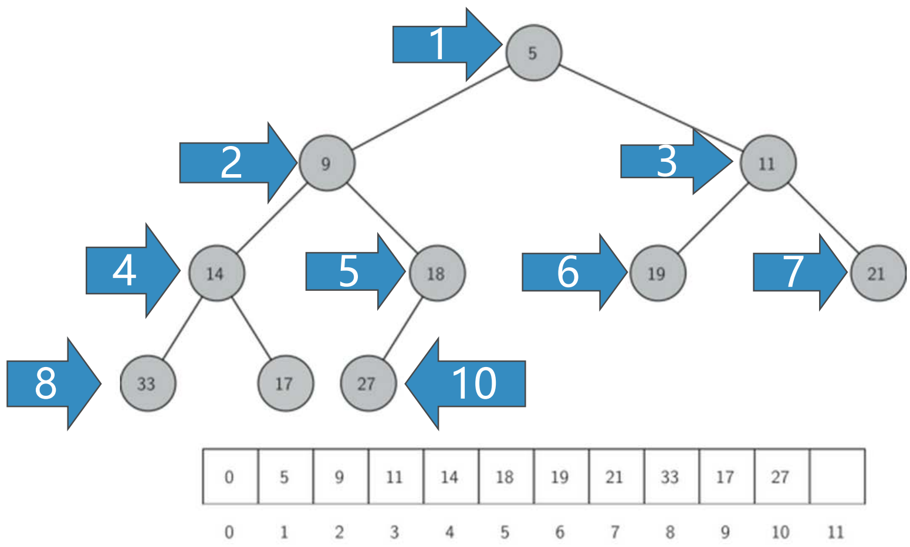

任何一个节点x，其父节点p中的key均小于x中的key

这样，符合“堆”性质的二叉树，其中任何一条路径，均是一个已排序数列，根节点的key最小
## 二叉堆的Python实现
### 二叉堆初始化
采用一个列表来保存堆数据，其中表首下标为0的项无用，但为了后面代码可以用到简单的整数乘除法，仍保留它
```Python
class BinHeap:
    def __init__(self):
        self.heapList = [0]
        self.currentSize = 0
```
### insert(key)
新key加在列表末尾，显然无法保持“堆”次序。虽然对其它路径的次序没有影响，但对于其到根的路径可能破坏次序

需要将新key沿着路径来“上浮”到其正确位置
> 注意：新key的“上浮”不会影响其它路径节点的“堆”次序
```Python
def percUp(self, i):
    while i // 2 > 0:
        if self.heapList[i] < self.heapList[i // 2]:
            self.heapList[i], self.heapList[i // 2] = self.heapList[i // 2], self.heapList[i]
        i //= 2
def insert(self, k):
    self.heapList.append(k)
    self.currentSize += 1
    self.percUp(self.currentSize)
```
### delMin()
移走整个堆中最小的key:根节点heapList[1]  
为了保持“完全二叉树”的性质，只用最后一个节点来代替根节点

同样，这么简单的替换，还是破坏了“堆”次序  
解决方法：将新的根节点沿着一条路径“下沉”，直到比两个子节点都小

“下沉”路径的选择：如果比子节点大，那么选择较小的子节点交换下沉
```Python
    def percDown(self, i):
        while i * 2 <= self.currentSize:
            mc = self.minChild(i)
            if self.heapList[i] > self.heapList[mc]:
                self.heapList[i], self.heapList[mc] = self.heapList[mc], self.heapList[i]
            i = mc
    def minChild(self, i):
        if i * 2 + 1 > self.currentSize:
            return i * 2
        else:
            if self.heapList[i * 2] < self.heapList[i * 2 + 1]:
                return i * 2
            else:
                return i * 2 + 1
    def delMin(self):
        retval = self.heapList[1]
        self.heapList[1] = self.heapList[self.currentSize]
        self.currentSize -= 1
        self.heapList.pop()
        self.percDown(1)
        return retval
```
### buildHeap(lst)
**从无序表生成“堆”**  
我们最自然的想法是：用insert(key)方法，将无序表中的数据项逐个insert到堆中，但这么做的总代价是 $O(nlog\ n)$

其实，用“下沉”法，能够将总代价控制在 $O(n)$
```Python
def buildHeap(self, alist):
    i = len(alist) // 2
    self.currentSize = len(alist)
    self.heapList = [0] + alist[:]
    while i > 0:
        self.percDown(i)
        i -= 1
```
见[二叉堆.py](./code/树/二叉堆.py)
## 二叉查找树及操作
### 二叉查找树Binary Search Tree
在ADT Map的实现方案中，可以采用不同的数据结构和搜索算法来保存和查找Key，前面已经实现了两个方案
1. 有序表数据结构+二分搜索算法
2. 散列表数据结构+散列及冲突解决算法

下面试试用二叉查找树保存key，实现key的快速搜索
### 二叉查找树BST的性质
比父节点小的key都出现在左子树，比父节点大的key都出现在右子树

按照70,31,93,94,14,23,73的顺序插入
- 首先插入的70成为树根
- 31比70小，放到左子节点
- 93比70大，放到右子节点
- 94比93大，放到右子节点
- 14比31小，放到左子节点
- 23比14大，放到其右
- 73比93小，放到其左

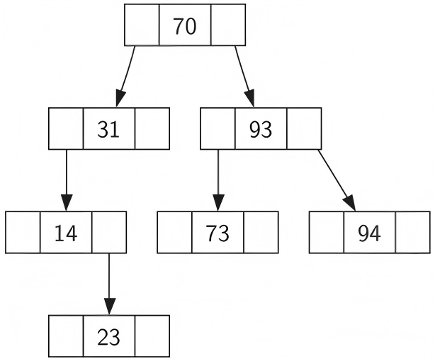

> 注意：插入顺序不同，生成的BST也不同
### 二叉查找树的实现
需要用到BST和TreeNode两个类，BST的root成员引用根节点TreeNode
#### TreeNode类
```Python
class TreeNode:
    def __init__(self, key, val, left=None, right=None, parent=None):
        self.key = key
        self.payload = val
        self.leftChild = left
        self.rightChild = right
        self.parent = parent
    def hasLeftChild(self):
        return self.leftChild
    def hasRightChild(self):
        return self.rightChild
    def isLeftChild(self):
        return self.parent and self.parent.leftChild == self
    def isRightChild(self):
        return self.parent and self.parent.rightChild == self
    def isRoot(self):
        return not self.parent
    def isLeaf(self):
        return not (self.rightChild or self.leftChild)
    def hasAnyChildren(self):
        return self.rightChild or self.leftChild
    def hasBothChildren(self):
        return self.rightChild and self.leftChild
    def replaceNodeData(self, key, value, lc, rc):
        self.key = key
        self.payload = value
        self.leftChild = lc
        self.rightChild = rc
        if self.hasLeftChild():
            self.leftChild.parent = self
        if self.hasRightChild():
            self.rightChild.parent = self
    def __iter__(self):
        if self:
            if self.hasLeftChild():
                for elem in self.leftChild:
                    yield elem
            yield self.key
            if self.hasRightChild():
                for elem in self.rightChild:
                    yield elem
```
#### BST类
##### put(key,val)
插入key构造BST
- 首先看BST是否为空，如果一个节点都没有，那么key成为根节点root
- 否则，就调用一个递归函数_put(key, val, root)来放置key
```Python
    def put(self, key, val):
        if self.root:
            self._put(key, val, self.root)
        else:
            self.root = TreeNode(key, val)
        self.size += 1
```
##### _put(key,val,currentNode)
- 如果key比currentNode小，那么_put到左子树
  - 但如果没有左子树，那么key就成为左子节点
- 如果key比currentNode大，那么_put到右子树
  - 但如果没有右子树，那么key就成为右子节点
```Python
def _put(self, key, val, currentNode):
    if key < currentNode.key:
        if currentNode.hasLeftChild():
            self._put(key, val, currentNode.leftChild)
        else:
            currentNode.leftChild = TreeNode(key, val, parent=currentNode)
    else:
        if currentNode.hasRightChild():
            self._put(key, val, currentNode.rightChild)
        else:
            currentNode.rightChild = TreeNode(key, val, parent=currentNode)
```
##### __setitem__索引赋值
支持tree[k] = v
```Python
def __setitem__(self, k, v):
    self.put(k, v)
```
##### get()
```Python
def get(self, key):
    if self.root:
        res = self._get(key, self.root)
        if res:
            return res.payload
        else:
            return None
    else:
        return None
def _get(self, key, currentNode):
    if not currentNode:
        return None
    elif currentNode.key == key:
        return currentNode
    elif key < currentNode.key:
        return self._get(key, currentNode.leftChild)
    else:
        return self._get(key, currentNode.rightChild)
```
##### __getitem__索引和__contains__归属判断
支持tree[key]和key in tree
```Python
def __getitem__(self, key):
    return self.get(key)
def __contains__(self, key):
    if self._get(key, self.root):
        return True
    else:
        return False
```
##### __iter__迭代器
支持for循环遍历
BST类中的__iter__方法直接调用了TreeNode中的同名方法
```Python
def __iter__(self):
    return self.root.__iter__()
```
##### delete(key)和__delitem__
__delitem__支持del tree[key]  
用_get找到要删除的节点，然后调用remove来删除，找不到则提示错误
```Python
def delete(self, key):
    if self.size > 1:
        nodeToRemove = self._get(key, self.root)
        if nodeToRemove:
            self.remove(nodeToRemove)
            self.size -= 1
        else:
            raise KeyError('Error, key not in tree')
    elif self.size == 1 and self.root.key == key:
        self.root = None
        self.size -= 1
    else:
        raise KeyError('Error, key not in tree')
def __delitem__(self, key):
    self.delete(key)
```
最复杂的是找到key对应的节点之后的remove节点方法
##### remove(node)
从BST中remove一个节点，还要求仍然保持BST的性质，分以下3种情形：
1. 这个节点没有子节点
2. 这个节点有1个子节点
3. 这个节点有2个子节点

- 没有子节点的情况好办，直接删除

```Python
if currentNode.isLeaf():
    if currentNode == currentNode.parent.leftChild:
        currentNode.parent.leftChild = None
    else:
        currentNode.parent.rightChild = None
```
- 第2种情形稍复杂：被删节点有1个子节点
    解决：将这个唯一的子节点上移，替换掉被删节点的位置

    但替换操作需要区分几种情况：
  - 被删节点的子节点是左？还是右子节点？
  - 被删节点本身是其父节点的左？还是右子节点？
  - 被删节点本身就是根节点？

```Python
else:
    if currentNode.hasLeftChild():
        if currentNode.isLeftChild():
            currentNode.leftChild.parent = currentNode.parent
            currentNode.parent.leftChild = currentNode.leftChild
        elif currentNode.isRightChild():
            currentNode.leftChild.parent = currentNode.parent
            currentNode.parent.rightChild = currentNode.leftChild
        else:
            currentNode.replaceNodeData(currentNode.leftChild.key,
                                        currentNode.leftChild.payload,
                                        currentNode.leftChild.leftChild,
                                        currentNode.leftChild.rightChild)
    else:
        if currentNode.isLeftChild():
            currentNode.rightChild.parent = currentNode.parent
            currentNode.parent.leftChild = currentNode.rightChild
        elif currentNode.isRightChild():
            currentNode.rightChild.parent = currentNode.parent
            currentNode.parent.rightChild = currentNode.rightChild
        else:
            currentNode.replaceNodeData(currentNode.rightChild.key,
                                        currentNode.rightChild.payload,
                                        currentNode.rightChild.leftChild,
                                        currentNode.rightChild.rightChild)
```
- 第3种情形最复杂：被删节点有2个子节点
    这时无法简单地将某个子节点上移替换被删节点，但可以找到另一个合适的节点来替换被删节点，这个合适节点就是被删节点的下一个key值节点，即被删节点右子树中最小的那个，称为“**后继**”

    可以肯定这个后继节点最多只有1个子节点（本身是叶节点，或仅有右子树），将这个后继节点摘出来（也就是删除了），替换掉被删节点
```Python
elif currentNode.hasBothChildren():
    succ = currentNode.findSuccessor()
    succ.spliceOut()
    currentNode.key = succ.key
    currentNode.payload = succ.payload
```
见[binsearchtree.py](code/树/binsearchtree.py)
### 算法分析（以put为例）
其性能决定因素在于二叉搜索树的高度（最大层次），而其高度又受数据项key插入顺序的影响

**如果key的列表是随机分布的话**，那么大于和小于根节点key的键值大致相等  
BST的高度就是 $log_2n$ （n是节点的个数），而且，这样的树就是平衡树  
put方法最差性能为 $O(log_2n)$

**但key列表分布极端情况就完全不同**  
按照从小到大顺序插入的话，这时候put方法的性能为 $O(n)$ ，其它方法也是类似情况
## AVL树的定义和性能
### 平衡二叉查找树：AVL树的定义
看看能够在key插入时一直保持平衡的二叉查找树：**AVL树**
> AVL是发明者的名字缩写：G.M. Adelson-Velskii and E.M. Landis

利用AVL树实现ADT Map，基本上与BST的实现相同，不同之处仅在于二叉树的生成与维护过程

AVL树的实现中，需要对每个节点跟踪“**平衡因子**balance factor”参数

平衡因子是根据节点的左右子树的高度来定义的，确切地说，是左右子树高度差：
balanceFactor = height(leftSubTree) − height(rightSubTree)
- 如果平衡因子大于0，称为“左重left-heavy”
- 小于零称为“右重right-heavy”
- 平衡因子等于0，则称作平衡

如果一个二叉查找树中每个节点的平衡因子都在-1，0，1之间，则把这个二叉搜索树称为**平衡树**

在平衡树操作过程中，有节点的平衡因子超出此范围，则需要一个重新平衡的过程
### AVL树性能分析
分析AVL树最差情形下的性能：即平衡因子为1或者-1

下图列出平衡因子为1的“左重”AVL树，树的高度从1开始，来看看问题规模（总节点数N）和比对次数（树的高度h）之间的关系如何

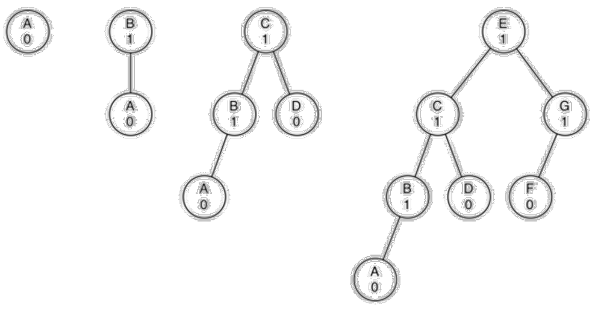

观察上图h=1~4时，总节点数N的变化
1. h= 1, N= 1
2. h= 2, N= 2= 1+ 1
3. h= 3, N= 4= 1+ 1+ 2
4. h= 4, N= 7= 1+ 2+ 4

$N_h=1+N_{h-1}+N_{h-2}$

这个通式很接近斐波那契数列

定义斐波那契数列 $F_i$ ，利用 $F_i$ 重写 $N_h$

$F_0=0$  
$F_1=1$  
$F_i=F_{i-1}+F_{i-2},i\geq2$

$N_h=1+N_{h-1}+N_{h-2}$  
$N_h=F_{h-2}-1,h\geq1$

斐波那契数列的性质： $F_i/F_{i-1}$ 趋向于黄金分割 $\Phi=\frac{1+\sqrt{5}}{2}$  

可以写出 $F_i$ 的通式： $F_i=\Phi^i/\sqrt{5}$

将 $F_i$ 通式代入到 $N_h$ 中，得到 $N_h$ 的通式： $N_h=\frac{\Phi^{h+2}}{\sqrt{5}}-1$

上述通式只有N和h了，解出h： 
$logN_h+1=(H+2)log\Phi-\frac{1}{2}log5$  
$h=\frac{logN_h+1-2log\Phi+\frac{1}{2}log5}{log\Phi}$  
$h=1.44logN_h$

最多搜索次数h和规模N的关系，可以说AVL树的搜索时间复杂度为 $O(log\ n)$
## AVL树的Python实现
既然AVL平衡树确实能够改进BST树的性能，避免退化情形，我们来看看向AVL树插入一个新key，如何才能保持AVL树的平衡性质

首先，作为BST，新key必定以叶节点形式插入到AVL树中

叶节点的平衡因子是0，其本身无需重新平衡，但会影响其父节点的平衡因子：
- 作为左子节点插入，则父节点平衡因子会增加1
- 作为右子节点插入，则父节点平衡因子会减少1

这种影响可能随着其父节点到根节点的路径一直传递上去，直到：
- 传递到根节点为止
- 或者某个父节点平衡因子被调整到0，不再影响上层节点的平衡因子为止
> 无论从-1或者1调整到0，都不会改变子树高度

### put()
重新定义_put方法即可
```Python
def _put(self, key, val, currentNode):
    if key < currentNode.key:
        if currentNode.hasLeftChild():
            self._put(key, val, currentNode.leftChild)
        else:
            currentNode.leftChild = TreeNode(key, val, parent=currentNode)
            self.updateBalance(currentNode.leftChild)
    else:
        if currentNode.hasRightChild():
            self._put(key, val, currentNode.rightChild)
        else:
            currentNode.rightChild = TreeNode(key, val, parent=currentNode)
            self.updateBalance(currentNode.rightChild)
```
### updateBalance()
```Python
def updateBalance(self, node):
    if node.balanceFactor > 1 or node.balanceFactor < -1:
        self.rebalance(node)
        return
    if node.parent is not None:
        if node.isLeftChild():
            node.parent.balanceFactor += 1
        elif node.isRightChild():
            node.parent.balanceFactor -= 1
        if node.parent.balanceFactor != 0:
            self.updateBalance(node.parent)
```
### rebalance()和rotateLeft()
主要手段：将不平衡的子树进行旋转rotation

视“左重”或者“右重”进行不同方向的旋转，同时更新相关父节点引用，更新旋转后被影响节点的平衡因子

如下图，是一个“右重”子树A的左旋转（并保持BST性质）

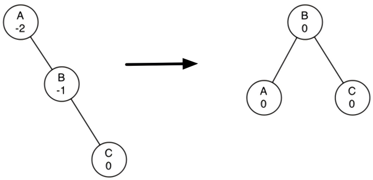

将右子节点B提升为子树的根，将旧根节点A作为新根节点B的左子节点  
如果新根节点B原来有左子节点，则将此节点设置为A的右子节点（A的右子节点一定有空）

更复杂一些的情况：如下图的“左重”子树右旋转

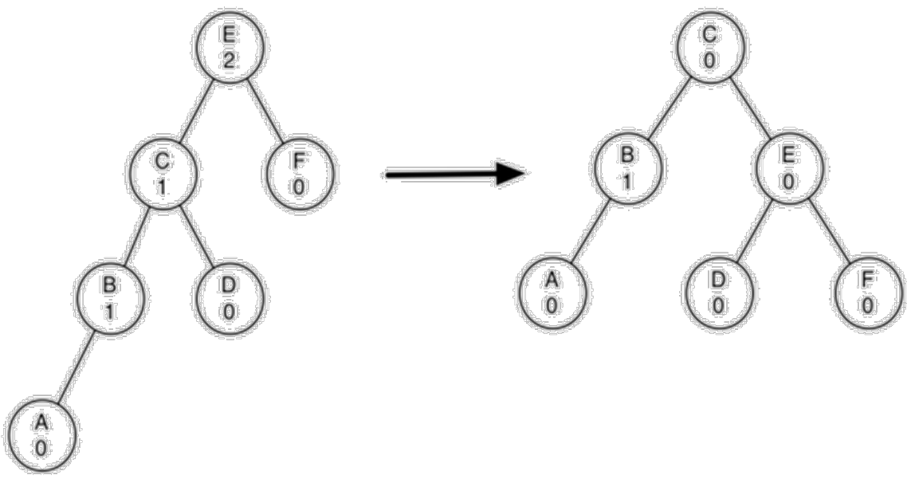

旋转后，新根节点将旧根节点作为右子节点，但是新根节点原来已有右子节点，需要将原有的右子节点重新定位  
原有的右子节点D改到旧根节点E的左子节点，同样，E的左子节点在旋转后一定有空
#### rotateLeft代码
```Python
def rotateLeft(self, rotRoot):
    newRoot = rotRoot.rightChild
    rotRoot.rightChild = newRoot.leftChild
    if newRoot.leftChild is not None:
        newRoot.leftChild.parent = rotRoot
    newRoot.parent = rotRoot.parent
    if rotRoot.isRoot():
        self.root = newRoot
    else:
        if rotRoot.isLeftChild():
            rotRoot.parent.leftChild = newRoot
        else:
            rotRoot.parent.rightChild = newRoot
    newRoot.leftChild = rotRoot
    rotRoot.parent = newRoot
    rotRoot.balanceFactor = rotRoot.balanceFactor + 1 - min(newRoot.balanceFactor, 0)
    newRoot.balanceFactor = newRoot.balanceFactor + 1 + max(rotRoot.balanceFactor, 0)
```
#### 更复杂的情形
下图的“右重”子树，单纯的左旋转无法实现平衡

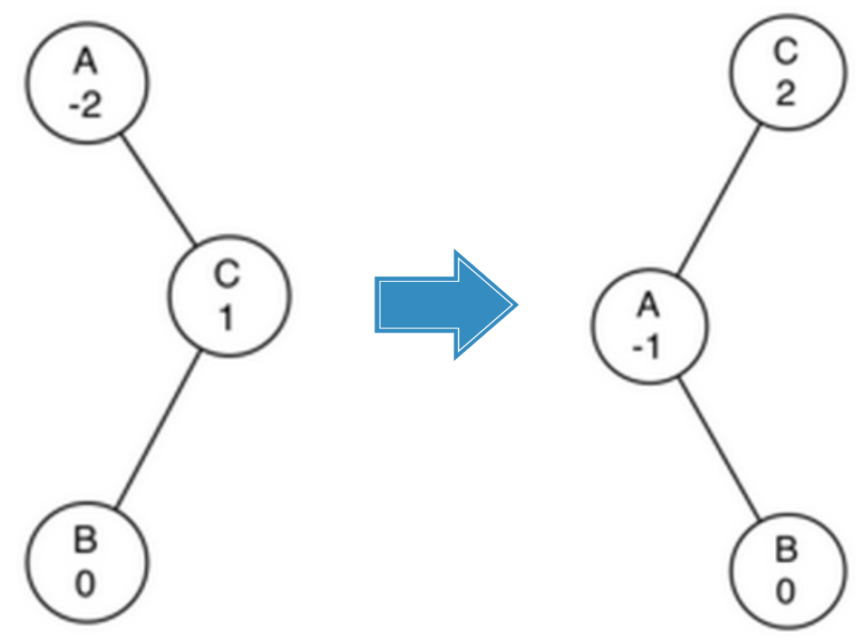

左旋转后变成“左重”了，“左重”再右旋转，还回到“右重”

所以，在左旋转之前检查右子节点的因子，如果右子节点“左重”的话，先对它进行右旋转，再实施原来的左旋转

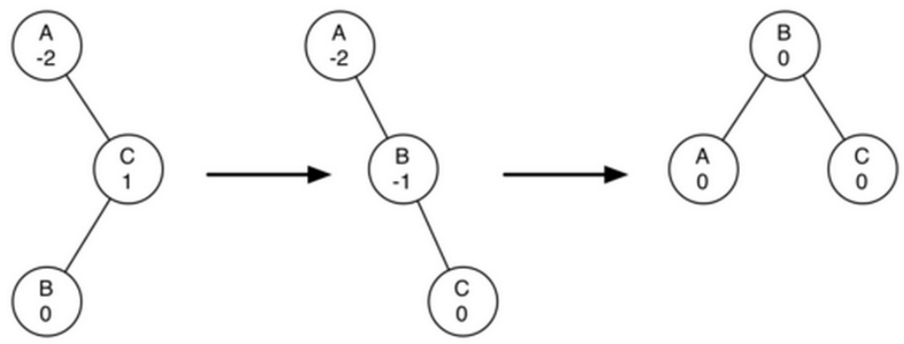

同样，在右旋转之前检查左子节点的因子，如果左子节点“右重”的话，先对它进行左旋转，再实施原来的右旋转
#### rebalance代码
```Python
def rebalance(self, node):
    if node.balanceFactor < 0:
        # RL型
        if node.rightChild.balanceFactor > 0:
            self.rotateRight(node.rightChild)
            self.rotateLeft(node)
        # RR型
        else:
            # single left
            self.rotateLeft(node)
    elif node.balanceFactor > 0:
        # LR型
        if node.leftChild.balanceFactor < 0:
            # Do an RL Rotation
            self.rotateLeft(node.leftChild)
            self.rotateRight(node)
        # LL型
        else:
            # single right
            self.rotateRight(node)
```
### 结语
经过复杂的put方法，AVL树始终维持平衡，get方法也始终保持 $O(log\ n)$ 高性能

不过，put方法的代价有多大？

将AVL树的put方法分为两个部分：
- 需要插入的新节点是叶节点，更新其所有父节点和祖先节点的代价最多为 $O(log\ n)$
- 如果插入的新节点引发了不平衡，重新平衡最多需要2次旋转，但旋转的代价与问题规模无关，是常数 $O(1)$

所以整个put方法的时间复杂度还是 $O(log\ n)$
# 图及算法
## 图的基本概念及相关术语
### 图Graph的概念
图Graph是比树更为一般的结构，也是由节点和边构成
> 实际上树是一种具有特殊性质的图

图可以用来表示现实世界中很多事物
> 道路交通系统、航班线路、互联网连接、或者是大学中课程的先修次序

一旦我们对图相关问题进行了准确的描述，就可以采用处理图的标准算法来解决那些看起来很艰深的问题

对于人来说，人脑的识别模式能够轻而易举地判断地图中不同地点的相互关联  
但如果用图来表示地图，就可以解决很多地图专家才能解决的问题，甚至远远超越  
互联网是由成千上万的计算机所连接起来的复杂网络，也可以通过图算法来确定计算机之间达成通讯的最短、最快或者最有效的路径
#### 互联网
互联网是一张百亿个信息点的巨型网络

提供内容的Web站点已突破10亿个

由超链接相互连接的网页更是不计其数

Google每天处理的数据量约10PB

在天文数字规模的网络面前，人脑已经无法处理
#### 社交网络：六度分隔理论
世界上任何两个人之间通过最多6个人即可建立联系

互联网社交网络的兴起将每个人联系到一起

在社会中有20%擅长交往的人，建立了80%的连接

区别于随机网络，保证了六度分隔的成立，引出了无尺度网络的研究
### 术语表