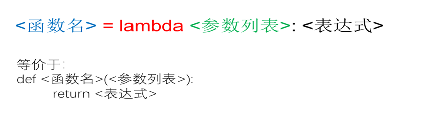

# 本关任务：
# 熟悉lambda函数的定义与使用

# lambda函数 
# 用于定义简单的、能够在一行内表示的函数，返回一个函数值
# 格式如下：

# 例如：
```
f=lambda x,y:x+y  #定义一个求两个数和的lambda函数
print(type(f))
print(f(10,20)) #调用lambda函数
```
# map()函数（备用,了解）
# map(function, iterable, ...)
# 其中 function 是一个函数，可以使用匿名函数，iterable 是一个或多个序列。第一个参数 function 以参数序列中的每一个元素调用 function 函数，返回包含每次 function 函数返回值的新列表。
# 例如：
```
result = map(lambda x: x**2, [1, 3, 5, 7, 9])
print(list(result)) #结果为：[1,9,25,49,81]
```
# 注意：map函数返回的是一个迭代器，需要使用list函数转换为列表

# 测试输入：`1,3,2 `  
# 预期输出：`3 1`

# 测试输入：`100,67,85`  
# 预期输出：`100 67`