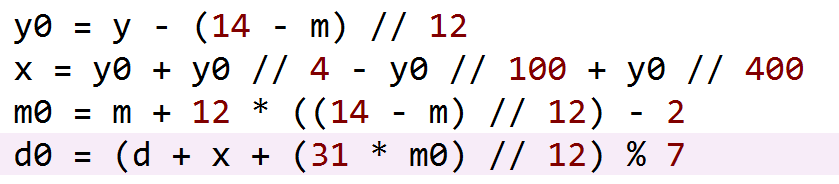
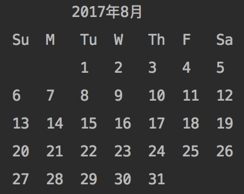

# 本关任务：
# 利用函数的知识， 编写函数模块，打印日历 

# 编程要求
1. 在指定位置完成函数编写，根据年和月，打印该月的日历。计算y年m月d日是星期几的公式为： 

2. 试题中已定义了三个函数，请完成这三个函数， 
- 函数day用于计算并返回某年某月某日是星期几；
- 函数isLeapYear用于判断某年是否是闰年；
- 函数calendar打印所给年月的日历，注意输出格式要求和空格的对齐，如下图所示，具体的空格数请参见本题代码。
