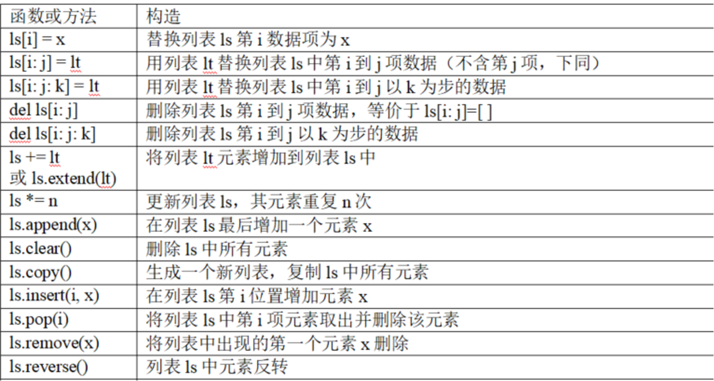
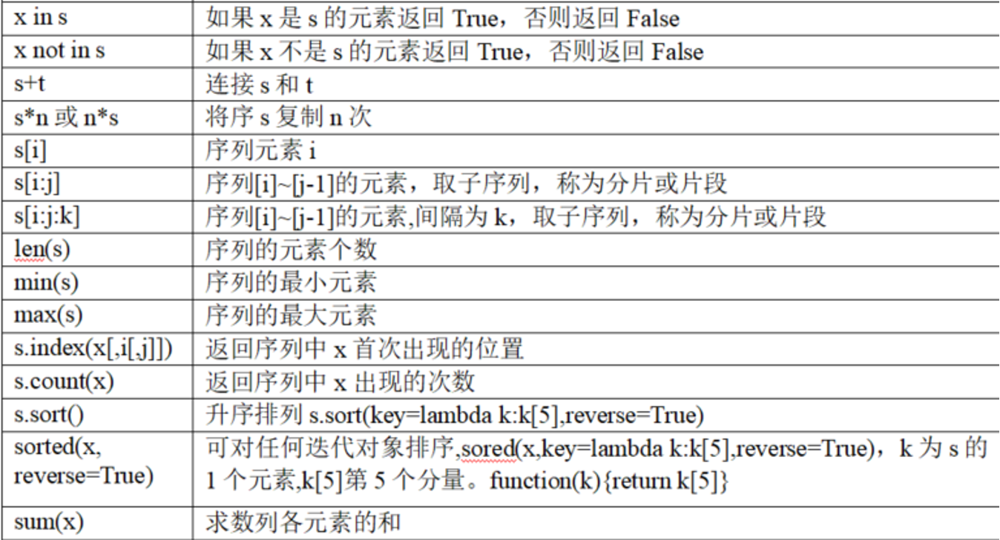
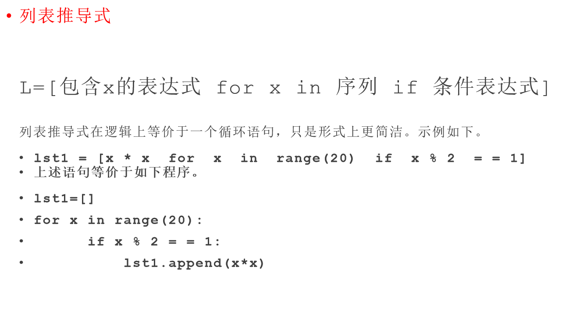

# 本关任务：
# 编写一个能完成列表数据基本操作的函数。

# 列表的基本操作


# 列表推导式

# 测试输入1：`[100,1,4,5,7,9,15.6,10,92]`
# 预期输出1：
```
列表的最大值:100,最小值:1,总和:243.6
列表均值：20.3714
升序排列列表:[1, 4, 5, 7, 9, 10, 15.6, 92, 100]
列表三个最小值,升序:[1, 4, 5]
列表三个最大值,降序:[100, 92, 15.6]
大于60的新列表：[92, 100]
```
# 测试输入2：`["python","c++","JAVA","R",[1,2,3,4],(9,10,10,8,7,4)]`  
# 预期输出2：
```
删除首尾元素后的列表:['c++', 'JAVA', 'R', [1, 2, 3, 4]]
插入首尾元素后的列表:[(9, 10, 10, 8, 7, 4), 'c++', 'JAVA', 'R', [1, 2, 3, 4], 'python']
逆序列表:['python', [1, 2, 3, 4], 'R', 'JAVA', 'c++', (9, 10, 10, 8, 7, 4)]
列表元素长度列表：[6, 4, 1, 4, 3, 6]
最长列表元素:python
最长列表元素:(9, 10, 10, 8, 7, 4) 
```