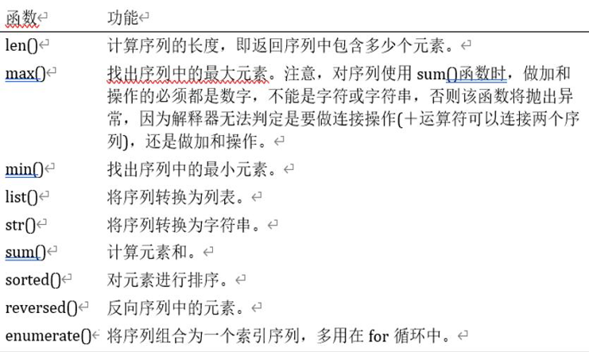

# 本关任务：
# 编写一个能完成序列数据基本操作的函数。

# 与序列数据有关的内置函数


# 测试输入1：`12345678`
# 预期输出1：
```
序列长度:8
序列首元素:1,尾元素:8
逆序序列:87654321
序列复制:1234567812345678
字符数字和:36
最大值：91
```
# 测试输入2：`1234xyz`
# 预期输出2：
```
序列长度:7
序列首元素:1,尾元素:z
逆序序列:zyx4321
序列复制:1234xyz1234xyz
1234xyz是非数字字符
```
# 测试输入3：`[1,2,3,4,5,6]` 
# 预期输出3：
```
序列长度:6
序列首元素:1,尾元素:6
逆序序列:[6, 5, 4, 3, 2, 1]
序列复制:[1, 2, 3, 4, 5, 6, 1, 2, 3, 4, 5, 6]
列表均值:3.5 
```
# 测试输入4：`[1,2,3,"hello",9]` 
# 预期输出4：
```
序列长度:5
序列首元素:1,尾元素:9
逆序序列:[9, 'hello', 3, 2, 1]
序列复制:[1, 2, 3, 'hello', 9, 1, 2, 3, 'hello', 9]
[1, 2, 3, 'hello', 9]是非数字列表
```
# 测试输入5：`(1,8,3,6,0)` 
# 预期输出5：
```
序列长度:5
序列首元素:1,尾元素:0
逆序序列:(0, 6, 3, 8, 1)
序列复制:(1, 8, 3, 6, 0, 1, 8, 3, 6, 0)
原序列：(1, 8, 3, 6, 0)
排序后的序列:[0, 1, 3, 6, 8]
```