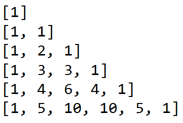

# 本关任务：
# 在屏幕上输出杨辉三角形图形。
# 二维列表与遍历
嵌套列表常被用作二维列表，类似于其他语言中的二维数组，遍历二维列表通常使用嵌套循环。
例如创建一个3×3的矩阵：
```
matrix = [[1, 2, 3], [4, 5, 6], [7, 8, 9]]
for row in matrix:
    for item in row:
        print(item,end=" ")
     print()
```
# 测试输入：`6`
# 预期输出：
