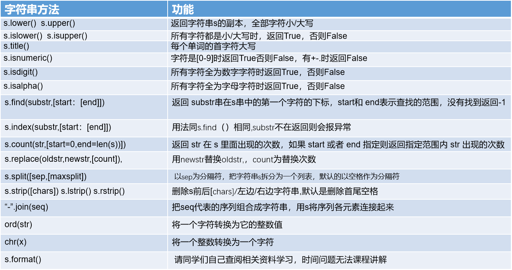

# 本关任务：
# 将歌曲以最长的那一行为标准，其它行居中对齐左补句号输出。

# 字符串的基本操作

# 示例如下：
```
str1=" python.biancheng.net "    
#找出子串在str6中的位置     
print(str1.find('bian')) #输出8
print(str1.find('bian',6,len(str1)))#输出8
print(str1.find('bian',10))#没找到输出-1
#统计某一字串在字符串中出现的次数
print(str1.count('e'))#输出2
#字符串的替换
print(str1.replace('python','c'))#输出 c.biancheng.net  
print(str1)#原字符串不改变 #输出 python.biancheng.net  
#字符串切割，生成列表
print(str1.split('.'))#输出[' python', 'biancheng', 'net ']
print(str1)#原字符串不改变
#字符串的链接
str2=str1.split('.')
print(str2) #[' python', 'biancheng', 'net ']
print('-'.join(str2))  #序列元素的连接输出 python-biancheng-net 
#删除字符串中某一字符
print(str1.strip(' '))#去掉首尾空格输出python.biancheng.net
print(str1)#原字符串不改变输出 python.biancheng.net 
```
# 测试输入：
```
《等风雨经过》曲：周杰伦，词：方文山，张学友演唱
等风雨经过  等我们相见  你微笑仰望着天 我们一起种下心愿  等花开等它实现  该流的泪还是滑过你的脸   我始终在你身边   说好要一起走很远  努力让未来鲜艳  在爱面前需要什么字眼  对你的承诺我一定实现  真正的爱不需要有太多语言  有些感动就放在心里面  在爱面前需要什么字眼  付出的瞬间也就是永远  每天离希望又再靠近了一点  守护家园是最美画面  我们为爱奉献   为梦改变    
```
# 预期输出：
```
《等风雨经过》曲：周杰伦，词：方文山，张学友演唱
。。。等风雨经过
。。。等我们相见
。。你微笑仰望着天
。。我们一起种下心愿
。。等花开等它实现
该流的泪还是滑过你的脸
。。我始终在你身边
。。说好要一起走很远
。。努力让未来鲜艳
。在爱面前需要什么字眼
。对你的承诺我一定实现
真正的爱不需要有太多语言
。有些感动就放在心里面
。在爱面前需要什么字眼
。付出的瞬间也就是永远
每天离希望又再靠近了一点
。守护家园是最美画面
。。。我们为爱奉献
。。。。为梦改变
```