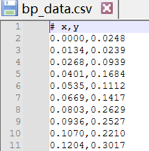

# 本关任务：
BP（反向传播）神经网络是一种经典的多层前馈网络，能够逼近任意非线性函数。本题要求你读懂代码，并填写确实代码，实现一个单隐层BP神经网络，用于拟合一个在工程和自然界中常见的函数——带线性趋势的正弦波。通过本题，你将深入理解前向传播、反向传播、梯度下降以及网络容量的影响。

数据文件“bp_data.csv”格式如下图所示：


# 测试输入1：
```
10
0.1
```
# 预期输出1：`MSE = 0.4690`
# 测试输入2：
```
12
0.5
```
# 预期输出2：`MSE = 0.4200`