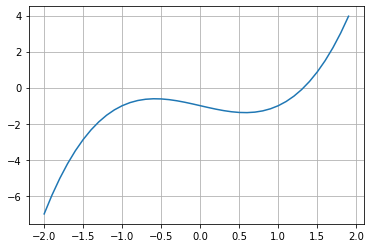

# 本关任务：
用暴力搜索法求$f(x)=x^3−x−1$在[-10,10]之间的近似根。已知f(-10)<0，f(10)>0,画图可知函数在[-10,10]区间有且仅有一个根。



要求近似根带入函数f(x)之后，函数值与0之间的误差在$10^{−6}$之内，请保留4位小数输出该根值，并输出搜寻次数。如果搜根失败，请输出False,并输出搜寻次数。

# 相关知识
针对本题的暴力搜根的思路如下：
1. 从给定的根初值x和步长值h开始，往右逐步寻找,x=x+h。注意：初始值x可能选取不当(f(x)>0且|f(x)|>=err)，直接导致搜根失败，迭代次数为0。
2. 如果|f(x)|< err,则找到近似根，搜根成功，结束计算。
3. 如果函数值大于0，但并不满足精度要求，则搜根失败，提前结束计算，以提高时间效率。

# 测试输入1：
```
1
0.00001
```
# 预期输出1：
```
root=False
迭代次数:32472
```
# 测试输入2：
```
0
0.000001
```
# 预期输出2：
```
root=1.3247
迭代次数:1324718
```