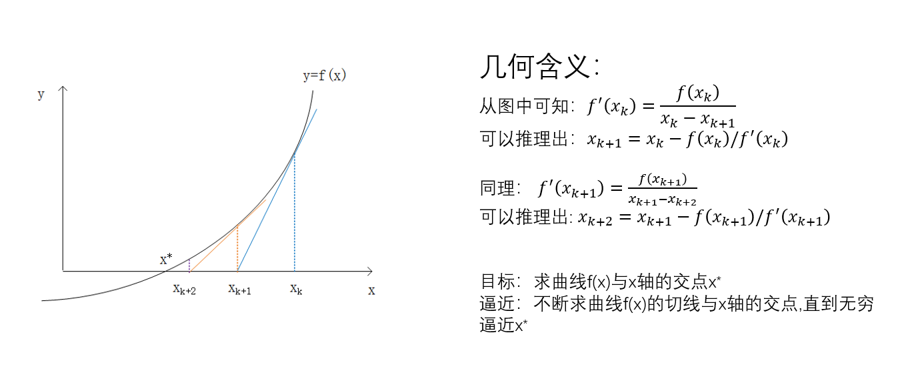

# 本关任务：
用牛顿迭代法求方程的近似根。求$f(x)=x^3−x−1$在[a,b]之间的近似根，要求近似根带入函数f(x)之后，函数值与0之间的误差在$10^{−6}$之内。请保留6位小数输出该根值，并输出迭代次数。

# 牛顿迭代公式
$x_{k+1}=x_k−f(x_k)/f'(x_k)$

算法的几何意义：


算法流程：

1. 画图得到根的初始值x

2. 求出函数的导数，计算f(x), f′(x)

3. 当|f(x)|>=err时,重复以下：  
   x=x−f(x)/f′(x)  
   重新计算f(x), f′(x)
# 测试输入1：`-10`
# 预期输出1：
```
root=1.324718
迭代次数=64
```
# 测试输入2：`-5`
# 预期输出2：
```
root=1.324718
迭代次数=18
```