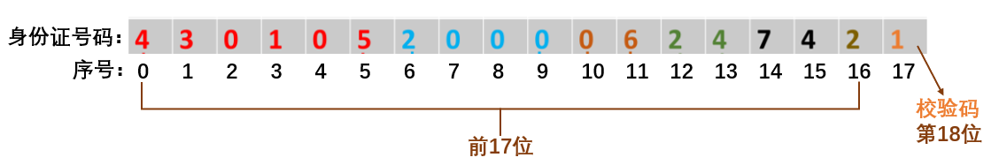

# 本关任务：
# 输入一个身份证号码，判断其是否有效：
- 若不为18位，提示“长度错误”；
- 若前17位存在非数字，提示“存在无效字符”；
- 最后一位为校验码，若错误，提示“错误校验码”， 若正确，提示“正确校验码”。

# 校验码产生规则
1. 将身份证号码的前17位数字分别乘以不同的系数，从第1位到第17位的系数分别为:7、9、10、5、8、4、2、1、6、3、7、9、10、5、8、4、2 ；
2. 将这17位数字和系数相乘的结果进行相加；
3. 用加出来的和除以11，看余数是多少；
4. 余数只可能是0、1、2、3、4、5、6、7、8、9、10这11个数字。其分别对应的最后一位身份证的号码为1、0、X、9、8、7、6、5、4、3、2，其中的X(大写)是罗马数字10；

通过上面得知如果余数是2，就会在身份证的第18位数字上出现罗马数字的X；如果余数是10，身份证的最后一位号码就是2。

# 测试输入：`431234200102049932`
# 预期输出：`正确校验码`