# 目录<a id="content"></a>
## [math库](#math-library)
## [NumPy库](#numpy-library)
## [matplotlib库](#matplotlib-library)
## [机器学习](#machine-learning)
## [算法思维](#algorithmic-thinking)
## [列表的基本操作](#basic-operation-of-list)
## [序列数据的基本操作](#basic-operation-of-sequential-data)
## [字典的基本操作](#basic-operation-of-dictionary)
## [文件操作](#file-operations)
## [ASCII表](#ascii)
## [人工智能-分类与聚类算法](#artificial-intelligence-classification-and-clustering-algorithms)
## [智能决策-搜索与优化](#intelligent-decision-making-search-and-optimization)
## [图像与感知](#computer-vision-and-perception)
## [大数据与机器人](#big-data-and-robots)

---
#  math库<a id="math-library"></a>
## 部分函数
- `abs(x)`：**返回整数的绝对值，如`abs(-10)`返回10。**

- `ceil(x)`：**返回数字的向上取整，如`math.ceil(4.1)`返回5。**

- `exp(x)`：**返回e的x次幂，如`math.exp(1)`返回2.718281828459045。**

- `fabs(x)`：**返回浮点数的绝对值，如`math.fabs(-10)` 返回10.0。**

- `floor(x)`：**返回数字的向下取整，如`math.floor(4.9)`返回4。**

- `log(x,base)`：**如`math.log(math.e,math.e)`返回1.0，`math.log(100,10)`返回2.0。**

- `log10(x)`：**返回以10为基数的x的对数，如`math.log10(100)`返回2.0。**

- `max(x1,x2,...)`：**返回给定参数的最大值，参数可以为序列。**

- `min(x1,x2,...)`：**返回给定参数的最小值，参数可以为序列。**

- `modf(x)`：**以元组的形式返回，（小数部分,整数部分）。两部分的数值符号与x相同，整数部分以浮点型表示。**

- `pow(x, y)`：**$x^y$运算后的值。**

- `round(x [,n])`：**返回浮点数x的四舍五入值，如给出n值，则代表舍入到小数点后的位数。**

- `sqrt(x)`：**返回数字x的平方根，返回类型为实数，如math.sqrt(4)返回2.0。**

- `acos(x)`：**返回x的反余弦弧度值。**

- `asin(x)`：**返回x的反正弦弧度值。**

- `atan(x)`：**返回x的反正切弧度值。**

- `atan2(y, x)`：**返回给定的X及Y坐标值的反正切值。**

- `hypot(x, y)`：**返回欧几里德范数$sqrt(x^2+y^2)$。**

- `cos(x)`：**返回x的弧度的余弦值。**

- `sin(x)`：**返回x弧度的正弦值。**

- `tan(x)`：**返回x弧度的正切值。**

- `degrees(x)`：**将弧度转换为角度，如`degrees(math.pi/2)`， 返回90.0。**

- `radians(x)`：**将角度转换为弧度。**

- `factorial(x)`：**返回x的阶乘。**

除了上述常用的数学函数，`math`库中还定义了两个常用的数学常量：

- `pi`—**圆周率，一般以`π`来表示。**

- `e`—**自然常数。**
### [回到目录](#content)

---
# NumPy库<a id="numpy-library"></a>
## NumPy数组和Python列表的区别
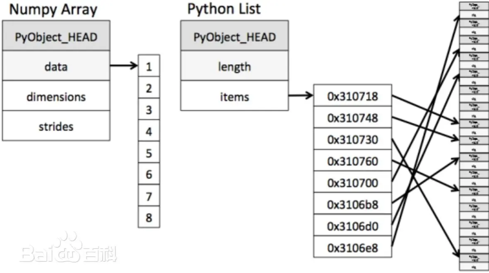
- NumPy数组中元素类型相同，按顺序连续存放，运算效率高
- 列表元素类型任意，存储对象指针，按寻址方式寻找数据
## 数组的创建和索引
### NumPy的核心数据类型ndarray
- ndarray是NumPy的核心对象，表示多维、同质的数组(所有元素类型相同)
- ndarray 的一些重要属性:  
    属性|说明
    ---|---
    ndim|数组的维度(轴)的
    shape|数组的维度，是一个整数元组
    size|数组元素的总数
    dtype|数组元素的数据类型
- dtype:NumPy提供了丰富的数据类型，int8, int16, int32, int64, float16, float32, float64, bool_, object_, str_等
### NumPy数组的创建
#### 从列表或元组创建数组np.array()
- 创建一维数组
```Python
arr1 = np.array([1, 2, 3, 4, 5]) # 从Python列表创建数组# 列表转数组
print("numpy数组:", arr1) # 输出数组 [1 2 3 4 5]
print("单列表:", arr1.tolist()) # 数组转列表 [1, 2, 3, 4, 5]
#注意列表和数组的输出差异，列表元素逗号分隔，数组元素空格分隔
# 查看数组属性
print("数组形状:", arr1.shape) # 维度大小 (5,)
print("数组维度:", arr1.ndim) # 维度数量 1
print("数组大小:", arr1.size) # 元素总数 5
print("数据类型:", arr1.dtype) # 元素数据类型 int64
```
- 创建二维数组
```Python
arr2 = np.array([[1, 2, 3], [4, 5, 6]], dtype=np.float32) # 列表转数组
print("numpy数组:", arr2) # 输出数组 [[1. 2. 3.] 
                          #          [4. 5. 6.]]
print("嵌套列表:", arr2.tolist()) # 数组转列表 [[1.0, 2.0, 3.0], [4.0, 5.0, 6.0]]
# 查看数组属性
print("数组形状:", arr2.shape) # 维度大小 (2, 3)
print("数组维度:", arr2.ndim) # 维度数量 2
print("数组大小:", arr2.size) # 元素总数 6
print("数据类型:", arr2.dtype) # 元素数据类型 float32
```
#### 使用NumPy库函数创建特殊数组
- `np.zeros(shape)`：创建全零数组，例如：`np.zeros((2, 3))`，结果：\[[0. 0. 0.], [0. 0. 0.]]

- `np.ones(shape)`： 创建全一数组，例如：`np.ones((3,))`，结果： [1. 1. 1.]

- `np.arange([start,] stop[, step,])`：创建等差序列数组，例如：`np.arange(0, 10, 2)`，结果：[0 2 4 6 8]

- `np.linspace(start, stop, num=50, endpoint=True)`: 创建指定元素数量的等分数组, 例如: `np.linspace(0, 1, 5)`, 结果: [0. 0.25 0.5 0.75 1.]

- `np.logspace(low, high=None, size=None)`: 创建指定元素数量的等比数组，例如:`np.logspace(0,2,5)`，
结果: 在100到102之间生成5个等比数列

- `np.eye(N)`：创建单位矩阵，例如：`np.eye(3)`，结果：\[[1. 0. 0.], [0. 1. 0.], [0. 0. 1.]]

- `np.identity(n)`：创建单位方阵，例如：`np.identity(2)`，结果：\[[1. 0.], [0. 1.]]

- `np.diag(v)`： 创建对角矩阵，例如：`np.diag([1, 2, 3])`，结果：\[[1 0 0], [0 2 0], [0 0 3]]

- `np.empty()`：生成一个空数组，例如：`np.empty((3, 2))`，结果：\[[0. 0.],[0. 0.],[0. 0.]]

- `np.full()`：用一个数初始化数组，例如：`np.full((3, 2), 10)`结果：\[[10 10],[10 10],[10 10]]
#### 使用NumPy库函数创建随机数组
- `np.random.seed(seed=None)`：设置随机数生成器的种子，使下面的随机数生成具有可重复性。seed建议使用0到$2^{32}−1$之间的整数。

- `np.random.rand(d0, d1, ..., dn)`：[0,1)均匀分布的随机数组，例如：`np.random.rand(2, 2)`，结果：2x2随机数组

- `np.random.randn(d0, d1, ..., dn)`：标准正态分布的随机数组，例如：`np.random.randn(3)`，结果：3个元素的随机数组

- `np.random.random(size=None)`：[0,1)均匀分布的随机数组，例如：`np.random.random((2,3))`，结果：2x3 随机数组

- `np.random.randint(low, high=None, size=None)`：指定范围的随机整数数组，例如：`np.random.randint(5, 10, size=(3,))`

- `np.random.normal(loc=0.0, scale=1.0, size=None)`：前两个参数分别为期望值和标准差
正态分布的随机数组，例如：`np.random.normal(5, 10, size=(3,))`

- `np.random.permutation(x)`：生成序列的随机排列或随机排列的序列索引。如果x是整数，生成0到x-1的随机排列;如果x是数组，返回数组的随机副本。
```Python
perm = np.random.permutation(5)print(perm) # 可能输出: [3, 1, 4, 0, 2]
arr = np.array([10, 20, 30, 40])
shuffled = np.random.permutation(arr) # 返回打乱顺序的新数组
print(shuffled)
matrix = np.array([[1, 2], [3, 4], [5, 6]])
shuffled_matrix = np.random.permutation(matrix) # 沿第一个轴（行方向）打乱
print(shuffled_matrix)
```
#### 保存数组到文件
- 将数组写入文本文件  
    `np.savetxt(fname, X, fmt='%.18e', delimiter=' ', newline='\n',header='', footer='', comments='# ', encoding=None)`
    - fname：文件名
    - X：要保存的数据数组
    - fmt：格式化字符串
    - delimiter：列分隔符
    - newline：行分隔符；
    - header：文件头部的字符串
    - footer：文件尾部的字符串
    - comments：注释前缀
    - encoding：文件编码，建议设置为’utf-8’以便支持中文
- 最基本的使用示例
    ```Python
    data = np.array([[1, 2, 3], [4, 5, 6],[7, 8, 9]])
    np.savetxt('basic_data.txt', data)
    ```
- 包含的头部和尾部示例
    ```Python
    data = np.random.rand(10, 5)
    header_text = """实验数据记录
    日期: 2024-01-15
    """
    footer_text = "数据结束。备注: 这是模拟实验数据"
    np.savetxt(
        'with_header_footer.txt', 
        data,
        fmt='%.4f',
        delimiter='\t',
        header=header_text,
        footer=footer_text,
        comments='# ',
        encoding='utf-8'
        )
    ```
#### 从文件读取数组
- `np.loadtxt(fname, dtype=<class 'float'>, comments='#',delimiter=' ', skiprows=0,usecols=None,encoding='bytes')`
    - 参数
      - fname：文件名
      - dtype：结果数组的数据类型
      - comments：用于指示注释开始的字符
      - delimiter：分隔字符串值的字符
      - skiprows：跳过文件开头的行数
      - usecols：要读取哪些列
      - encoding：用于解码输入文件的编码，建议设置为'utf-8'以便支持中文。
    - 基本加载示例：
    ```Python
    arr = np.loadtxt('basic_data.txt')
    arr2 = np.loadtxt('basic_data.txt',dtype=np.int32)
    ```
    - 处理注释加载示例：
    ```Python
    arr_no_comments = np.loadtxt('with_header_footer.txt', delimiter='\t', comments='#', encoding = "utf-8")
    print(arr_no_comments)
    arr_no_comments2 = np.loadtxt('with_header_footer.txt', delimiter='\t',comments='#', usecols=(0,-1), encoding = "utf-8")
    print(arr_no_comments2)
    ```
- `np.genfromtxt(fname, dtype=<class 'float'>, comments='#', delimiter=' ',skip_header=0, skip_footer=0, missing_values=None, filling_values=None,usecols=None, encoding='bytes')`
    - 参数
      - 前四个参数与np.loadtxt相同
      - skip_header：跳过文件开头行数
      - skip_footer：跳过文件末尾行数
      - missing_values：缺失值标记
      - filling_values：缺失值填充值
      - usecols：要读取哪些列
      - encoding：用于解码输入文件的编码，建议设置为'utf-8'以便支持中文。
    - 基本加载示例：
    ```Python
    arr = np.genfromtxt('basic_data.txt')
    print(arr)
    ```
    - 处理包含缺失值加载示例：
    ```Python
    missing_data = """1,2,3
    4,,6
    7,8,
    ,10,11"""
    arr_filled = np.genfromtxt(missing_data.splitlines(), delimiter=",", filling_values=-999)
    print("缺失值处理结果:")
    print(arr_filled)
    ```
### 数组索引和切片
- 整数索引：使用单个整数来访问数组中的单个。对于多维数组，可以指定多个整数索引来访问特定位置的元素。
  - 示例：
    ```Python
    # 创建二维数组
    arr_2d = np.array([[1, 2, 3, 4],
        [5, 6, 7, 8],
        [9, 10, 11, 12]])
    # 单个元素索引
    print("arr_2d[0, 1]:", arr_2d[0, 1]) # 第一行第二列
    print("arr_2d[2, 3]:", arr_2d[2, 3]) # 第三行第四列
    print("arr_2d[-1, -2]:", arr_2d[-1, -2]) # 最后一行倒数第二列
    # 整行/整列索引
    print("第二行:", arr_2d[1])# 第二行（整行）
    print("第三列:", arr_2d[:, 2])# 第三列（整列）
    ```
- 切片索引：使用切片语法（start:stop:step）来访问数组的子集。注意：数组切片是原始数组的**视图**，视图上的任何修改都会直接反应到源数组。如果要获得新数组： arr_bak = arr[:3].copy()
  - 示例：
    ```Python
    # 行切片
    print("前两行:\n", arr_2d[:2])# 前两行
    print("第二行以后:\n", arr_2d[1:])# 第二行及以后
    # 列切片
    print("前两列:\n", arr_2d[:, :2])# 所有行的前两列
    print("第二列以后:\n", arr_2d[:, 1:]) # 所有行的第二列及以后
    # 行列组合切片
    print("前两行的前两列:\n", arr_2d[:2, :2])
    print("第二行以后的第二列以后:\n", arr_2d[1:, 1:])
    # 带步长的切片
    print("每隔一行的每隔一列:\n", arr_2d[::2, ::2])
    # 选择性修改数组元素
    arr_2d[::2,::2]=0 #修改切片的数组值
    print("每隔一行的每隔一列赋零",arr_2d)
    ```
    ```Python
    arr1 = np.arange(10)
    print(arr1)
    print(arr1[5: 8])
    arr1[5: 8] = 12 # 值的广播
    print(arr1)# [ 0  1  2  3  4 12 12 12  8  9]
    arr1_bak = arr1[5:8].copy()
    arr1_bak[0]=100
    print(arr1)# [ 0  1  2  3  4 12 12 12  8  9]
    ```
- 整数数组索引：使用整数数组或列表来指定要访问的元素的索引，又称花式索引、列表索引，获得的是**新数组**。整数数组索引允许你一次选择多个不连续的元素。
  - 示例：
    ```Python
    # 一维测试数组示例
    arr = np.array([10, 20, 30, 40, 50, 60, 70, 80, 90]) # 创建测试数组
    indices = [0, 2, 5, 7]
    print("整数数组索引:", arr[indices])
    # 二维测试数组示例
    arr_2d = np.array([[1, 2, 3],
        [4, 5, 6],
        [7, 8, 9]])#创建测试数组
    print("选择第0和第2行:\n", arr_2d[[0, 2]]) # 选择特定行
    rows = [0, 1, 2]
    cols = [2, 1, 0]
    print("对角线元素:", arr_2d[rows, cols]) # 选择特定行列组合(0,2), (1,1), (2,0)
    ```
    ```Python
    arr2d = np.linspace(1,100,12).reshape(4,3)
    print(arr2d)
    print(arr2d[[2,0,1]]) #依次选取2,0,1行
    print(arr2d[:,[2,0]]) #依次选取2,0列
    arr_bak = arr2d[[2,0,1]]
    arr_bak *= 2
    print(arr2d)
    print(arr_bak)
    ```
- 布尔索引：使用布尔数组或条件表达式来选择满足条件的元素。
  - 示例：
    ```Python
    # 一维测试数组
    arr = np.array([1, 2, 3, 4, 5, 6, 7, 8, 9, 10]) # 创建测试数组
    print("大于5的元素:", arr[arr > 5]) # 简单布尔条件
    print("偶数元素:", arr[arr % 2 == 0]) # 简单布尔条件
    print("大于3且小于8的元素:", arr[(arr > 3) & (arr < 8)]) # 组合条件逻辑与
    print("小于3或大于7的元素:", arr[(arr < 3) | (arr > 7)]) # 组合条件逻辑或
    # 二维测试数组
    arr_2d = np.array([[1, 2, 3],
        [4, 5, 6],
        [7, 8, 9]])
    print("大于5的元素:", arr_2d[arr_2d > 5])
    print("第二列大于2的行:\n", arr_2d[arr_2d[:, 1] > 2]) # 按行/列条件选择  
    ```
- 条件赋值：在布尔索引的基础上对数组元素进行修改
  - 示例：
    ```Python
    # 一维测试数组示例
    arr = np.array([1, 2, 3, 4, 5, 6, 7, 8, 9, 10])
    arr[arr > 5] = 0 # 将所有大于5的元素设为0
    arr = np.array([1, 2, 3, 4, 5, 6, 7, 8, 9, 10]) # 重置数组
    arr[(arr > 3) & (arr < 8)] = -1 # 使用多个条件
    print("3到8之间的元素设为-1:", arr)
    # 二维测试数组示例
    arr_2d = np.array([[1, 2, 3, 4],
        [5, 6, 7, 8],
        [9, 10, 11, 12]])
    arr_2d[arr_2d > 5] = 0
    print("大于5的元素被赋值为0:", arr_2d)
    ```
    ```Python
    # 按列条件选择行
    arr_2d = np.array([[1, 2, 3, 4],
        [5, 6, 7, 8],
        [9, 10, 11, 12]])
    mask = arr_2d[:, 1] > 2
    arr_2d[mask,:] = -1 # 请尝试 arr_2d[mask,2] = -1 ，并分析结果
    print("第一列大于2的行被赋值为-1:\n", arr_2d)
    # 按行条件选择列
    arr_2d = np.array([[1, 2, 3, 4],
        [5, 6, 7, 8],
        [9, 10, 11, 12]])
    mask = arr_2d[1, :] > 6
    arr_2d[:, mask] = -1 # 请尝试 arr_2d[2, mask] = -1 ，并分析结果
    print("第一行大于6的列被赋值为-1:\n", arr_2d)
    ```
### 逐元素函数及ndarray方法
- 三角函数：
  - `np.sin(x) `
  - `np.cos(x)`
  - `np.tan(x)`
  - `np.cos(x)/np.sin(x)`：实现余切。
  - 示例：
    ```Python
    angles = np.linspace(0, 2*np.pi, 100) # 创建角度数组（弧度制）
    sin_values = np.sin(angles) # 基本三角函数计算
    # 角度与弧度转换函数
    degrees = np.array([0, 30, 45, 60, 90, 180, 270, 360])
    radians = np.deg2rad(degrees) # 角度转弧度
    back_to_degrees = np.rad2deg(radians) # 弧度转角度
    ```
- 取整函数：
  - `np.ceil(x)`：向正无穷取整
  - `np.floor(x)`：向负无穷取整
  - `np.fix(x)`：截断小数部分
  - `np.round(a, decimals=0)`或`ndarray.round(decimals=0)`：四舍六入五成双(向偶数靠拢)。例如：`round(2.5) = 2`，`round(3.5) = 4`，`round(4.5) = 4`
- 其它函数：
  - `np.abs(x)`：绝对值
  - `np.sqrt(x)`：平方根，x>=0
  - `np.mod(x, y)`：取模运算,y≠0
  - `np.power(x, y)`：幂运算，x ≥ 0 或 y 为整数。
### 数组元素基本类型转换
`ndarray.astype(dtype)`  
示例：
```Python
arr = np.array([1, 2, 3, 4])
arr_float = arr.astype(np.float64) # 整数转浮点
print("整数转浮点:", arr_float.dtype)
arr_float = np.array([1.9, 2.1, 3.5])
arr_int = arr_float.astype(np.int32) # 浮点转整数（截断）
print("浮点转整数（截断）:", arr_int)
arr_signed = np.array([-1, 0, 1])
arr_unsigned = arr_signed.astype(np.uint8) # 有符号转无符号
print("有符号转无符号:", arr_unsigned) # 注意-1会变成255
```
## 聚合函数及axis轴
### NumPy中的函数参数axis解析
- 对于二维数组（矩阵）
    - axis=0：沿着行的方向（垂直方向），即跨行操作，结果是列方向的汇总（每列一个值）（变成一行）
    - axis=1：沿着列的方向（水平方向），即跨列操作，结果是行方向的汇总（每行一个值）（变成一列）
- 通用规则
    - 指定axis后，函数操作会沿着该轴进行，并消除该轴（即结果数组的维度会减少该轴，除非使用keepdims=True）
    - 如果不指定axis，则对整个数组进行操作（返回一个标量）
### 聚合函数
- `np.sum(a, axis=None, keepdims=<no value>)`：求和

- `np.mean(a, axis=None, keepdims=<no value>)`：平均值

- `np.max (a, axis=None, keepdims=<no value>)`：最大值

- `np.argmax(a, axis=None)`：最大值索引

- `np.min(a, axis=None, keepdims=<no value>)`：最小值

- `np.argmin(a, axis=None)`：最小值索引

- `np.std(a, axis=None, keepdims=<no value>)`：标准差

- `np.var(a, axis=None, keepdims=<no value>)`：方差

- `np.median(a, axis=None, keepdims=<no value>)`：中位数

- `np.prod(a, axis=None, keepdims=<no value>)`：所有元素乘积

- 示例：
    ```Python
    a = np.array([[1,2,3], 
        [4,5,6]])
    print(np.sum(a))# 输出：21
    print(np.sum(a, axis=0)) # 按列求和：输出 [5, 7, 9]
    print(np.sum(a, axis=0, keepdims=True)) # 按列求和：shape (1,3)，行数缩成1，列数不变
    print(np.sum(a, axis=1)) # 按行求和：输出 [6, 15]
    print(np.sum(a, axis=1, keepdims=True)) # shape (2,1)，行数不变，列数缩成1
    ```
### 拼接函数
`np.concatenate((a1, a2, ...), axis=0)`  
示例：
```Python
# 一维数组示例:
a = np.array([1, 2, 3])
b = np.array([4, 5, 6])
result1 = np.concatenate((a, b)) # 沿默认轴(0)连接
print(result1)
result2 = np.concatenate((a, b), axis=1) # 报错，axis 1 is out of bounds for array of dimension 1
# 二维数组示例：
x = np.array([[1, 2], [3, 4]]) # 2行2列
y = np.array([[5, 6]]) # 1行2列
rows = np.concatenate((x, y), axis=0) # 沿行连接 (axis=0) ，列相同
z = np.array([[7], [8]]) # 2行1列
cols = np.concatenate((x, z), axis=1) # 沿列连接 (axis=1)，行相同
```
### 数组形状重塑函数reshape
`np.reshape(a, newshape)`或`ndarray.reshape(shape)`  
示例：
```Python
arr_1d = np.arange(12) # [0, 1, 2, ..., 11]
print("原始形状:", arr_1d.shape)
arr_2d = arr_1d.reshape(3, 4) # 重塑为二维数组 (3x4)
print("新形状:", arr_2d.shape)
arr_auto1 = arr_1d.reshape(4, -1) # 4x3，使用-1自动计算维度大小,自动计算第二维
print("4x-1 形状:", arr_auto1.shape)
arr_auto2 = arr_1d.reshape(-1, 6) # 4x6，# 自动计算第一维
print("-1x6 形状:", arr_auto2.shape)
print(arr_auto2.reshape(-1)) # 一维
```
### 多维数组展平为一维数组
- np.ravel(a)：numpy库函数
- ndarray.ravel()：ndarray专有方法
- ndarray.flatten()：ndarray专有方法
  - 示例：
    ```Python
    # 创建二维数组
    arr_2d = np.array([[1, 2, 3],
        [4, 5, 6],
        [7, 8, 9]])
    arr_ravel = arr_2d.ravel() # 使用方法ravel展平
    arr_flatten = arr_2d.flatten() # 使用方法flatten展平
    arr_ravel_np = np.ravel(arr_2d) # 使用numpy函数展平
    ```
### 升维和降维
- 使用``np.newaxis``或`None`升维
  - 示例：
    ```Python
    arr_1d = np.array([1, 2, 3, 4, 5])
    arr_col = arr_1d[:, np.newaxis] # 增加行维度（变为列向量），可用None替代np.newaxis
    print(arr_col.shape) # (5, 1)
    arr_row = arr_1d[np.newaxis, :] # 增加列维度（变为行向量）
    print(arr_row.shape) # (1, 5)
    arr_2d = np.array([[1, 2], [3, 4]])
    arr_3d = arr_2d[np.newaxis, :, :, np.newaxis] # 在多个位置增加维度
    print("增加两个维度后形状:", arr_3d.shape) # (1, 2, 2, 1)
    ```
- 使用`np.squeeze(a, axis=None)`或`ndarray.squeeze(axis=None)`降维
  - 示例：
    ```Python
    arr_3d = np.array([[[1], [2]], [[3], [4]]]) # 创建高维数组
    print("原始三维数组形状:", arr_3d.shape) # 形状 (2, 2, 1)
    arr_squeezed = np.squeeze(arr_3d) # 自动移除所有长度为1的维度
    print("squeeze后形状:", arr_squeezed.shape) # 形状 (2, 2)
    arr_4d = np.array([[[[1, 2]]]]) 
    print("\n四维数组形状:", arr_4d.shape) # 形状 (1, 1, 1, 2)
    arr_squeeze_axis0 = np.squeeze(arr_4d, axis=0) # 移除轴0
    arr_squeeze_axis1 = np.squeeze(arr_4d, axis=1) # 移除轴1
    print("移除轴0后形状:", arr_squeeze_axis0.shape) # 形状 (1, 1, 2)
    print("移除轴1后形状:", arr_squeeze_axis1.shape) # 形状 (1, 1, 2)
    ```
### 数组排序
`np.sort(a, axis=-1, kind, order)`或`ndarray.sort(axis=-1)`  
参数：
- a: 要排序的numpy数组，支持任意维度的数组
- axis: 排序维度，-1表示最后一个轴，None表示所有元素拉平后排序
- kind: 排序算法，包括 'quicksort', 'mergesort', 'heapsort', 'stable' 
- order: 用于结构化数组的多级排序

示例：
```Python
# 一维数组
arr = np.array([3, 1, 4, 1, 5, 9, 2, 6, 5, 3]) # 创建测试数组
arr.sort() # 原地排序（改变原数组）
print("排序后数组:", arr) # [1 1 2 3 3 4 5 5 6 9]
print("方法返回:", arr.sort()) # None
arr = np.array([3, 1, 4, 1, 5, 9, 2, 6, 5, 3]) # 创建测试数组
sorted_func = np.sort(arr)
print("原数组:", arr) # [3, 1, 4, 1, 5, 9, 2, 6, 5, 3] 原数组不变
print("返回数组:", sorted_func) # [1 1 2 3 3 4 5 5 6 9]
```
```Python
# 二维数组
matrix = np.array([[3, 1, 4], [1, 5, 9], [2, 6, 5]]) # 创建2D数组
matrix_copy = matrix.copy() # 复制一份用于比较
matrix.sort(axis=1) # 方法版本 - 原地按行排序
print("\n方法排序后（按行）:\n", matrix)
sorted_matrix = np.sort(matrix_copy, axis=1) # 函数版本 - 返回新数组
print("\n函数排序后（按行）:\n", sorted_matrix)
print("原矩阵:\n", matrix_copy) # 保持不变
```
### 获取排序索引
`np.argsort(a, axis=-1)`或`ndarray.argsort(axis=-1)`  

示例：
```Python
# 一维数组
arr = np.array([3, 1, 4, 2])
indices = arr.argsort() # 获取排序索引（升序）
print("排序索引:", indices) # [1 3 0 2]
print("使用索引获取排序结果:", arr[indices]) # [1 2 3 4]
indices_desc = arr.argsort()[::-1] # 降序排序索引
print("降序索引:", indices_desc) # [2 0 3 1]
print("降序结果:", arr[indices_desc]) # [4 3 2 1]
indices_desc2 = (-arr).argsort() # 另一种降序方式
print("降序索引(方式2):", indices_desc2)
```
```Python
# 二维数组
matrix = np.array([[3, 1, 4], 
    [1, 5, 9], 
    [2, 6, 5]])
row_indices = matrix.argsort(axis=1) # 每行的排序索引
print("\n每行排序索引:\n", row_indices)
print("\n",np.take_along_axis(matrix,row_indices,axis=1)) #用排序索引输出排序数组
col_indices = matrix.argsort(axis=0) # 每列的排序索引
print("\n每列排序索引:\n", col_indices)
```
## 矩阵运算及广播
### 矩阵乘法
`A @ B`或`np.matmul(A, B)`  

示例：
```Python
A = np.array([[1, 2, 3], [3, 4, 5]])
B = np.array([[2, 1], [3, 2], [0, 3]])
result1 = A @ B # 得到[[ 8 14] [18 26]]
result2 = np.matmul(A, B) # 两者等价
```
### 点积(内积)运算
对于一维数组是向量内积，对于二维数组是矩阵乘法，对于更高维的数组则是张量缩并（tensor contraction）  
`np.dot(a, b)`或`a.dot(b)`
- 两个一维数组 → 向量内积，要求数组元素个数相同
- 两个二维数组 → 矩阵乘法，要求满足矩阵乘法规则，与np.matmul()和@等同

示例：
```Python
# 一维数组
a = np.array([1, 2, 3])
b = np.array([4, 5, 6])
result = np.dot(a, b) # 1*4 + 2*5 + 3*6 = 32
# 二维数组
A = np.array([[1, 2, 3], # 2×3矩阵
[4, 5, 6]])
B = np.array([[7, 8], # 3×2矩阵
[9, 10],
[11, 12]])
result = np.dot(A, B) # 结果形状：2×2
"""
第一行：[1*7 + 2*9 + 3*11, 1*8 + 2*10 + 3*12] = [58, 64]
第二行：[4*7 + 5*9 + 6*11, 4*8 + 5*10 + 6*12] = [139, 154]
"""
```
### 逐元素运算的广播机制
- 广播（Broadcasting）是 NumPy 中最强大的特性之一，它允许对不同形状的数组进行算术运算，而不需要显式复制数据。广播机制使得 NumPy 能够高效地处理不同维度的数组运算。
- 广播规则详解
    - 维度对齐：从尾部（最右边）维度开始比较
    - 维度兼容：维度必须满足以下条件之一：
      - 相等
      - 其中一个为 1
    - 维度扩展：在缺失维度或大小为 1 的维度上进行扩展

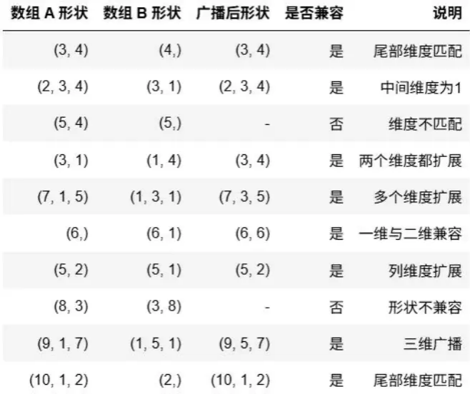
```Python
c = np.array([[1], [2], [3]]) # 形状 (3, 1)
d = np.array([10, 20, 30]) # 形状 (3,)
print(c + d)
# c的形状由(3,1) 扩充为(3,3),列向扩充 ;
# d的形状由(3,)扩充为(1,3),再扩充为(3,3),行向扩充。
# 输出:
# [[11 21 31]
#  [12 22 32]
#  [13 23 33]]
a = np.array([[1, 2, 3]]) # (1, 3) - 行向量
b = np.array([10, 20, 30]) # (3,)
print(a + b) # a的形状不变；b的形状由(3,)扩充为(1,3)
# 输出: [[11 22 33]]
```
```Python
A = np.ones((2, 3)) # 形状: (2, 3) 数据格式为float64
B = np.array([1, 2, 3]) # 形状: (3,)
print(A+B)
# 广播步骤：
# 1. 对齐维度: A(2,3) vs B(3) → B添加新轴: (1,3)
# 2. 扩展维度: B沿轴0复制: (2,3)
# 3. 执行操作: A + 扩展后的B
# 输出:
# [[2. 3. 4.]
#  [2. 3. 4.]]
# 数组与标量相加
arr = np.array([1, 2, 3, 4])
scalar = 10
new = arr + scalar # 这实际上会将标量广播到与数组相同的形状，然后进行元素级加法
print(new) # 输出: [11 12 13 14]
```
### 矩阵乘法的广播机制
- np.matmul 或 @ 运算遵循矩阵乘法规则，广播发生在：
    - 最后两个维度进行矩阵乘法
    - 前面维度遵循逐元素广播规则
- 对于形状为 (a, b, ..., m, n) 和 (a, b, ..., n, p) 的数组：
    - 前面维度 (a, b, ...) 必须广播兼容
    - 最后两个维度 (m, n) 和 (n, p) 必须满足矩阵乘法规则
- 一维数组自动添加/移除维度：
    - 左操作数自动添加前置维度：(n,) → (1, n)
    - 右操作数自动添加后置维度：(n,) → (n, 1)
- 结果维度自动缩减：
    - (m,n) @ (n,) → (m,) # 移除尾部维度
    - (m,) @ (m,n) → (n,) # 移除首部维度

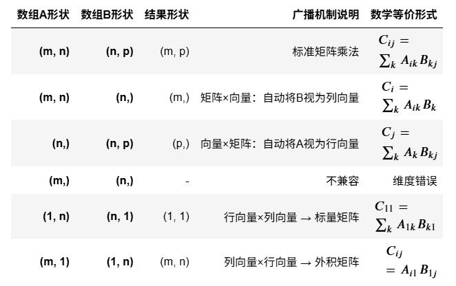
#### 向量与矩阵相乘示例：
```Python
# 向量 (3,) 与矩阵 (3x2) 相乘
vector = np.array([2, 3, 7])
matrix = np.array([[1, 2], [3, 4], [5, 6]])
result = vector @ matrix #np.dot(vector,matrix)
# 向量(3,)自动广播为行向量(1,3); 运算结果移除首部维度
print(result) # 输出: [46 58]
```
#### 矩阵与向量相乘示例：
```Python
# 矩阵 (3x2) 与向量 (2,) 相乘
matrix = np.array([[1, 2], [3, 4], [5, 6]])
vector = np.array([2, 3])
result = matrix @ vector # np.dot(matrix,vector)
# 向量(2,)自动广播为列向量(2,1); 运算结果移除尾部维度
print(result) # 输出：[ 8 18 28]
```
#### 向量的矩阵乘法示例：
```Python
u = np.array([1, 2, 3]) # (3,)
v = np.array([4, 5, 6]) # (3,)
dot_product = u @ v
# (3,)(3,)=>(1,3)(3,1)=>(1,1)，效果等同于内积
print(dot_product) # 输出: 32 
```
#### 行向量与矩阵相乘示例：
```Python
# 行向量 (1, 3) 与矩阵 (3x2) 相乘
matrix = np.array([[1, 2], [3, 4], [5, 6]])
vector = np.array([[2, 3, 7]])
result = vector @ matrix
# 行向量与矩阵相乘；运算结果不移除维度
print(result) # 输出: [[46 58]]
```
### 线性代数相关函数
- `np.dot()`：矩阵点乘（内积）

- `np.matmul()`：矩阵乘法（等同于 @ 运算符）

- `np.linalg.inv()`：计算矩阵的逆

- `np.linalg.det()`：计算矩阵的行列式

- `np.linalg.eig()`：计算矩阵的特征值和特征向量

- `np.transpose()`：矩阵转置，ndarray.T

- `np.trace()`：计算矩阵的迹（对角线元素之和）
### [回到目录](#content)

---
# matplotlib库<a id="matplotlib-library"></a>
## 基本知识
- 导入库`import matplotlib.pyplot as plt`
- 中文问题：
    ```Python
    # 步骤一（替换sans-serif字体）
    plt.rcParams['font.sans-serif'] = ['SimHei']
    # 步骤二（解决坐标轴负数的负号显示问题）
    plt.rcParams['axes.unicode_minus'] = False
    # 解决汉字乱码问题
    # 注意：Macos用 STHeitiSC-Light
    ```
- 创建绘图区域
    - 在绘图结构中，figure 创建窗口，subplot 创建子图。所有的绘画只能在子图上进行。plt 表示当前子图，若没有就创建一个子图。
      - figure：面板(图)，matplotlib中的所有图像都是位于figure对象中，一个图像只
      能有一个figure对象。
      - subplot：子图，figure对象下创建一个或多个subplot对象(即axes)用于绘制图像。
    - 使用 subplot 函数的时候，你需要指明网格的行列数量，以及你希望将图样放在哪一个网格区域中。
```Python
#导入库函数
import matplotlib.pyplot as plt
plt.rcParams['font.sans-serif'] = ['SimHei']
plt.rcParams['axes.unicode_minus'] = False
import numpy as np
#准备绘图数据
x = np.arange(-5,5,0.1) # 定义x数据范围
y1 = x*3 # 定义y1数据范围
y2 = x*x # 定义y2数据范围
#创建窗口、子图
fig = plt.figure() # 先创建一个窗口
ax1 = fig.add_subplot(2,1,1) #通过fig添加子图，参数：(行数,列数,第几个)
ax2 = fig.add_subplot(2,1,2)
ax1.plot(x,y1) # plot()画出直线
ax2.plot(x,y2,color = 'red',marker = '*', linestyle = '--') # 设置曲线颜色,标记，样式
plt.show() # 显示图像
```
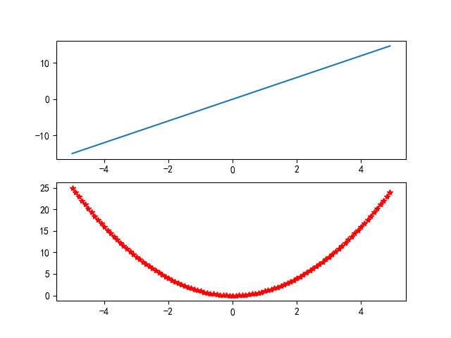
## 图表的基本组成元素
<table>
    <tr>
        <td>图表基本元素</td> 
        <td>含义</td>
        <td>plt.函数名</td>
    </tr>
    <tr>
        <td>画布</td> 
        <td>绘图界面，可绘制1个或多个图</td> 
        <td>fig = plt.figure(figsize =(15,10))</td>
    </tr>
    <tr>
        <td>坐标系、坐标轴</td>
        <td>直角、球和极坐标系，常用直角坐标系x轴和y轴（二维）</td>
        <td>坐标刻度默认x或y的值，改变显示用plt.xticks(),plt.yticks()，刻度范围plt.xlim(),plt.ylim()</td>
    </tr>
    <tr>
        <td>坐标轴标题</td>
        <td>x轴和y轴的名称</td>
        <td>plt.xlabel(),plt.ylabel()</td>
    </tr>
    <tr>
        <td>图表标题</td>
        <td>图表核心主题</td>
        <td>plt.title("标题名称")</td>
    </tr>
    <tr>
        <td>数据标签</td>
        <td>展示图表中的数值</td>
        <td>plt.text(i,j,value),(i,j)代表位置</td>
    </tr>
    <tr>
        <td>数据表</td>
        <td>图表下方的数据表</td>
        <td>plt.table()</td>
    </tr>
    <tr>
        <td>网格线</td>
        <td>更方便察看数据的位置信息</td>
        <td>plt.grid(b=True/False)</td>
    </tr>
    <tr>
        <td>图例</td>
        <td>不同符号或颜色代表的内容和指标</td>
        <td>label 参数传入图例名称，plt.legend(loc =?)显示图例</td>
    <tr>
        <td>格式化参数</td>
        <td colspan="2">颜色color，线型linestyle，线宽linewidth, 标记marker， 图例label，字体大小fontsize</td>
    </tr>
</table>

## 折线图-plot
`plt.plot(x, y, color="r", linestyle="--", marker="*", linewidth=1.0)`  
简化写成`plt.plot(x, y, "r--*" ,linewidth=1.0)`
<details><summary>linestyle</summary>
    <ul>
        <li>实线：'-'或'solid'</li>
        <li>虚线：'--'或'dashed'</li>
        <li>点线：':'或'dotted'</li>
        <li>点划线：'-.'或'dashdot'</li>
        <li>无线条：''或' '或'None'</li>
    </ul>
</details>
<details><summary>color</summary>
    <ul>
        <li>蓝色：'b'或'blue'</li>
        <li>红色：'r'或'red'</li>
        <li>绿色：'g'或'green'</li>
        <li>青色：'c'或'cyan'</li>
        <li>品红：'m'或'magenta'</li>
        <li>黄色：'y'或'yellow'</li>
        <li>黑色：'k'或'black'</li>
        <li>白色：'w'或'white'</li>
    </ul>
</details>
<details><summary>marker</summary>
    <ul>
        <li>实心圆：'o'</li>
        <li>叉号：'x'</li>
        <li>加号：'+'</li>
        <li>实心加号：'P'</li>
        <li>菱形：'D'</li>
        <li>正方形：'s'</li>
        <li>上三角形：'^'</li>
    </ul>
</details>
<details><summary>loc</summary>
    <ul>
        <li>'best'</li>
        <li>'upper right'</li>
        <li>'upper left'</li>
        <li>'lower left'</li>
        <li>'lower right'</li>
        <li>'right'</li>
        <li>'center left'</li>
        <li>'center right'</li>
        <li>'lower center'</li>
        <li>'upper center'</li>
        <li>'center'</li>
    </ul>
</details>

```Python
#绘制折线图设置图标元素
x = [1, 2, 3, 4]
y = [1.2, 2.5, 4.5, 7.3]
'''
第一个参数是序号，可为数字或字符串,用来区分不同画布；可用figsize参数指明画布大小。
fig1=plt.figure('fig1', figsize=(7,5))
默认使用一个画布 如果要拥有多个画布，可用figure函数创建!
''' 
fig1 = plt.figure('fig1',figsize =(7,5))
# plot函数作图折线图
plt.plot(x, y, color="r", linestyle="--", marker="*", linewidth=1.0,label ='虚线')
plt.plot(x, x, color="b", linestyle="-", marker="o", linewidth=2.0,label = '实线')
plt.legend(loc='upper left') #图例显示位置
plt.title('折线图')
plt.ylabel('Y')
plt.xlabel('X')
plt.grid() #网格
plt.savefig('line.png') #保存
plt.show() #看得到图形则不用这条语句
```
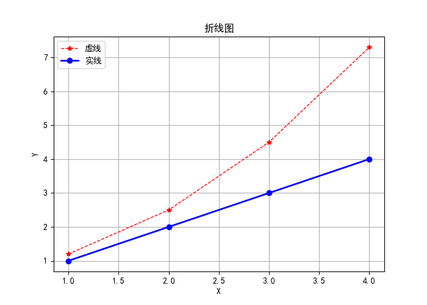
## 条形图-bar
`bar(left, height, alpha=1, width,bottom, color=, edgecolor=, label=, linewidth)`
<details><summary>参数：</summary>
    <ul>
        <li>left：x轴的位置序列，一般采用arange函数产生一个序列，类别型数据位置</li>
        <li>height：y轴的数值序列，也就是柱形图的高度，一般就是我们需要展示的数据</li>
        <li>alpha：透明度</li>
        <li>width：为柱形图的宽度</li>
        <li>bottom：为条形起始位置</li>
        <li>color：柱形图填充的颜色</li>
        <li>edgecolor：图形边缘颜色</li>
        <li>label：解释每个图像代表的含义</li>
        <li>linewidth：边缘线的宽度</li>
    </ul>
</details>

```Python
# 条形图：bar()
x = [0,1,2,3] #季度
y = [1000, 1500, 1300, 1800] #销量
colors=['red','green','cyan','blue']
plt.bar(x, y,width=0.8,color=colors)
plt.xticks(x,['春', '夏', '秋', '冬'])
# 水平条形图：barh()
plt.barh(x, y,height=0.8,color=colors)
plt.yticks(x,['春', '夏', '秋', '冬'])
# 值标签
for i,j in zip(x,y):
    plt.text(i,j,j)
```
<div style="display: flex; gap: 5px;">
    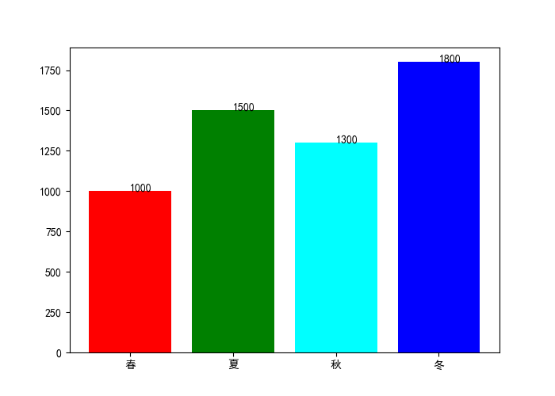
    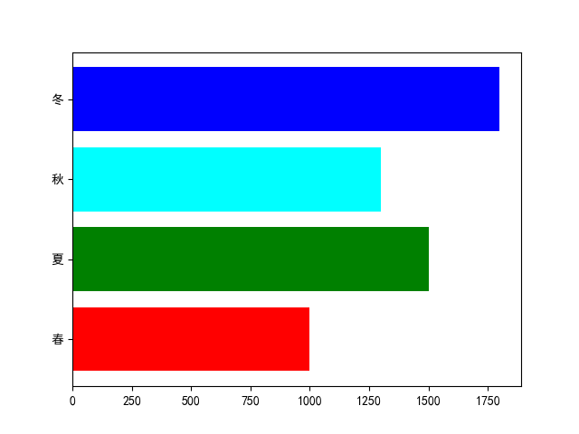
</div>

```Python
#绘制条形图
n=12
X=np.arange(n)
Y1=(1-X/float(n))*np.random.uniform(0.5,1.0,n)#均匀分布
Y2=(1-X/float(n))*np.random.uniform(0.5,1.0,n)
fig=plt.figure()#创建一个窗口
ax=fig.add_subplot(1,1,1)#添加一个子图
ax.bar(X,+Y1,color='#9999ff',edgecolor='white')
ax.bar(X,-Y2,color='#ff9999',edgecolor='white')
for x,y in zip(X,Y1):
    plt.text(x,y+0.05,'%.2f'%y,ha='center',va='bottom')
for x,y in zip(X,Y2):
    plt.text(x,-y-0.05,'%.2f'%y,ha='center',va='bottom')
plt.ylim(-1.25,+1.25)
plt.show()
```
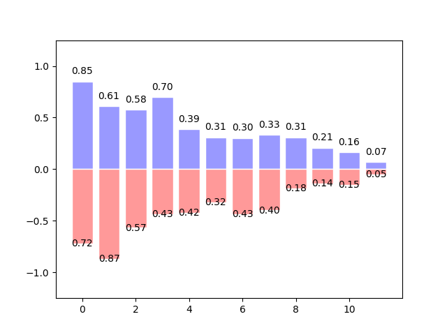

## 饼图-pie
`pie(size, explode=None, labels=None,colors=('b', 'g', 'r', 'c', 'm', 'y', 'k', 'w'),autopct=None, shadow=False,labeldistance=1.1, radius=None)`
<details><summary>参数：</summary>
    <ul>
        <li>size：(每一块)的比例，如果sum(x) > 1会使用sum(x)归一化</li>
        <li>labels：(每一块)饼图外侧显示的说明文字（标签数据）</li>
        <li>explode：(每一块)离开中心距离，突出部分</li>
        <li>startangle：起始绘制角度,默认图是从x轴正方向逆时针画起,如设定=90则从y轴正方向画起</li>
        <li>shadow：是否阴影</li>
        <li>labeldistance：label绘制位置,相对于半径的比例, 如小于1则绘制在饼图内侧</li>
        <li>autopct：控制饼图内百分比设置,可以使用format字符串指小数点前后位数</li>
        <li>radius：控制饼图半径</li>
        <li>pctdistance：设置圆内文本距圆心距离</li>
    </ul>
</details>

```Python
label_list = ["第一部分", "第二部分", "第三部分"] # 各部分标签
size = [55, 35, 10] # 各部分大小
color = ["red", "green", "blue"] # 各部分颜色
explode = [0.05, 0, 0] # 各部分突出值
#绘制饼图
plt.pie(size, explode=explode, colors=color, labels=label_list, labeldistance=1.1, autopct="%1.1f%%", shadow=False, startangle=90, pctdistance=0.6)
plt.axis("equal") # 设置横轴和纵轴大小相等，这样饼是圆的
plt.legend()
plt.show()
```
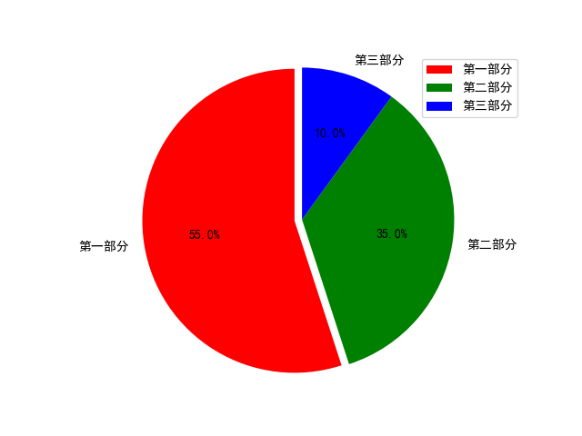

## 散点图-scatter
`scatter(x, y, s=None, c=None, marker=None, cmap=None, norm=None, vmin=None, vmax=None, alpha=None, linewidths=None)`
<details><summary>参数：</summary>
    <ul>
        <li>x,y：分别是x轴和y轴的数据集。两者的数据长度必须一致。</li>
        <li>s：点的尺寸。如果是一个具体的数字，那么散点图的所有点都是一样大小，如果是一个序列，那么这个序列的长度应该和x轴数据量一致，序列中的每个元素代表每个点的尺寸。</li>
        <li>c：点的颜色。可以为具体的颜色，也可以为一个序列或者是一个cmap对象。</li>
        <li>marker：标记点，默认是圆点，也可以换成其他的。</li>
    </ul>
</details>

```Python
# 使用numpy产生数据
fig = plt.figure() # 创建一个窗口
ax = fig.add_subplot(1,1,1) # 在窗口上添加一个子图
x = np.random.random(100) # 产生随机数组
y = np.random.random(100) # 产生随机数组
ax.scatter(x,y,s = x*100,c = 'y',marker = (6,1),alpha = 0.5,lw = 2)
# x横坐标，y纵坐标，s图像大小，c颜色，marker图片，lw图像边框宽度
plt.show() # 显示图像
```
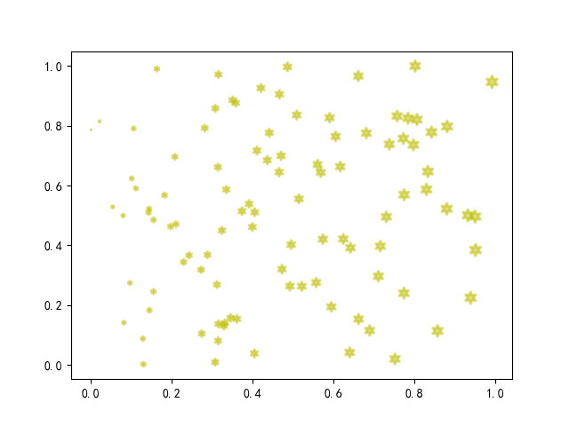

### [回到目录](#content)

---
# 机器学习<a id="machine-learning"></a>
## 概述
### 工作流程
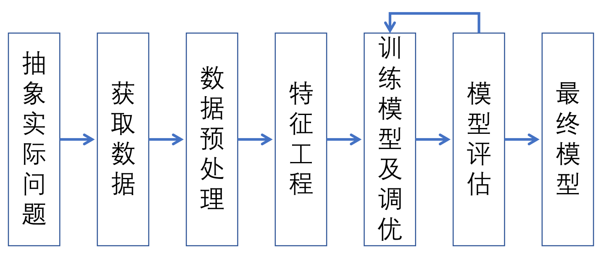
### 常用术语
1. 模型与模型参数  
    类似黑盒子，根据数据与算法构建 ，有决策树模型,线性模型， 分类模型
2. 数据集、样本、特征和目标
3. 训练与推理（预测与决策）
4. 泛化能力  
    模型不仅在训练数据上表现佳，在其他数据集上也表现不错，举一反三的作用
5. 训练集，验证集和测试集
### 方式
- 有监督学习：训练样本包含对应的‘标签’（例如每个样本所属的类别）。训练集需要包括输入和输出，也就是特征和目标，其中目标是由人工标注的‘标签’。通过大量已知的数据不断训练和减少错误来提高认知能力，最后根据积累的经验去预测未知数据的属性。
  - 回归问题：一元、多元和非线性回归，连续变量的预测
  - 分类问题：二分类与多分类问题，分类线或超平面，离散变量的预测
- 无监督学习：训练数据包含一组输入向量而没有相应的目标值。这类算法的目标可能是发现原始数据中相似样本的组合（称作聚类），或者确定数据的分布（称作密度估计），或者把数据从高维空间投影到低维空间（称作降维）以便进行可视化。
  - 聚类：K-means算法
  - 降维：主成分分析
- 半监督学习：少量标记数据与大量未标记数据
  - 利用少量的标记数据对模型进行参数的初始化
  - 用初始化的模型对大量的未标记数据进行预测以获得新的标记数据
  - 采用新的标记数据重新训练模型
  - 重复训练直到模型训练达到收敛
## 回归
### 回归分析
指利用数据统计原理，对大量统计数据进行数学处理，并确定因变量与某些自变量的相关关系，建立一个相关性较好的回归方程（函数表达式），并加以外推，用于预测今后的因变量的变化的分析方法。
#### 分类
- 线性回归
  - 一元线性回归
  - 多元线性回归
- 非线性回归
#### 第三方库 sklearn（scikit-learn）
[sklearn库主要模块功能简介](https://www.cnblogs.com/hongbao/p/17660040.html)
### 数据挖掘
```Python
# 导入库
from sklearn.model_selection import train_test_split
from sklearn.linear_model import LinearRegression
from sklearn.metrics import mean_squared_error, r2_score
import numpy as np
# 从文件中读取数据：
data=np.genfromtxt('advertising.csv',delimiter=',',skip_header =1)
# 绘制散点图观察数据相关性
plt.figure('fig1',dpi=200)
plt.scatter(data[:,1],data[:,-1],color='r',marker='^')
plt.grid()
plt.title('TV')
plt.figure('fig2',dpi=200)
plt.scatter(data[:,2],data[:,-1],color='g',marker='*')
plt.grid()
plt.title('radio')
plt.figure('fig3',dpi=200)
plt.scatter(data[:,3],data[:,-1],color='b',marker='o')
plt.grid()
plt.title('newspaper')
# 拆分特征值和目标值
x=data[:,1] # 特征值
y=data[:,-1] # 目标值
# 拆分训练集和测试集
x_train, x_test, y_train, y_test = train_test_split(x, y, test_size=0.25, random_state=33) 
# 创建线性回归模型对象
lr = LinearRegression(normalize=True) 
# 训练模型
lr.fit(x_train, y_train) 
# 方程系数
print('回归方程的系数：',lr.coef_)
print('回归方程的截距：',lr.intercep)
```
#### 归一化
1. 把数据变成(0，1)之间的小数。把数据映射到0～1范围之内处理，更加便捷快速
2. 把有量纲表达式变成无量纲表达式，便于不同单位或量级的指标能够进行比较和加权
```Python
def normalization(data): 
    _range = np.max(data,axis=0) - np.min(data,axis=0) #列向量
    return (data - np.min(data,axis=0)) / _range
```
#### 标准化
使每个特征中的数值平均变为0、标准差变为1。
```Python
def standard(data): 
    _mean=np.mean(data,axis=0) 
    _std=np.std(data,axis=0)
    return (data - _mean) / _std
```
#### 模型测试和拟合效果
均方根误差（MSE = mean square error）：真实值与预测值之
间误差的平方和的均值。（最小二乘）  
R方（$R^2$：决定系数）是衡量回归模型拟合优度的统计量，用于反映回归模型对样本数据的拟合程度R² = 1 - SSE/SST（计算残差平方和（SSE）和总平方和（SST））
```Python
y_pred=lr.predict(x_test)
print(mean_squared_error(y_test,y_pred)) # 均方误差
print(lr.score(x_test, y_test)) # 测试集拟合优化度
print(r2_score(y_test, y_pred)) # R方
```
### 训练问题解决方法
- 过拟合：增加数据量、用正则化（如L1/L2）、早停法、Dropout等。  
- 欠拟合：增加特征、用更复杂的模型、减少正则化等。
## 分类
### 逻辑回归
是一个用于分类的线性模型，可以说是加了个sigmoid函数(S函数)的线性回归。
```Python
# 导入库
from sklearn.model_selection import train_test_split
from sklearn.linear_model import LogisticRegression
from sklearn.metrics import accuracy_score
import numpy as np
# 从文件中读取数据：
data=np.genfromtxt('test_pass.csv', delimiter=',', skip_header =1, encoding='utf-8')
# 绘制散点图观察数据分布情况
plt.xlabel('duration')
plt.ylabel('efficiency')
plt.scatter(data[:,1],data[:,2], marker='o',c=data[:,-1])
# 拆分训练集和测试集
x=data[:,1:3]
y=data[:,-1]
X_train,X_test,y_train,y_test=train_test_split(x,y,test_size=0.25,random_state
=30)
# 创建线性回归模型对象
reg = LogisticRegression()
# 训练模型
reg.fit(X_train, y_train)
# 模型评价
y_pred =reg.predict(X_test)
score = accuracy_score(y_test,y_pred)
#分类准确率Accuracy = (TP + TN)/(TP + TN + FN + FP)
#confusion_matrix(y_test,y_pred)
#recall_score、precision_score、f1_score等
# 预测
learning=np.array([[8, 0.9],[2, 0.6]])
result = reg.predict(learning)
# 可视化
plt.scatter(data[:,1],data[:,2],c=data[:,-1],marker='o')
plt.scatter(learning[:,0],learning[:,1],marker='^',c=result)
```
```Python
df = pd.read_csv("breast_cancer_test.csv")#用pandas打开数据文件
df1 =df.dropna() #默认丢弃任何含有NaN的行
print(df1)
print(df1.dtypes) #查看各列的数据类型
print(df1.shape) #查看数据的维度
data = df1.values #数据转换，df转化成数组arr
print(data)
x = data[:,1:-1] #获取特征值
y = data[:,-1] #获取标签数据
```
### [回到目录](#content)

---
# 算法思维<a id="algorithmic-thinking"></a>
## 算法的基本概念
衡量一个算法的优劣可以用时间复杂度与空间复杂度，即所谓的算的快，占地少。
## 求方程的根
### 暴力搜索
**前提**：函数是连续的，或者在求解范围内是连续的。误差是指函数值与0值的差异绝对值。  

**算法思路**：画图，在函数f(x)与横轴交点处的左边选个值做为初始根$x_0$，然后尝试一个较小的步长值delta,从左至右逐步丈量，直到$f(x_0+n*delta)$的值落在误差范围内，或者$f(x_0+n*delta)*f(x_0)<0$（即异号,搜根失败）。

例：[暴力搜索法求方程近似根](./2026春练习/算法思维-方程求根/暴力搜索法求方程近似根/暴力搜索法求方程近似根.md)
### 二分法
即为一分为二的方法，对于区间[a，b]上连续不断且f(a)*f(b)<0的函数y=f(x)，通过不断地把函数f(x)的零点所在的区间一分为二，使区间的两个端点逐步逼近零点，进而得到零点近似值的方法为二分法，可以求方程的根，也可以用于大数据查找。

例：[二分法求方程近似根](./2026春练习/算法思维-方程求根/二分法求方程近似根/二分法求方程近似根.md)
### 牛顿迭代法（切线法）
**公式**：$x_{k+1}=x_k-f(x_k)/f'(x_k)$

**目标**：不断求曲线f(x)的切线与x轴的交点,直到无穷逼近f(x)与x轴的交点

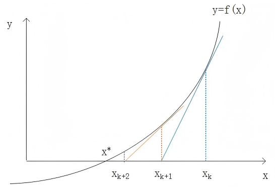

例：[牛顿迭代法求方程近似根](./2026春练习/算法思维-方程求根/牛顿迭代法求方程近似根/牛顿迭代法求方程近似根.md)
### 牛顿割线法
**公式**：$x_{k+1}=x_k-\frac{f(x_k)}{f(x_k)-f(x_{k-1})}(x_k-x_{k-1})$

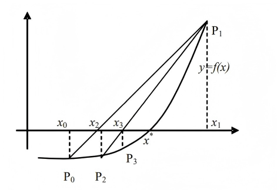

例：[牛顿割线法法求方程近似根](./2026春练习/算法思维-方程求根/牛顿割线法法求方程近似根/牛顿割线法法求方程近似根.md)
## 求函数的最值
### 相关概念
- 偏导数：描述多元函数在不同自变量方向的变化率，是标量
- 梯度 ：梯度是一个向量（矢量），表示某一函数在该点处的方向导数沿着该方向取得最大值，即函数在该点处沿着该方向（此梯度的方向）变化最快，变化率最大（为该梯度的模）
### 梯度下降法
为了找到函数的最小值处，只要让函数值朝着梯度方向的反方向(下降)走一小步，再求出此处的梯度方向，继续往梯度方向的反方向走一小步，如此往复，就能找到函数的最小值。
### 一元函数
**公式**：$x_{k+1}=x_k−\eta∗f'(x_k)$  
这里η称为学习率，一般设置得较小

例：[用梯度下降法求一元函数的最值](./2026春练习/算法思维-函数求最值/用梯度下降法求一元函数的最值/用梯度下降法求一元函数的最值.md)
### 二元函数
**公式**：$(x_{k+1},y_{k+1})=(x_k,y_k)-\eta *(\frac{\partial f}{\partial x},\frac{\partial f}{\partial y})$

例：[用梯度下降法求二元函数的最值](./2026春练习/算法思维-函数求最值/用梯度下降法求二元函数的最值/用梯度下降法求二元函数的最值.md)
## 数据拟合
测量所得的数据一般都有一定的误差，如何从大量测量所得的数据点中找出数据服从的一般规律性，即找出一个函数来刻画数据点的分布，可以称为***数据的函数拟合***。拟合好的函数，可以用来对新的测量数据进行预测。
### 线性拟合
设隐含的线性函数$y=h(x)=w_0+w_1x$。给定初始的$(w_0,w_1)$值，对于任何一个点$(x_{(i)},y_{(i)})$，称为样本, 计算其函数值$h(x_{(i)})$与$y_{(i)}$的差异，一般使用均方误差损失函数$L(w_0,w_1)=\frac{1}{2m}\sum_{i=1}^m(h(x^{(i)})-y^{(i)})^2=\frac{1}{2m}\sum_{i=1}^m(w_0+w_1x^{(i)}-y^{(i)})^2$表示，m是样本点个数。只要找到最合适的$(w_0,w_1)$值使得对于所有的数据点(样本点)误差函数值最小化，就求得了线性拟合函数。因此线性拟合问题转换为误差函数求最小值问题，此时的未知数是$(w_0,w_1)$, 使用***梯度下降法***对$(w_0,w_1)$进行迭代，找出合适的$(w_0,w_1)$值使得$L(w_0,w_1)$最小。
例：[线性拟合](./2026春练习/算法思维-数据拟合/数据的直线拟合/数据的直线拟合.md)
### 多项式曲线拟合
```Python
import numpy as np
import matplotlib.pyplot as plt
# 1. 生成示例数据
np.random.seed(42)
x = np.linspace(0, 2*np.pi, 100)
y = np.sin(x)+0.2 * np.random.randn(100)
# 2. 多项式特征
degree = 5 # 多项式阶数
X_poly = np.zeros((len(x), degree + 1)) #全0矩阵
for i in range(degree + 1):
    X_poly[:, i] = x ** i # x^0, x^1, x^2, ..., x^degree
# 3. 特征标准化（除截距项）
X_normalized=X_poly.copy()
mean = np.mean(X_poly[:, 1:], axis=0) # 除第一列外，求每列的均值
std = np.std(X_poly[:, 1:], axis=0) # 除第一列外，求每列的标准差
X_normalized[:, 1:] = (X_poly[:, 1:] - mean) / std
# 4. 初始化
lr=0.1 #学习率
epochs=2000 #对数据点集的迭代轮数
m=len(x) #数据点(样本点)个数
w=np.random.randn(degree+1) #初始w值的设置，服从标准正态分布的随机数
# 5.批量梯度下降法更新w值
for i in range(epochs):
    errors=X_normalized@w-y
    L=np.sum(errors**2)/m #mse,平均平方误差，注意没有添加系数1/2
    if i%200==0:
        print(f"epoch={i}/{epochs}, w={np.round(w,2)},Loss={L:.6f}")
    grad=(1/m)*X_normalized.T@errors
    w=w-lr*grad
print(f"w={np.round(w,2)},Loss={L:.6f}")
# 6. 可视化
predict=X_normalized@w
plt.plot(x,y,'.')#数据点，真实值
plt.plot(x,predict,"r-",label='Gradient Descent') #拟合曲线
plt.plot(x,np.sin(x),'b-',label='True') #真实曲线
plt.legend() #图例
plt.show()
```
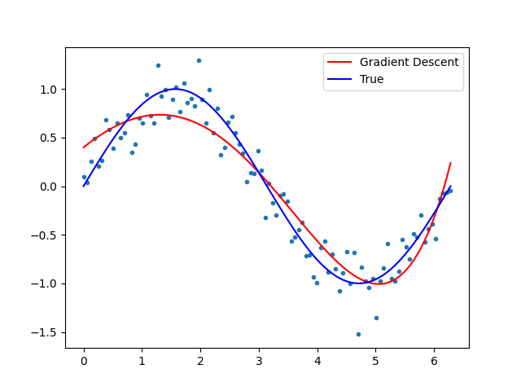

例：[多项式曲线拟合](./2026春练习/算法思维-数据拟合/数据的一元二次曲线函数拟合/数据的一元二次曲线函数拟合.md)
### BP神经网络
#### 多层感知机
***多层感知机***是一种前馈人工神经网络，由至少一个***输入层***、一个或多个***隐藏层***以及一个***输出层***组成。每个***隐藏层***和***输出层***中的神经元（也称为“单元”）与前一层的所有神经元全连接，并通过非线性激活函数引入非线性变换。***多层感知机***是深度神经网络的基本形式，也是最经典的神经网络模型之一。

- 输入层：接收原始特征向量
- 隐藏层：包含若干神经元（个数可自定义）
- 输出层：产生最终预测结果。神经元个数由任务决定。输出层的激活函数视任务而定（回归常用线性，二分类常用Sigmoid，多分类常用 Softmax）。
#### BP神经网络
***BP神经网络***（Backpropagation Neural Network）是一种基于误差反向传播算法训练的多层前馈神经网络。它通过链式法则计算损失函数对网络中所有权重和偏置的梯度，然后利用梯度下降法更新参数，使得网络输出不断逼近目标值。BP算法解决了***多层感知机***（MLP）的训练难题，是深度学习的基石之一。在实际语境中，***多层感知机***和***BP神经网络***两者往往混用。理解***BP神经网络***是学习更复杂神经网络（CNN、RNN、Transformer等）的基础，而Transformer结构是deepseek, ChatGPT 等大语言模型的基石。
### [回到目录](#content)

---
# 列表的基本操作<a id="basic-operation-of-list"></a>


## 列表推导式
`lst=[包含x的表达式 for x in 序列 if 条件表达式]`
```Python
lst1 = [x for x in range(20) if x % 2 == 1]
# 等效于
lst2 = []
for x in range(20):
    if x % 2 == 1:
        lst2.append(x)
```
### [回到目录](#content)

---
# 序列数据的基本操作<a id="basic-operation-of-sequential-data"></a>

### [回到目录](#content)

---
# 字典的基本操作<a id="basic-operation-of-dictionary"></a>
### 访问字典中的值:
```Python
cars = {'BMW': 8.5, 'BENS': 8.3, 'AUDI': 7.9}
print(cars['AUDI'])
```
### 添加键值对:
```Python
cars = {'BMW': 8.5, 'BENS': 8.3, 'AUDI': 7.9}
cars['JLR']=8.0
print(cars)
```
### 修改字典中的值:
```Python
cars = {'BMW': 8.5, 'BENS': 8.3, 'AUDI': 7.9,'JLR':8.0}
cars['JLR']=7.0
print(cars)
```
### 删除键值对:
```Python
cars = {'BMW': 8.5, 'BENS': 8.3, 'AUDI': 7.9,'JLR':8.0}
del cars['JLR']
print(cars)
```
### 判断字符串是否只由数字组成:
```Python
str=input()
if str.isdigit():
    str=eval(str)
```
这样可以确保输入的内容会以数值形式保存。
### 判断字符串是否只由字母字符组成:
```Python
str=input()
if str.isalpha():
    str=eval(str)
```
### 从列表创建字典:
`dict.fromkeys(seq[, value])`用于创建一个新字典，以序列 seq 中元素做字典的键，value 为字典所有键对应的初始值(默认为None)
- 参数
    - seq:字典键的来源(列表，元组，字符串，集合)。
    - value:可选参数, 设置键序列(seq)的初始值。
### 获取指定键的值:
- `dict.get(key[, default])`用于安全地获取指定键key的值，如果键不存在则返回default（默认为None）而不是抛出KeyError
  - 参数
      - key:要查找的键
      - default:可选参数，键不存在返回的值

- `dict.setdefault(key, default_value)`用于获取指定键key的值，如果键不存在则设定一个值default_value(默认为None)并返回这个值
  - 参数
      - key:要查找的键
      - default_value:可选参数，键不存在设定并返回的值
### 遍历字典中的键:
```Python
cars = {'BMW': 8.5, 'BENS': 8.3, 'AUDI': 7.9}
for key in cars.keys():
    print(key)
```
### 遍历字典中的值:
```Python
cars = {'BMW': 8.5, 'BENS': 8.3, 'AUDI': 7.9}
for value in cars.values():
    print(value)
```
### 遍历字典中的键值对:
```Python
cars = {'BMW': 8.5, 'BENS': 8.3, 'AUDI': 7.9}
for key,value in cars.items():
    print(key,value)
```
### [回到目录](#content)

---
# 文件操作<a id="file-operations"></a>
## 文件基本概念
### 文件编码
编码表|适用性|特点
---|---|---|
ASCII码 | 英文大小写，字符，不包含中文 | 占用空间小
GB2312和GBK码 | 支持中文 | GBK 码是 GB2312 的升级
Unicode码 | 支持国际语言 | 占用空间大，适用性强
UTF-8码 | 支持国际语言 | 是 Unicode 码的升级，两者可互相转化，占用空间小 ，ASCII 码被 UTF-8 码包 含
```Python
#文本与UTF-8编码之间的转换示例
s1='你好吗'
print(s1.encode('utf-8')) #输出为b'\xe6\x88\x91\xe7\x88\xb1\xe4\xbd\xa0'
s2=s1.encode('utf-8')
print(s2.decode()) #输出为你好吗
```
### 文件类型
按照文件的编码方式，可以将文件分为文本文件（Text File）和二进制文件（Binary File）。  
按文件的组织方式：
- 文本文件是基于字符编码的文件，保存的是文本数据，这些文本采用一定的编码。在用记事本等软件保存文本文件时，通常需要指定编码方式（或用默认编码方式）。汉字文件有时打开是乱码，往往就是因为编码方式选择不当。文本文件由字符组成，可以看成是一个很长的字符串。
- 二进制文件是基于值编码的文件，存储的是二进制数据，也就是说，数据按照其实际占用的字节数来存储的。二进制文件不是以字符为单位的，不能看成字符串，而是被当作特定格式的字节流来处理的。

其他文件：excel文件，csv 文件，json文件  
可参阅：[Python文件类型读写库大盘点](https://www.jb51.net/python/284815fu4.htm)
## 目录操作
导入库：`import os`

- `getcwd()`：**返回当前的工作路径**

- `chdir(path)`：**改变当前工作路径到指定的路径**

- `listdir(path)`：**返回指定路径下的文件和文件夹列表**

- `path.exists(path)`：**路径存在则返回True，路径损坏返回False**
## 文本、二进制文件操作 
### 打开、关闭文本文件（.txt）
`f=open(file, mode='r', buffering=-1, encoding=None, errors=None, newline=None, closed=True, opener=None)`加上`f.close()`  
或`with open(file, mode, encoding=None) as f:语句块`

参数：
- file：表示要打开的文件路径（相对或者绝对路径）
- mode：表示文件打开模式
- buffering：用于设置缓冲
- encoding：用于设置编码格式，一般使用utf8
- errors：指明编码和解码错误时怎么样处理，适用于文本模式
- newline：文本模式之下，控制一行的结束字符
- closed：传入的file参数类型
- opener：自定义打开文件方式

<details><summary>mode</summary>
    <ul>
        <li>r：以读方式打开文件，可读取文件信息</li>
        <li>w：以写方式打开文件，可向文件写入信息。如文件存在，则清空该文件，再写入新内容</li>
        <li>a：以追加模式打开文件（即一打开文件，文件指针自动移到文件末尾），如果文件不存在则创建</li>
        <li>r+：以读写方式打开文件，可对文件进行读和写操作</li>
        <li>w+：消除文件内容，然后以读写方式打开文件</li>
        <li>a+：以读写方式打开文件，并把文件指针移到文件尾</li>
        <li>b：以二进制模式打开文件，而不是以文本模式。该模式只对Windows或Dos有效，类Unix的文件是用二进制模式进行操作的</li>
    </ul>
</details>

### 文件读取
- `f.seek(0)`：**文件指针复位，重新回到初始状态**

- `f.read([size])`：**从文件读取指定的字节数。如果没有给定 size 的值，或者 size 的值为负数，则读取全部文件内容**

- `f.readline([size])`：**从文件中读取整行，包括“\n”字符。如果给定 size 的值（非负），则返回给定的字符数或字节数**

- `f.readlines()`：**从文件中读取所有行，以每行一个元素形成一个列表返回。该列表可以用for…in…结构进行处理**
### 文件写入
- `f.write([str])`：**用于向文件中写入一个字符串或字节流**

- `f.writelines([str])`：**用于向文件中写入一个序列的字符串，如元素为字符串的列表。换行需要自己添加换行符“\n”。**
## Json数据格式
导入库`import json`   
字典或列表中嵌套字典，本质上是一个带有特定格式的字符串
### Python数据和json数据的相互转化
- python数据转成json字符串：`json_data = json.dumps(python_data)`
- json字符串转成python对象：`python_data = json.loads(json_data)`
```Python
Dict = {'name':'总经理','address': '湖南大学','scores': [75,85,90,60]}
Json_Dict = json.dumps(Dict) # 转换成json数据
print(Json_Dict) # 输出{"name": "\u603b\u7ecf\u7406", "address": "\u6e56\u5357\u5927\u5b66", "scores": [75, 85, 90, 60]}
print(type(Json_Dict)) # 输出<class 'str'>
Json_Dict2=json.dumps(Dict,ensure_ascii=False) 
print(Json_Dict2) # 输出{"name": "总经理", "address": "湖南大学", "scores": [75, 85, 90, 60]}
Dictdata = json.loads(Json_Dict) # 还原成字典数据
print(Dictdata) # 输出{"name": "总经理", "address": "湖南大学", "scores": [75, 85, 90, 60]}
```
### Python操作Json文件(.json)
1. 用write()函数来实现json文件的写，如我们将上面的字典数据存入data.json文件中
    ```Python
    with open('data.json','w') as data:
        data.write(json.dumps(Dict))
    ```
2. 也可用Json模块提供的dump()函数来实现
    `json.dump(Json_Dict, open('data.json','w'))`
3. 从JSON文件中读取数据返回一个python对象可用load()函数来实现
    `data = json.load(open('data.json'))`
### [回到目录](#content)

---
# ASCII表<a id="ascii"></a>


- `ord(字符)函数`：**可以返回字符的编码。**

- `chr(码值)函数`：**可以返回编码对应的字符。**
### [回到目录](#content)

---
# 人工智能-分类与聚类算法<a id="artificial-intelligence-classification-and-clustering-algorithms">
## 预测目标
### 预测对象有标记信息：监督学习
- 分类：离散值（决策树、k近邻、神经网络）
    - 二分类：是、否
    - 多分类：冬瓜、南瓜、西瓜
- 回归：连续值
    - 瓜的成熟度
### 预测对象无标记信息：非监督学习
- 聚类：对应一些潜在概念的划分（k-means、神经网络）
    - 本地瓜、外地瓜
## 决策树算法
### 树的建立
#### 信息熵：$Ent(D)$
度量样本集合纯度最常用的一种指标。  
$Ent(D)$的值越小，D的纯度越高
#### 信息增益：$Gain(D,a)$
一般而言，信息增益越大，则意味着使用属性a来进行划分所获得的“纯度提升”越大
### 树的剪枝
#### 学习器性能不佳的原因
- 过拟合：学习器把训练样本学习的“太好”，将训练样本本身的特点当做所有样本的一般性质，导致泛化性能下降
    - 优化目标加正则项
    - early stop
- 欠拟合：对训练样本的一般性质尚未学好
    - 决策树：拓展分支
    - 神经网络：增加训练轮数
#### 剪枝：
决策时学习算法对付“过拟合”的主要手段
#### 剪枝的基本策略
- 预剪枝
- 后剪枝
#### 判断决策树泛化性能是否提升的方法
- 留出法：预留一部分数据用作“验证集”以进行性能评估
## k近邻算法
- 解决的问题：分类、预测或拟合
- 输入：实例的特征向量（对应于特征空间的点）
- 输出：实例的类别

##### k取不同值时，对于同一个实例的预测结果也可能不同
- k值过小：预测结果对近邻的实例点非常敏感，整体模型比较复杂，容易发生过拟合（极端：k=1，又称最近邻算法）
- k值过大：整体模型比较简单，与输入实例距离较远（不相似的）训练实例也会对预测起作用，使预测出错。（极端：k=N，不管输入实例是什么，都将简单地预测它属于训练实例中最多的类）
### 距离的度量
#### 欧式距离
$dist(x,y)=\sqrt{\sum_{k=1}^{d}(x_k-y_k)^2}$
#### 曼哈顿距离
$dist(x,y)=\sum_{k=1}^{d}|x_k-y_k|$
#### 汉明距离
$对两个等长二进制串进行异或运算，异或结果中1的个数就是汉明距离$
#### 余弦相似度
$cos(\overrightarrow{\alpha},\overrightarrow{\beta})=\frac{\overrightarrow{\alpha}\cdot\overrightarrow{\beta}}{\sqrt{\overrightarrow{\alpha}^2\cdot\overrightarrow{\beta}^2}}$
#### 自定义度量
### 分类决策规则
- 往往是多数表决，即由输入示例的k个邻近的训练实例中的多数类决定输入实例的类
- 多数表决规则等价于经验风险最小化
### 算法优点
- 简单，易于理解，易于实现，无需估计参数，无需训练
- 适合对稀有事件进行分类
- 特别适合于多分类问题(对象具有多个类别标签)
### 算法缺点
- 当样本不平衡时(如一个类的样本容量很大，而其他类样本容量很小时)有可能导致当输入
一个新样本时，该样本的K个邻居中大容量类的样本占多数。
- 需要存储全部训练样本，计算量较大
- 可解释性较差，无法给出决策树那样的规则。
## k-means算法
### 聚类目标
将数据集中的样本划分为若干个通常不相交的子集（“簇”）
### 聚类分类
- 层次聚类
    - 凝聚方法AGNES
    - 分类方法DIANA
- 密度聚类
    - DBSCAN
- 原型聚类
    - 高斯混合GMM
    - K-means
### k-means介绍
对数值型数据进行聚类
#### 方法
- 随机选取K个对象作为初始的聚类中心;
- 把每个对象分配给距离它最近的聚类中心;
- 根据聚类中现有的对象重新计算聚类中心;
- 在得到类别中心下继续进行类别划分;
- 如果连续两次的类别划分结果不变则停止
算法;否则循环2~5。
#### 特点
初始参数：类别数&初始类别中心

优点：聚类时间快  
缺点：对初始参数敏感； 容易陷入局部最优

### [回到目录](#content)

---
# 智能决策-搜索与优化<a id="intelligent-decision-making-search-and-optimization"></a>
## 智能决策支持系统（IDSS）
### 特性
- 处理非结构化或半结构化的数据;
- 自主学习能力与推理能力;
- 良好的适应性和灵活性;
- 友好的人机接口;
- ···
### 分类
- 基于人工智能
- 基于数据仓库
- 基于范例推理
### 搜索的过程
1. 从初始状态出发，并将它作为当前状态。
2. 扫描操作算子集，将适用当前状态的一些操作算子作用于当前状态而得到新的状态，并建立指向其父结点的指针。
3. 检查所生成的新状态是否满足目标状态，如果满足，则得到问题的一个解，并可沿着有关指针从结束状态反向到达
初始状态，给出求解路径;否则，将新状态作为当前状态，返回第2步再进行搜索。
### 搜索算法面临的挑战
1. 求解问题系统不可能知道与实际问题有关的全部信息，因而无法知道该问题的全部状态空间，也不可能用一套算法来求解所有的问题。
2. 有些问题在理论上虽然存在着求解算法，但是在工程实践中，这些算法不是效率太低，就是根本无法实现。
### 优化算法部分分类
**基本搜索算法**：广度和深度优先搜索法  
**启发式搜索算法**：爬山法  
**博弈搜索**：Minimax  
**智能优化算法**：模拟退火、遗传算法、粒子群优化算法
## 遗传算法（Genetic Algorithm）
### 基本思想
- 以k个随机产生的状态开始(population)
- 一个后继状态由两个父状态决定
- 一个状态用编码来表示一个解(染色体)
- 定义一个适应值函数用来评价解的好坏
- 通过选择，交叉，变异的操作产生下一代的解
### 基本组成
- **编码方案**：怎样把优化问题的解进行编码。
- **适应度函数**：怎样根据目标函数构建适应度函数。
- **选择策略**优胜劣汰、适者生存。
- **控制参数**：种群的规模、算法执行的最大代数、执行不同遗传操作的概率等。
- **遗传算子**：选择、交叉、变异。
- **算法终止准则**：规定一个最大的演化代数，或算法在连续多少代以后解的适应值没有改进。
### 设计
1. 确定编码方案
   - 选择何种编码方式对算法的性能、效率等产生很大的影响。
   - 将问题结构变换为位串形式编码的过程叫编码，即表示成染色体(个体)，也就是问题的一个解。
   - 遗传算法的编码方法有二进制编码、浮点数编码方法、格雷码、符号编码方法、多参数编码方法等。
2. 定义适应度函数
   - 解的适应度是演化过程中进行选择的唯一依据。
3. 确定选择策略
   - 优胜劣汰的选择机制使得适应值大的解有较高的存活率，这是遗传算法与一般搜索算法的主要区别之一。
4. 设计遗传操作算子
   - 交叉、变异
## 模拟退火
### 基本思想
允许算法向坏的方向移动以摆脱局部最优值，但这种移动随着时间的推移概率逐步下降。
> 模拟金属退火过程，是对爬山法的改进
### 爬山算法的缺点
依据初始状态，得到局部最大值
> 改进爬山算法：以一定概率接收比当前解差的解，从而有机会跳出局部最优解
## 粒子群优化算法
### 群智能算法
**群体智能**：由简单个体组成的群落与环境以及个体之间的互动行为。受动物群体智能启发的算法。
**包括**：粒子群优化算法、蚁群算法、蜂群算法···
### 粒子群优化算法
将每个个体看作n维搜索空间中一个没有体积质量的粒子，在搜索空间中以一定的速度行，该速度决定粒子飞行的方向和距离。所有粒子定义一个适应值函数。
### 基本原理
PSO初始化为一群随机粒子，然后通过迭代找到最优解。在每一次迭代中，粒子通过跟踪两个“极值”来更新自己。第一个就是粒子本身所找到的最优解，这个解称为个体极值。另一个是整个种群目前找到的最优解，这个解称为全局极值。
### [回到目录](#content)

---
# 图像与感知<a id="computer-vision-and-perception"></a>
## 计算机中的图像表示及语义感知
### 任务
- 图像分割->语义对象的位置
- 图像分类->语义对象的类别
- 目标检测->语义对象的位置、语义对象的类别
- 图像语义捕捉->语义的自然语言表达
### 目标检测
找出图片或者视频中所有感兴趣的目标(物体)，确定它们的类别和位置
## 图像变换
### 几何变换
包括了图像的**形状变换**和**位置变换**。
- 图像的**形状变换**是指图像的放大、缩小与错切。
- 图像的**位置变换**是指图像的平移、镜像与旋转。  

图像的几何变换通常在目标识别中使用。
#### 图像的缩小
分为按比例缩小(等间隔地选取数据)和不按比例缩小
#### 图像的放大
需要对多出的空位填入适当的值，是信息的估计。  
如果需要将原图像放大为k倍，则将原图像中的每个像素值填在新图像中对应的k*k大小的子块中。
#### 图像的错切
实际上是平面景物在投影平面上的非垂直投影效果。
#### 图像的平移
#### 图像的镜像
指在镜子中所成的像。其特点是左右颠倒或者是上下颠倒。
#### 图像的旋转
## 目标检测算法
### 图像数据预处理
主要采用图像增广的方式
- 随机改变亮度，对比度和颜色
- 随机填充
- 随机裁剪
- 随机缩放
- 随机翻转
### 传统的目标检测流程
*主要问题*：
1. 基于滑窗的区域选择策略没有针对性，时间复杂度高，窗口冗余;
2. 手工设计的特征对于环境多样性的变化并没有很好的鲁棒性。
## 基于深度学习的目标检测算法
### 二阶段方法
- 第一阶段:生成大量的候选区域(region proposals);
- 第二阶段:对每个region proposal提取特征并分类。
- 速度慢
### 一阶段方法
同时产生候选区域和分类结果
- 速度快
- 主要有YOLO、SSD、DSSD
## YOLO算法的基本概念及原理
### YOLO
- 将检测变为一个regression problem, YOLO从输入的图像，仅仅经过一个 neural network，直接得bounding boxes以及每个bounding box所属类别的概率。
- 端对端的优化网络结构
- 每秒可以处理40帧图片，达到了实时的速度
### 核心思想
- 输入:利用整张图作为网络的输入
- 输出:直接在输出层回归bounding box的位置和类别
### 基本概念
- bounding box：包括四个坐标(x,y,w,h)
- 真实框：人工标注的含有对象的bounding box
- 锚框(anchor):人为构造出来的假想框，锚框的长宽是人为设置的，锚框用于解决对象的多尺度问题，锚框类似于机器学习里面的样本
### 训练过程
- **锚框生成**:在每个网格的中心点以一定的长宽生成多个锚框;
- **候选区域生成**:对于每个真实框，找到重叠度(IoU)最大的锚框作为正样本，随机挑选低重叠的锚框作为负样本;
- **模型训练**:通过模型参数的更新学习使得候选区域和真实框位置尽可能重叠，类别尽可能一致。
## YOLO算法的训练和测试
### 模型训练
正负候选区域传递给深度学习网络进行参数学习。  
*目标*：
- 正候选区域输出的objectness输出为1;
- 正候选区域的class输出正确;
- 正候选区域的位置进行微调与真实区域尽可能重合。
### 测试过程
*过滤无用信息*
- 根据confidence参数筛选置信度高的候选框；
- 采用非极大抑制算法对候选框进行后滤。
### 非极大抑制算法
如果多个预测框位置比较接近，只选出得分最高的预测框。
### [回到目录](#content)

---
# 大数据与机器人<a id="big-data-and-robots"></a>
**大数据**：Volume(大量)、Velocity(高速)、Variety(多样)、Value(低价值密度)、Veracity(真实性)
## 大数据架构及Hadoop生态
**HDFS优势**:在于非常适合部署在非常廉价的机器上面，它能够在这些廉价的机机器上面提供高吞吐量的数据访问，非常适合做大规模数据集上的应用。
## MapReduce原理
MapReduce是基于集群的一个高性能的并行计算平台。  
MapReduce能够自动完成计算任务的并行化处理，自动划分计算数据和计算任务，自动的分配和执行任务，以及收集计算结果，然后将数据分布式的存储，数据通信、容错处理等并行计算涉及到的很多的系统底层的一些复杂细节。  
Map操作非常适合并行化，可以高度并行，对高性能要求的应用以及并行计算领域的需求非常有用。  
reduce井行化程度较低，化简之后的答案比较简单，在高度并行化环境下不会对性能造成很大影响。
## 机器人知识图谱
### 日本工业机器人协会(IRA)分类法
- 手动操作手(Human-Controlled System)
- 定序机器人(Fixed Sequence Robot)
- 变序机器人(Aterable Sequence Robot)
- 复演式机器人(Playback Robot)
- 程控机器人(Numerical Controlled Robot)
- 智能机器人(Intelligent Robot)

### 机器人系统
一般由机械手、环境、任务和控制器四个互相作用的部分组成
- **环境**即指导机器人所处的周围环境。环境不仅由几何条件(可达空间)所决定，而且由环境和它所包含的每个事物的全部自然特性所决定的。
- **任务**定义为环境的两种状态(初始状态和目标状态)之间的差别。必须用适当的程序设计语言来描述这些任务。
- **控制器**:机器人接收来自传感器的信号，对之进行数据处理，并按照预存信息、机器人的状态及其环境情况等，产生出控制信号去驱动机器人的各个关节。
    - 控制器内存主要存有:
      - 机器人动作模型
      - 环境模型
      - 任务程序
      - 控制算法
- **机械手**具有传动执行装置的机械，由臂、关节和末端执行装置(工具等)构成。
## 机器人运动学和动力学
**运动学**:机器人在立体空间里面的位置如何映射到机器人里面每一个传动装置对应的参数上面去。  
**动力学**:机器人要完成上述动作，驱动区该匹配的动力。这两块是机器人学的一个重点。
### [回到目录](#content)

---
