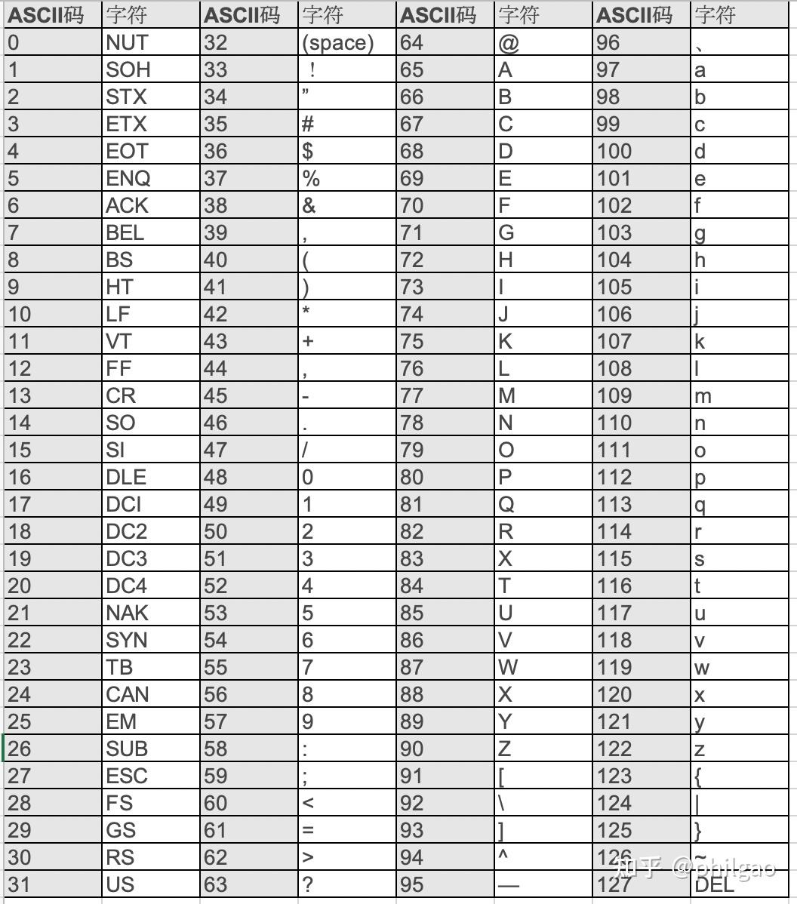

# 目录
## [$math库$](#math库)
## [$ASCII表$](#ascii表)
## [$人工智能-分类与聚类算法$](#人工智能-分类与聚类算法)

#  math库
## 部分函数
- `abs(x)`：**返回整数的绝对值，如`abs(-10)`返回10。**

- `ceil(x)`：**返回数字的向上取整，如`math.ceil(4.1)`返回5。**

- `exp(x)`：**返回e的x次幂，如`math.exp(1)`返回2.718281828459045。**

- `fabs(x)`：**返回浮点数的绝对值，如`math.fabs(-10)` 返回10.0。**

- `floor(x)`：**返回数字的向下取整，如`math.floor(4.9)`返回4。**

- `log(x,base)`：**如`math.log(math.e,math.e)`返回1.0，`math.log(100,10)`返回2.0。**

- `log10(x)`：**返回以10为基数的x的对数，如`math.log10(100)`返回2.0。**

- `max(x1,x2,...)`：**返回给定参数的最大值，参数可以为序列。**

- `min(x1,x2,...)`：**返回给定参数的最小值，参数可以为序列。**

- `modf(x)`：**以元组的形式返回，（小数部分,整数部分）。两部分的数值符号与x相同，整数部分以浮点型表示。**

- `pow(x, y)`：**$x^y$运算后的值。**

- `round(x [,n])`：**返回浮点数x的四舍五入值，如给出n值，则代表舍入到小数点后的位数。**

- `sqrt(x)`：**返回数字x的平方根，返回类型为实数，如math.sqrt(4)返回2.0。**

- `acos(x)`：**返回x的反余弦弧度值。**

- `asin(x)`：**返回x的反正弦弧度值。**

- `atan(x)`：**返回x的反正切弧度值。**

- `atan2(y, x)`：**返回给定的X及Y坐标值的反正切值。**

- `hypot(x, y)`：**返回欧几里德范数$sqrt(x^2+y^2)$。**

- `cos(x)`：**返回x的弧度的余弦值。**

- `sin(x)`：**返回x弧度的正弦值。**

- `tan(x)`：**返回x弧度的正切值。**

- `degrees(x)`：**将弧度转换为角度，如`degrees(math.pi/2)`， 返回90.0。**

- `radians(x)`：**将角度转换为弧度**

除了上述常用的数学函数，`math`库中还定义了两个常用的数学常量：

- `pi`—**圆周率，一般以`π`来表示。**

- `e`—**自然常数。**
### [回到目录](#目录)
---
# ASCII表

- `ord(字符)函数`：**可以返回字符的编码。**

- `chr(码值)函数`：**可以返回编码对应的字符。**
### [回到目录](#目录)
---
# 人工智能-分类与聚类算法
## 预测目标
### 预测对象有标记信息：监督学习
- 分类：离散值（决策树、k近邻、神经网络）
    - 二分类：是、否
    - 多分类：冬瓜、南瓜、西瓜
- 回归：连续值
    - 瓜的成熟度
### 预测对象无标记信息：非监督学习
- 聚类：对应一些潜在概念的划分（k-means、神经网络）
    - 本地瓜、外地瓜
## 决策树算法
### 树的建立
#### 信息熵：$Ent(D)$
度量样本集合纯度最常用的一种指标。  
$Ent(D)$的值越小，D的纯度越高
#### 信息增益：$Gain(D,a)$
一般而言，信息增益越大，则意味着使用属性a来进行划分所获得的“纯度提升”越大
### 树的剪枝
#### 学习器性能不佳的原因
- 过拟合：学习器把训练样本学习的“太好”，将训练样本本身的特点当做所有样本的一般性质，导致泛化性能下降
    - 优化目标加正则项
    - early stop
- 欠拟合：对训练样本的一般性质尚未学好
    - 决策树：拓展分支
    - 神经网络：增加训练轮数
#### 剪枝：
决策时学习算法对付“过拟合”的主要手段
#### 剪枝的基本策略
- 预剪枝
- 后剪枝
#### 判断决策树泛化性能是否提升的方法
- 留出法：预留一部分数据用作“验证集”以进行性能评估
## k近邻算法
- 解决的问题：分类、预测或拟合
- 输入：实例的特征向量（对应于特征空间的点）
- 输出：实例的类别

##### k取不同值时，对于同一个实例的预测结果也可能不同
- k值过小：预测结果对近邻的实例点非常敏感，整体模型比较复杂，容易发生过拟合（极端：k=1，又称最近邻算法）
- k值过大：整体模型比较简单，与输入实例距离较远（不相似的）训练实例也会对预测起作用，使预测出错。（极端：k=N，不管输入实例是什么，都将简单地预测它属于训练实例中最多的类）
### 距离的度量
#### 欧式距离
$dist(x,y)=\sqrt{\sum_{k=1}^{d}(x_k-y_k)^2}$
#### 曼哈顿距离
$dist(x,y)=\sum_{k=1}^{d}|x_k-y_k|$
#### 汉明距离
$对两个等长二进制串进行异或运算，异或结果中1的个数就是汉明距离$
#### 余弦相似度
$cos(\overrightarrow{\alpha},\overrightarrow{\beta})=\frac{\overrightarrow{\alpha}\cdot\overrightarrow{\beta}}{\sqrt{\overrightarrow{\alpha}^2\cdot\overrightarrow{\beta}^2}}$
#### 自定义度量
### 分类决策规则
- 往往是多数表决，即由输入示例的k个邻近的训练实例中的多数类决定输入实例的类
- 多数表决规则等价于经验风险最小化
### 算法优点
- 简单，易于理解，易于实现，无需估计参数，无需训练
- 适合对稀有事件进行分类
- 特别适合于多分类问题(对象具有多个类别标签)
### 算法缺点
- 当样本不平衡时(如一个类的样本容量很大，而其他类样本容量很小时)有可能导致当输入
一个新样本时，该样本的K个邻居中大容量类的样本占多数。
- 需要存储全部训练样本，计算量较大
- 可解释性较差，无法给出决策树那样的规则。
## k-means算法
### 聚类目标
将数据集中的样本划分为若干个通常不相交的子集（“簇”）
### 聚类分类
- 层次聚类
    - 凝聚方法AGNES
    - 分类方法DIANA
- 密度聚类
    - DBSCAN
- 原型聚类
    - 高斯混合GMM
    - K-means
### k-means介绍
对数值型数据进行聚类
#### 方法
- 随机选取K个对象作为初始的聚类中心;
- 把每个对象分配给距离它最近的聚类中心;
- 根据聚类中现有的对象重新计算聚类中心;
- 在得到类别中心下继续进行类别划分;
- 如果连续两次的类别划分结果不变则停止
算法;否则循环2~5。
#### 特点
初始参数：类别数&初始类别中心

优点：聚类时间快  
缺点：对初始参数敏感； 容易陷入局部最优

### [回到目录](#目录)
---

