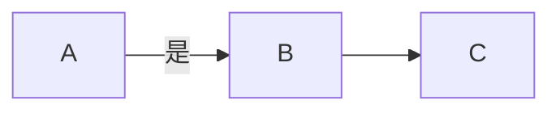

# 这是标题一
## 这是标题二
### 这是标题三
#### 这是标题四
##### 这是标题五
###### 这是最小的标题
* 这是小点
- 这也是小点
  * 这是空心点
  - 这也是空心点
    - 嘻嘻
      - 不嘻嘻

**这是加粗**：我没加粗，__我加粗了__

*我是斜体* _我也是斜体_

***我是粗斜体***

`我是`

~~我是删除线~~

10<sup>2</sup>

10<sub>2</sub>

***

---

----------------
上面是三个分界线（最后一条只要大于等于三个 - ）

>  这是引用

>>这是嵌套引用

下面是一个链接

[哔哩哔哩](https://www.bilibili.com/)

| aa | bb |   |
|---:|:---|:-:|
|列表| 列表|   |

插入图片


$n$

<details>
<summary>可以展开</summary>
嘘
</details>


```Python
print('阿巴阿巴')
```

这是脚注[^1]
[^1]:阿巴阿巴

文字后加两个空格  
可以强制换行
